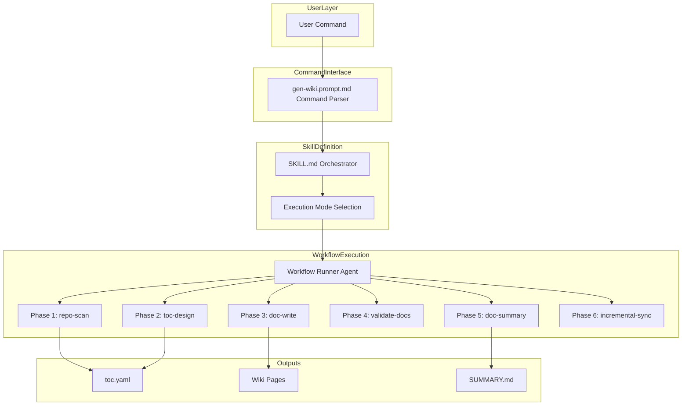
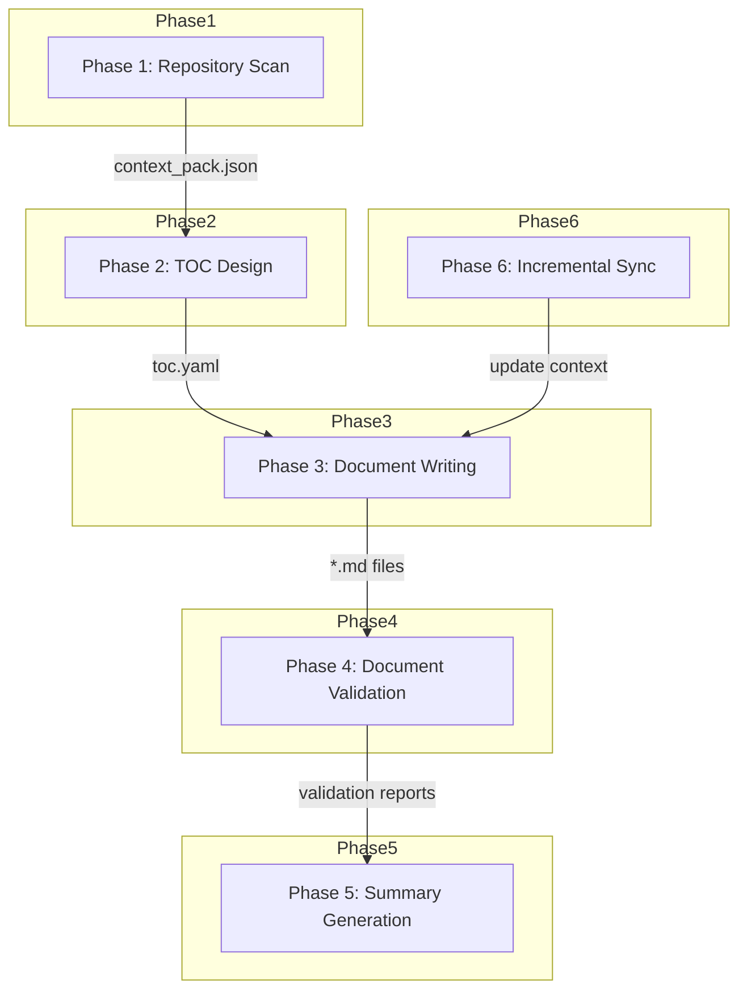

<div align="center">

# 📚 deepwiki-skill

### あらゆるコードベースに対して、網羅的で根拠に基づいた wiki スタイルのドキュメントを生成

**deepwiki-skill** は移植可能な **エージェントスキル（Agent Skill）** です。行レベルのソース引用と検証済みの Mermaid 図を備えた DeepWiki スタイルのドキュメントを、Claude Code、Gemini、Codex、そしてエージェントスキルをサポートするあらゆるエージェント向けに生成します。

[apm](https://github.com/microsoft/apm) を使えば、**たった 1 つのコマンド** ですべてのハーネスにインストールできます。独立したエージェントも、複雑なセットアップも不要です。


[English](./README.md) | [中文](./README.zh-CN.md) | **日本語**

</div>

---

## なぜ deepwiki-skill なのか

- **標準的なエージェントスキル**：もう 1 つの独立したエージェントではなく、複数の AI エージェントをまたいで再利用できるスキルです
- **設定の手間ゼロ**：既存のサブスクリプションをそのまま活用でき、複雑なセットアップは不要です
- **根拠ベースでハルシネーションなし**：すべての重要な記述に、ソースコードからの正確な行レベルの引用が付きます
- **構造を手動でコントロール**：ドキュメント構造を完全に制御でき、自動生成コンテンツが制御不能になる問題を解決します
- **CI/CD 対応**：組み込みの増分更新機能により、CI/CD パイプラインへの導入が容易で、ドキュメントをコードの変更と同期させ続けられます

## 主な機能

- **根拠ベースのドキュメント**：すべての記述が行番号付きでソースファイルまで追跡可能
- **Mermaid 図のサポート**：フローチャート、シーケンス図、クラス図などを生成・検証
- **柔軟な実行モード**：全自動、TOC ファイルベース、または増分更新
- **並列処理**：サブエージェントを利用して、より高速なドキュメント生成とより良いコンテキスト分離を実現
- **スマートなコード解析**：複数のプログラミング言語を検出し、エンコーディング検出を行い、バイナリファイルを除外
- **多言語・Markdown ベースの出力**：Markdown で出力し、出力言語を簡単に制御

## クイックスタート

### 前提条件
- Python >=3.12
- Node.js と Mermaid CLI（図の検証用）
   ```bash
   npm install -g @mermaid-js/mermaid-cli
   ```

### インストール

> **注意**：deepwiki-skill はエージェントスキルをサポートするあらゆるコーディングエージェントで動作しますが、現時点では Claude Code がサブエージェントを最もよくサポートしており、最適なドキュメント生成が可能です。最良の体験を得るには Claude Code を推奨します。

#### 推奨：apm（Agent Package Manager）

[apm](https://github.com/microsoft/apm) は AI エージェントのプリミティブ向けのパッケージマネージャーです。単一のマニフェストから、`wiki` スキル、`workflow-runner` エージェント、`gen-wiki` プロンプトを、サポート対象のあらゆるハーネス（Claude Code、Copilot、Cursor、Codex、Gemini など）にインストールできます。同じコマンドがどこでも動作します。

まず [apm CLI をインストール](https://microsoft.github.io/apm/quickstart/) し、プロジェクトのルートで次を実行します：

```bash
apm install natsu1211/deepwiki-skill
```

またはユーザーフォルダにインストールします：

```bash
apm install -g natsu1211/deepwiki-skill
```

apm はこれらのプリミティブを、お使いのハーネスに適した場所（例：Claude Code なら `.claude/skills/wiki/`、統合レイアウトなら `.agents/skills/wiki/`）へコンパイルします。

### 使い方

`wiki スキルを使って wiki ドキュメントを生成して` や `wiki スキルを呼び出して、docs/wiki/toc.yaml に基づいて docs/wiki のドキュメントを更新して` のように入力するだけで、エージェントにスキルを呼び出させることができます。

引数を解析してスキルを明示的に呼び出すためのカスタムコマンド `gen-wiki` も用意されています。これにより、通常の CLI ツールのようにスキルを使え、入力をより簡潔にしながら意図をより正確に表現できます。

#### 基本的な使い方

全自動の wiki ドキュメント生成：
```bash
/gen-wiki
```

TOC ファイルのみを生成：
```bash
/gen-wiki --structure
```

既存の TOC から生成：
```bash
/gen-wiki docs/wiki/toc.yaml
```

`toc.yaml` の手動変更やコードの変更後にドキュメントを更新：
```bash
/gen-wiki docs/wiki/toc.yaml --update
```

出力ディレクトリを指定：
```bash
/gen-wiki --output ./documentation/wiki
```

中国語でドキュメントを生成：
```bash
/gen-wiki --language zh-CN
```

特定のファイルのみを含める：
```bash
/gen-wiki --include "src/**/*.ts"
```

テストファイルを除外：
```bash
/gen-wiki --exclude "**/*.test.js"
```

引数の組み合わせ：
```bash
/gen-wiki --language zh-CN --output ./docs --exclude "**/*.test.js"
```

CLI から実行（yolo モード / ヘッドレスモード）：
```bash
claude -p "/gen-wiki" --dangerously-skip-permissions
```

#### ユースケース

1. 新しいプロジェクトを素早く把握する
   - 全自動モードを使用：`/gen-wiki`

2. 章構成をコントロールしながらプロジェクトの wiki ドキュメントを生成する
   - まず structure-only モードで初期の `toc.yaml` を生成：`/gen-wiki --structure`
   - 必要に応じて `docs/wiki/toc.yaml` を修正
   - その後、TOC ベースのモードでドキュメントを再生成：`/gen-wiki docs/wiki/toc.yaml`

3. TOC ファイルやコードが更新されたときにドキュメントを同期する
   - 増分更新モードを使用：`/gen-wiki docs/wiki/toc.yaml --update`

**利用可能な引数：**

| 引数 | 説明 |
|----------|-------------|
| `<toc.yaml>` | 既存の TOC ファイルへのパス |
| `--structure` | TOC 構造のみを生成し、ドキュメント生成の前に停止 |
| `--update` | 増分更新モード（TOC ファイルのパスが必要） |
| `--output <dir>` | 出力ディレクトリ（デフォルト：`./docs/wiki/`） |
| `--language <locale>` | 出力言語（デフォルト：`en-US`、ほぼ任意の locale コードに対応） |
| `--include <pattern>` | パターンに一致するファイルを含める（複数回指定可能） |
| `--exclude <pattern>` | パターンに一致するファイルを除外（複数回指定可能） |


### CI/CD 連携

#### Claude Code

Pro/Max サブスクリプションをお持ちの場合は、まず OAuth トークンを作成してください（API キーを使いたい場合は、OAuth トークンの代わりに API キーを GitHub secrets に保存してください）。

ターミナルを開き、次を入力します
```
claude setup-token
```

ターミナルに出力されたトークンを控え、リポジトリの GitHub secrets に `CLAUDE_CODE_OAUTH_TOKEN` のような名前で保存します。

次に GitHub Actions のワークフローファイルを作成します。
以下は、手動でトリガーして既存ドキュメントを増分更新できる GitHub Actions ワークフローの例です：
```
name: Wiki Doc Update

on:
  workflow_dispatch:

jobs:
  generate:
    runs-on: ubuntu-latest
    permissions:
      contents: write
      pull-requests: write
      issues: write
      id-token: write
    steps:
      - name: Checkout repository
        uses: actions/checkout@v4
        with:
          fetch-depth: 1

      - name: Setup Node.js
        uses: actions/setup-node@v4
        with:
          node-version: '20'

      - name: Install mermaid-cli
        run: npm install -g @mermaid-js/mermaid-cli

      - name: Setup Python
        uses: actions/setup-python@v5
        with:
          python-version: '3.12'

      - name: Install apm and deepwiki-skill
        run: |
          curl -sSL https://aka.ms/apm-unix | sh
          apm install natsu1211/deepwiki-skill --target claude

      - name: Install Python dependencies
        run: |
          if [ -f .claude/skills/wiki/scripts/requirements.txt ]; then
            pip install -r .claude/skills/wiki/scripts/requirements.txt
          fi

      - name: Run Wiki Doc Update
        id: deepwiki-skill
        uses: anthropics/claude-code-action@v1
        with:
          claude_code_oauth_token: ${{ secrets.CLAUDE_CODE_OAUTH_TOKEN }}
          prompt: '/gen-wiki docs/wiki/toc.yaml --update'
          additional_permissions: |
            actions: read

```

#### Gemini CLI
https://github.com/google-github-actions/run-gemini-cli を参照してください

#### Codex
https://github.com/openai/codex-action を参照してください

## 技術的な詳細

deepwiki-skill 自身が生成した詳細なドキュメントをご覧ください：[docs](./docs/wiki)

### アーキテクチャ



### ワークフロー



### 出力構造

```
docs/wiki/
├── toc.yaml                  # 目次（TOC）の定義
├── 01_overview.md            # 生成されたページ
├── 02_architecture.md
├── 03_workflow.md
├── _context/
│   └── context_pack.json     # 生成用のコンテキストデータ
└── _reports/
    ├── SUMMARY.md            # ドキュメントのサマリーレポート
    ├── mermaid_invalid.json  # Mermaid 図の検証
    └── structure_validation.json
```

## ライセンス
MIT
