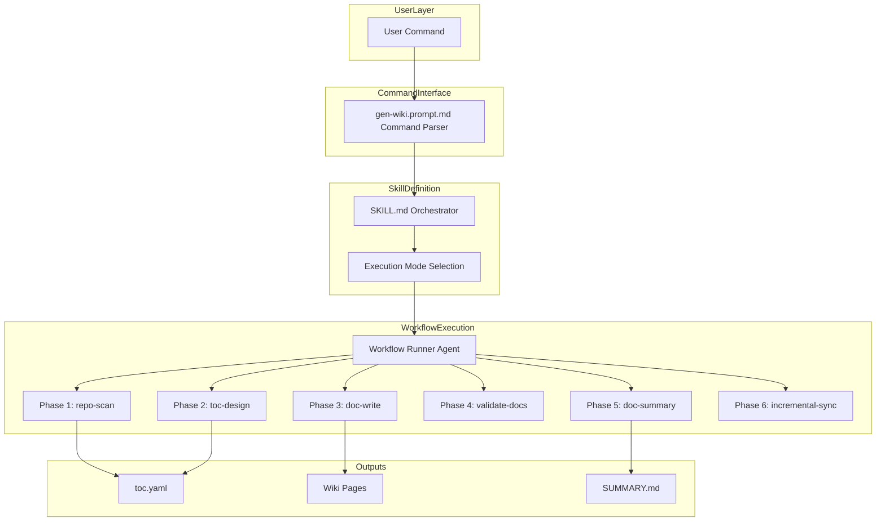
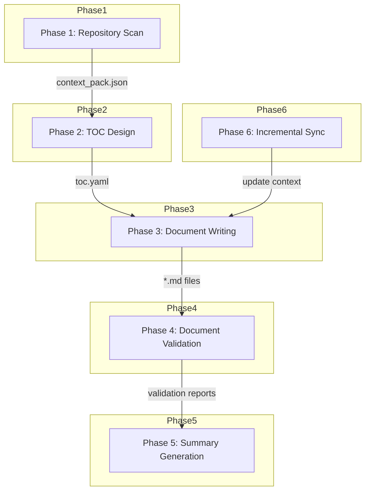

<div align="center">

# 📚 deepwiki-skill

### Generate comprehensive, evidence-based wiki documentation for any codebase

**deepwiki-skill** is a portable **agent skill** that produces DeepWiki-style documentation — with line-level source citations and validated Mermaid diagrams — for Claude Code, Gemini, Codex, and any agent that supports agent skills.

Install it across every harness with **one command** via [apm](https://github.com/microsoft/apm). Zero standalone agents, zero complex setup.


**English** | [中文](./README.zh-CN.md) | [日本語](./README.ja.md)

</div>

---

## Why use deepwiki-skill

- **Standard Agent Skill**: Not another standalone agent, but a reusable skill that works across multiple AI agents
- **Zero Configuration Hassle**: Leverage your existing subscription without complex setup
- **Evidence-Based & Hallucination-Free**: Every key statement includes precise line-level citations from source code
- **Manual Structure Control**: Available to take full control of document structure, solving the problem of uncontrollable auto-generated content
- **CI/CD Ready**: Built-in incremental updates feature makes it easy to deploy in CI/CD pipelines, keeping docs synchronized with code changes

## Features

- **Evidence-Based Documentation**: Every statement traced back to source files with line numbers
- **Mermaid Diagram Support**: Generate and validate flowcharts, sequence diagrams, class diagrams, and more
- **Flexible Execution Modes**: Fully automatic, TOC-file-based, or incremental updates
- **Parallel Processing**: Subagents for faster documentation generation and better context isolation
- **Smart Code Analysis**: Detects multiple programming languages, handles encoding detection, filters binary files
- **Multi-Language & Markdown-Based Output**: Output as Markdown, simple control over output language

## Quick Start

### Prerequisites
- Python >=3.12
- Node.js and Mermaid CLI (for diagram validation)
   ```bash
   npm install -g @mermaid-js/mermaid-cli
   ```

### Installation

> **Note**: While deepwiki-skill works with any coding agent that supports agent skills, Claude Code currently offers the best subagent support for optimal documentation generation. Claude Code is recommended for the best experience.

#### Recommended: apm (Agent Package Manager)

[apm](https://github.com/microsoft/apm) is a package manager for AI agent primitives. It installs the `wiki` skill, the `workflow-runner` agent, and the `gen-wiki` prompt into any supported harness (Claude Code, Copilot, Cursor, Codex, Gemini, and more) from a single manifest — so the same command works everywhere.

First [install the apm CLI](https://microsoft.github.io/apm/quickstart/), then from your project root run:

```bash
apm install natsu1211/deepwiki-skill
```

Or install it globally:

```bash
apm install -g natsu1211/deepwiki-skill
```

apm compiles the primitives into the right place for your harness (e.g. `.claude/skills/wiki/` for Claude Code, `.agents/skills/wiki/` for the converged layout).

### Usage

Just write something like `Use wiki skill to generate wiki documentation` or `Invoke wiki skill to update documents at docs/wiki based on docs/wiki/toc.yaml` to tell the agent to invoke the skill.

Custom command `gen-wiki` is also provided to parse the arguments and explicitly invoke the skill. This allows you to use the skill like a regular CLI tool, making inputs more concise while expressing intent more precisely.

#### Basic Usage

Fully automatic wiki document generation:
```bash
/gen-wiki
```

Generate TOC file only:
```bash
/gen-wiki --structure
```

Generate from existing TOC:
```bash
/gen-wiki docs/wiki/toc.yaml
```

Update documentation after manually changing `toc.yaml` and/or code changes:
```bash
/gen-wiki docs/wiki/toc.yaml --update
```

Specify output directory:
```bash
/gen-wiki --output ./documentation/wiki
```

Generate documentation in Chinese:
```bash
/gen-wiki --language zh-CN
```

Include only specific files:
```bash
/gen-wiki --include "src/**/*.ts"
```

Exclude test files:
```bash
/gen-wiki --exclude "**/*.test.js"
```

Combined arguments:
```bash
/gen-wiki --language zh-CN --output ./docs --exclude "**/*.test.js"
```

Run from CLI (yolo mode / headless mode):
```bash
claude -p "/gen-wiki" --dangerously-skip-permissions
```

#### Use Cases

1. Quickly understand a new project
   - Use fully automatic mode: `/gen-wiki`

2. Generate wiki documentation for your project with control over chapter structure
   - First use structure-only mode to generate initial `toc.yaml`: `/gen-wiki --structure`
   - Modify `docs/wiki/toc.yaml` according to your needs
   - Then use TOC-based mode to regenerate documentation: `/gen-wiki docs/wiki/toc.yaml`

3. Sync documentation when TOC file or code is updated
   - Use Incremental Update mode: `/gen-wiki docs/wiki/toc.yaml --update`

**Available Arguments:**

| Argument | Description |
|----------|-------------|
| `<toc.yaml>` | Path to existing TOC file |
| `--structure` | Generate only TOC structure, stop before generating docs |
| `--update` | Incremental update mode (requires TOC file path) |
| `--output <dir>` | Output directory (default: `./docs/wiki/`) |
| `--language <locale>` | Output language (default: `en-US`, supports almost any locale code) |
| `--include <pattern>` | Include files matching pattern (can use multiple times) |
| `--exclude <pattern>` | Exclude files matching pattern (can use multiple times) |


### CI/CD Integration

#### Claude Code

If you have a Pro/Max subscription, create an OAuth token first (if you prefer to use an API key, save the API key instead of an OAuth token to GitHub secrets).

Open your terminal and input
```
claude setup-token
```

Record the token output in your terminal and save it to GitHub secrets for your repository, giving it a name like `CLAUDE_CODE_OAUTH_TOKEN`.

Then create the GitHub Actions workflow file.
Here is a GitHub Actions workflow example that can be triggered manually to incrementally update existing documentation:
```
name: Wiki Doc Update

on:
  workflow_dispatch:

jobs:
  generate:
    runs-on: ubuntu-latest
    permissions:
      contents: write
      pull-requests: write
      issues: write
      id-token: write
    steps:
      - name: Checkout repository
        uses: actions/checkout@v4
        with:
          fetch-depth: 1

      - name: Setup Node.js
        uses: actions/setup-node@v4
        with:
          node-version: '20'

      - name: Install mermaid-cli
        run: npm install -g @mermaid-js/mermaid-cli

      - name: Setup Python
        uses: actions/setup-python@v5
        with:
          python-version: '3.12'

      - name: Install apm and deepwiki-skill
        run: |
          curl -sSL https://aka.ms/apm-unix | sh
          apm install natsu1211/deepwiki-skill --target claude

      - name: Install Python dependencies
        run: |
          if [ -f .claude/skills/wiki/scripts/requirements.txt ]; then
            pip install -r .claude/skills/wiki/scripts/requirements.txt
          fi

      - name: Run Wiki Doc Update
        id: deepwiki-skill
        uses: anthropics/claude-code-action@v1
        with:
          claude_code_oauth_token: ${{ secrets.CLAUDE_CODE_OAUTH_TOKEN }}
          prompt: '/gen-wiki docs/wiki/toc.yaml --update'
          additional_permissions: |
            actions: read

```

#### Codex
Refer to https://github.com/openai/codex-action

## Technical Details

Check out the detailed documents generated by deepwiki-skill itself: [docs](./docs/wiki)

### Architecture



### Workflow



### Output Structure

```
docs/wiki/
├── toc.yaml                  # Table of Contents definition
├── 01_overview.md            # Generated pages
├── 02_architecture.md
├── 03_workflow.md
├── _context/
│   └── context_pack.json     # Context data for generation
└── _reports/
    ├── SUMMARY.md            # Documentation summary report
    ├── mermaid_invalid.json  # Mermaid diagram validation
    └── structure_validation.json
```

## LICENSE
MIT
