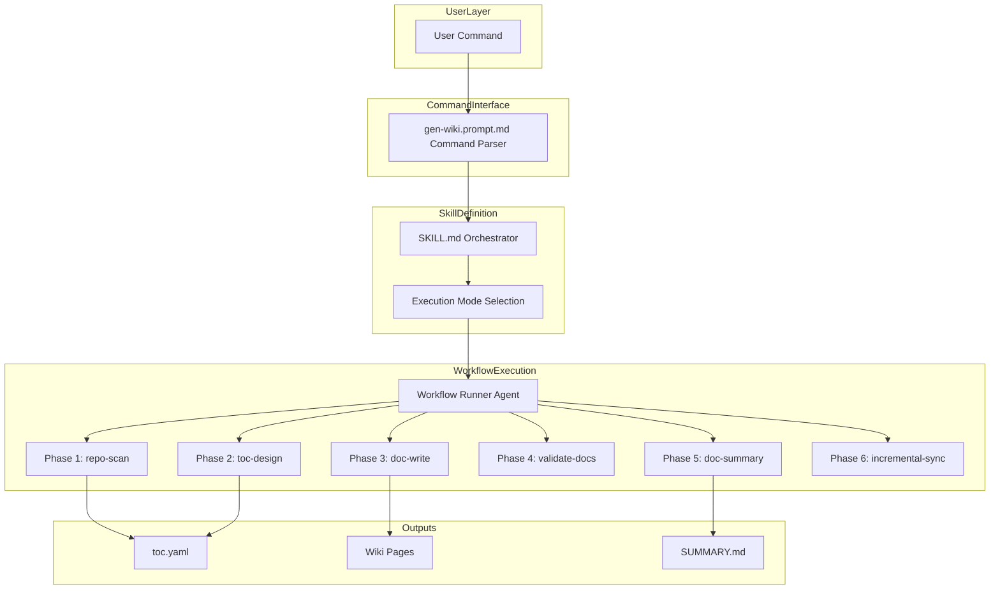
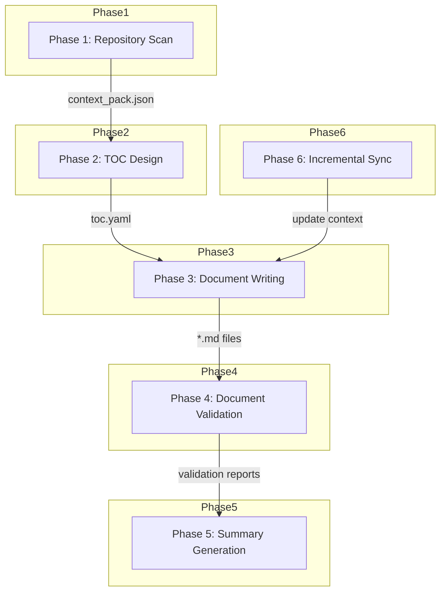

<div align="center">

# 📚 deepwiki-skill

### 为任何代码库生成全面、有据可循的 wiki 风格文档

**deepwiki-skill** 是一个可移植的 **Agent Skill（智能体技能）**，能够生成 DeepWiki 风格的文档 —— 包含行级源码引用与经过校验的 Mermaid 图表 —— 适用于 Claude Code、Gemini、Codex 以及任何支持 agent skill 的智能体。

通过 [apm](https://github.com/microsoft/apm)，只需 **一条命令** 即可在所有运行环境中安装。无需独立智能体，无需复杂配置。


[English](./README.md) | **中文** | [日本語](./README.ja.md)

</div>

---

## 为什么使用 deepwiki-skill

- **标准 Agent Skill**：它不是又一个独立的智能体，而是一个可在多种 AI 智能体间复用的技能
- **零配置烦恼**：复用你现有的订阅，无需复杂的搭建
- **有据可循、杜绝幻觉**：每一条关键陈述都附带来自源码的精确行级引用
- **手动控制结构**：可完全掌控文档结构，解决自动生成内容不可控的问题
- **CI/CD 就绪**：内置增量更新能力，可轻松部署到 CI/CD 流水线中，让文档与代码变更保持同步

## 功能特性

- **有据可循的文档**：每条陈述都可追溯到带行号的源文件
- **支持 Mermaid 图表**：生成并校验流程图、时序图、类图等多种图表
- **灵活的执行模式**：全自动、基于 TOC 文件、或增量更新
- **并行处理**：使用子智能体（subagent）以更快地生成文档并实现更好的上下文隔离
- **智能代码分析**：识别多种编程语言，处理编码检测，过滤二进制文件
- **多语言、基于 Markdown 的输出**：以 Markdown 输出，并可简单控制输出语言

## 快速开始

### 前置条件
- Python >=3.12
- Node.js 和 Mermaid CLI（用于图表校验）
   ```bash
   npm install -g @mermaid-js/mermaid-cli
   ```

### 安装

> **注意**：尽管 deepwiki-skill 适用于任何支持 agent skill 的编码智能体，但目前 Claude Code 对子智能体的支持最佳，能获得最优的文档生成效果。推荐使用 Claude Code 以获得最佳体验。

#### 推荐：apm（Agent Package Manager）

[apm](https://github.com/microsoft/apm) 是面向 AI 智能体基本单元（primitive）的包管理器。它可以通过单一清单文件，将 `wiki` 技能、`workflow-runner` 智能体和 `gen-wiki` 提示词安装到任何受支持的运行环境（Claude Code、Copilot、Cursor、Codex、Gemini 等）中 —— 同一条命令在所有环境中通用。

首先[安装 apm CLI](https://microsoft.github.io/apm/quickstart/)，然后在你的项目根目录下运行：

```bash
apm install natsu1211/deepwiki-skill
```

或进行全局安装：

```bash
apm install -g natsu1211/deepwiki-skill
```

apm 会将这些基本单元编译到适合你运行环境的位置（例如 Claude Code 为 `.claude/skills/wiki/`）。

### 使用方法

只需输入类似 `使用 wiki 技能生成 wiki 文档` 或 `调用 wiki 技能，根据 docs/wiki/toc.yaml 更新 docs/wiki 下的文档` 的内容，即可让智能体调用该技能。

此外还提供了自定义命令 `gen-wiki`，用于解析参数并显式调用技能。这让你可以像使用常规 CLI 工具一样使用该技能，使输入更简洁、意图表达更精确。

#### 基础用法

全自动生成 wiki 文档：
```bash
/gen-wiki
```

仅生成 TOC 文件：
```bash
/gen-wiki --structure
```

基于已有 TOC 生成：
```bash
/gen-wiki docs/wiki/toc.yaml
```

在手动修改 `toc.yaml` 和/或代码变更后更新文档：
```bash
/gen-wiki docs/wiki/toc.yaml --update
```

指定输出目录：
```bash
/gen-wiki --output ./documentation/wiki
```

生成中文文档：
```bash
/gen-wiki --language zh-CN
```

仅包含特定文件：
```bash
/gen-wiki --include "src/**/*.ts"
```

排除测试文件：
```bash
/gen-wiki --exclude "**/*.test.js"
```

组合参数：
```bash
/gen-wiki --language zh-CN --output ./docs --exclude "**/*.test.js"
```

从 CLI 运行（yolo 模式 / 无头模式）：
```bash
claude -p "/gen-wiki" --dangerously-skip-permissions
```

#### 使用场景

1. 快速了解一个新项目
   - 使用全自动模式：`/gen-wiki`

2. 为你的项目生成 wiki 文档，并掌控章节结构
   - 先用 structure-only 模式生成初始 `toc.yaml`：`/gen-wiki --structure`
   - 根据需要修改 `docs/wiki/toc.yaml`
   - 然后用基于 TOC 的模式重新生成文档：`/gen-wiki docs/wiki/toc.yaml`

3. 当 TOC 文件或代码更新时同步文档
   - 使用增量更新模式：`/gen-wiki docs/wiki/toc.yaml --update`

**可用参数：**

| 参数 | 说明 |
|----------|-------------|
| `<toc.yaml>` | 已有 TOC 文件的路径 |
| `--structure` | 仅生成 TOC 结构，在生成文档前停止 |
| `--update` | 增量更新模式（需要 TOC 文件路径） |
| `--output <dir>` | 输出目录（默认：`./docs/wiki/`） |
| `--language <locale>` | 输出语言（默认：`en-US`，支持几乎任意 locale 代码） |
| `--include <pattern>` | 包含匹配该模式的文件（可多次使用） |
| `--exclude <pattern>` | 排除匹配该模式的文件（可多次使用） |


### CI/CD 集成

#### Claude Code

如果你拥有 Pro/Max 订阅，请先创建一个 OAuth token（如果你更喜欢使用 API key，请将 API key 而非 OAuth token 保存到 GitHub secrets 中）。

打开终端并输入
```
claude setup-token
```

记录终端输出的 token，并将其保存到你仓库的 GitHub secrets 中，命名为类似 `CLAUDE_CODE_OAUTH_TOKEN` 的名称。

然后创建 GitHub Actions 工作流文件。
以下是一个可手动触发、用于增量更新现有文档的 GitHub Actions 工作流示例：
```
name: Wiki Doc Update

on:
  workflow_dispatch:

jobs:
  generate:
    runs-on: ubuntu-latest
    permissions:
      contents: write
      pull-requests: write
      issues: write
      id-token: write
    steps:
      - name: Checkout repository
        uses: actions/checkout@v4
        with:
          fetch-depth: 1

      - name: Setup Node.js
        uses: actions/setup-node@v4
        with:
          node-version: '20'

      - name: Install mermaid-cli
        run: npm install -g @mermaid-js/mermaid-cli

      - name: Setup Python
        uses: actions/setup-python@v5
        with:
          python-version: '3.12'

      - name: Install apm and deepwiki-skill
        run: |
          curl -sSL https://aka.ms/apm-unix | sh
          apm install natsu1211/deepwiki-skill --target claude

      - name: Install Python dependencies
        run: |
          if [ -f .claude/skills/wiki/scripts/requirements.txt ]; then
            pip install -r .claude/skills/wiki/scripts/requirements.txt
          fi

      - name: Run Wiki Doc Update
        id: deepwiki-skill
        uses: anthropics/claude-code-action@v1
        with:
          claude_code_oauth_token: ${{ secrets.CLAUDE_CODE_OAUTH_TOKEN }}
          prompt: '/gen-wiki docs/wiki/toc.yaml --update'
          additional_permissions: |
            actions: read

```

#### Codex
参考 https://github.com/openai/codex-action

## 技术细节

查看由 deepwiki-skill 自身生成的详细文档：[docs](./docs/wiki)

### 架构



### 工作流



### 输出结构

```
docs/wiki/
├── toc.yaml                  # 目录（TOC）定义
├── 01_overview.md            # 生成的页面
├── 02_architecture.md
├── 03_workflow.md
├── _context/
│   └── context_pack.json     # 用于生成的上下文数据
└── _reports/
    ├── SUMMARY.md            # 文档汇总报告
    ├── mermaid_invalid.json  # Mermaid 图表校验
    └── structure_validation.json
```

## 许可证
MIT
