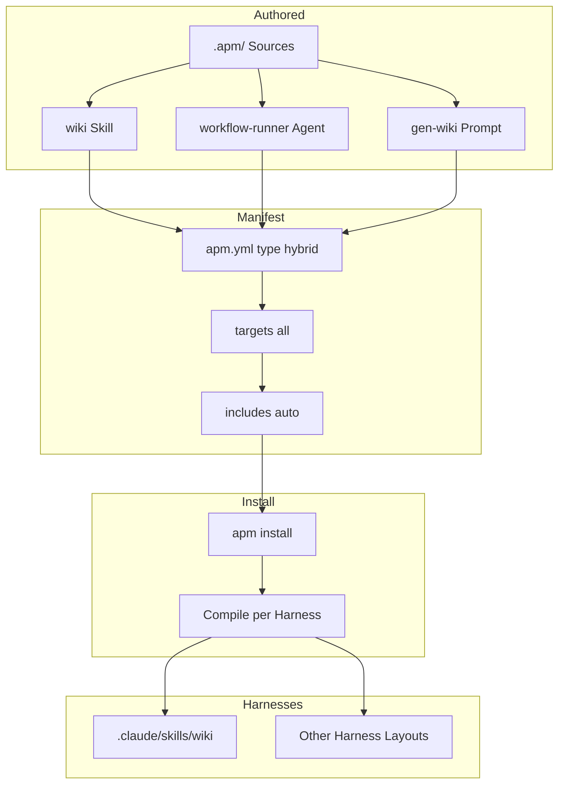

<!-- PAGE_ID: deepwiki-skill_01_overview -->

📚 Relevant source files

The following files were used as context for generating this wiki page:

- [README.md:1-333](https://github.com/natsu1211/deepwiki-skill/blob/5623db8cf158176a7d55791d6fb9bcb992834262/README.md#L1-L333)
- [apm.yml:1-22](https://github.com/natsu1211/deepwiki-skill/blob/5623db8cf158176a7d55791d6fb9bcb992834262/apm.yml#L1-L22)
- [.apm/skills/wiki/SKILL.md:1-83](https://github.com/natsu1211/deepwiki-skill/blob/5623db8cf158176a7d55791d6fb9bcb992834262/.apm/skills/wiki/SKILL.md#L1-L83)

# Overview

> **Related Pages**: [[Architecture|02_architecture.md]], [[Installation and CI/CD Integration|06_cicd.md]]

---

<!-- BEGIN:AUTOGEN deepwiki-skill_01_overview_introduction -->
## Introduction

`deepwiki-skill` is a portable **agent skill** that generates DeepWiki-style documentation — with line-level source citations and validated Mermaid diagrams — for any codebase ([README.md:3-7](https://github.com/natsu1211/deepwiki-skill/blob/5623db8cf158176a7d55791d6fb9bcb992834262/README.md#L3-L7)). Rather than shipping as a standalone agent, it is packaged as a reusable skill intended to run across multiple AI coding agents, including Claude Code, Gemini, and Codex ([README.md:7](https://github.com/natsu1211/deepwiki-skill/blob/5623db8cf158176a7d55791d6fb9bcb992834262/README.md#L7)).

The problem it targets is the unreliability of auto-generated documentation. The project addresses this with two design choices: every key statement is required to include precise line-level citations back to source code, making output **evidence-based and hallucination-free**, and authors may take full control of the document structure to solve "the problem of uncontrollable auto-generated content" ([README.md:26-27](https://github.com/natsu1211/deepwiki-skill/blob/5623db8cf158176a7d55791d6fb9bcb992834262/README.md#L26-L27)).

The skill itself is defined by `SKILL.md`, which describes it as providing "a complete workflow for generating and updating wiki-style documentation for any codebase, with evidence-based citations and Mermaid diagram validation" ([.apm/skills/wiki/SKILL.md:8-9](https://github.com/natsu1211/deepwiki-skill/blob/5623db8cf158176a7d55791d6fb9bcb992834262/.apm/skills/wiki/SKILL.md#L8-L9)). It is intended for developers who want to quickly understand an unfamiliar project, produce structured wiki documentation with controlled chapter layout, or keep documentation synchronized with code in CI/CD ([README.md:128-139](https://github.com/natsu1211/deepwiki-skill/blob/5623db8cf158176a7d55791d6fb9bcb992834262/README.md#L128-L139)).

Sources: [README.md:3-9](https://github.com/natsu1211/deepwiki-skill/blob/5623db8cf158176a7d55791d6fb9bcb992834262/README.md#L3-L9), [README.md:22-28](https://github.com/natsu1211/deepwiki-skill/blob/5623db8cf158176a7d55791d6fb9bcb992834262/README.md#L22-L28), [README.md:128-139](https://github.com/natsu1211/deepwiki-skill/blob/5623db8cf158176a7d55791d6fb9bcb992834262/README.md#L128-L139), [.apm/skills/wiki/SKILL.md:8-9](https://github.com/natsu1211/deepwiki-skill/blob/5623db8cf158176a7d55791d6fb9bcb992834262/.apm/skills/wiki/SKILL.md#L8-L9)
<!-- END:AUTOGEN deepwiki-skill_01_overview_introduction -->

---

<!-- BEGIN:AUTOGEN deepwiki-skill_01_overview_features -->
## Key Features

The skill is built around evidence-based output, diagram validation, and flexible execution. The following capabilities are documented in the README:

| Feature | Description |
|---------|-------------|
| Evidence-Based Documentation | Every statement is traced back to source files with line numbers ([README.md:32](https://github.com/natsu1211/deepwiki-skill/blob/5623db8cf158176a7d55791d6fb9bcb992834262/README.md#L32)) |
| Mermaid Diagram Support | Generates and validates flowcharts, sequence diagrams, class diagrams, and more ([README.md:33](https://github.com/natsu1211/deepwiki-skill/blob/5623db8cf158176a7d55791d6fb9bcb992834262/README.md#L33)) |
| Flexible Execution Modes | Fully automatic, TOC-file-based, or incremental updates ([README.md:34](https://github.com/natsu1211/deepwiki-skill/blob/5623db8cf158176a7d55791d6fb9bcb992834262/README.md#L34)) |
| Parallel Processing | Subagents enable faster generation and better context isolation ([README.md:35](https://github.com/natsu1211/deepwiki-skill/blob/5623db8cf158176a7d55791d6fb9bcb992834262/README.md#L35)) |
| Smart Code Analysis | Detects multiple programming languages, handles encoding detection, and filters binary files ([README.md:36](https://github.com/natsu1211/deepwiki-skill/blob/5623db8cf158176a7d55791d6fb9bcb992834262/README.md#L36)) |
| Multi-Language & Markdown Output | Outputs Markdown with simple control over the output language ([README.md:37](https://github.com/natsu1211/deepwiki-skill/blob/5623db8cf158176a7d55791d6fb9bcb992834262/README.md#L37)) |

These features map onto the four execution modes exposed by the skill — **Automatic**, **Structure-only**, **TOC-based**, and **Incremental** — each of which runs a different sequence of workflow phases ([.apm/skills/wiki/SKILL.md:31-36](https://github.com/natsu1211/deepwiki-skill/blob/5623db8cf158176a7d55791d6fb9bcb992834262/.apm/skills/wiki/SKILL.md#L31-L36)). The parallel-processing feature is realized by spawning one `workflow-runner` subagent per page during the `doc-write` phase, with all page subagents running in the foreground before validation proceeds ([.apm/skills/wiki/SKILL.md:58-82](https://github.com/natsu1211/deepwiki-skill/blob/5623db8cf158176a7d55791d6fb9bcb992834262/.apm/skills/wiki/SKILL.md#L58-L82)).

Beyond the feature list, the README highlights operational benefits: it requires zero standalone agents and minimal setup, leverages an existing agent subscription, and is **CI/CD ready** through built-in incremental updates that keep docs synchronized with code changes ([README.md:24-28](https://github.com/natsu1211/deepwiki-skill/blob/5623db8cf158176a7d55791d6fb9bcb992834262/README.md#L24-L28)).

Sources: [README.md:24-37](https://github.com/natsu1211/deepwiki-skill/blob/5623db8cf158176a7d55791d6fb9bcb992834262/README.md#L24-L37), [.apm/skills/wiki/SKILL.md:31-36](https://github.com/natsu1211/deepwiki-skill/blob/5623db8cf158176a7d55791d6fb9bcb992834262/.apm/skills/wiki/SKILL.md#L31-L36), [.apm/skills/wiki/SKILL.md:58-82](https://github.com/natsu1211/deepwiki-skill/blob/5623db8cf158176a7d55791d6fb9bcb992834262/.apm/skills/wiki/SKILL.md#L58-L82)
<!-- END:AUTOGEN deepwiki-skill_01_overview_features -->

---

<!-- BEGIN:AUTOGEN deepwiki-skill_01_overview_packaging -->
## Packaging and Distribution Model

`deepwiki-skill` is distributed as a package for [apm](https://github.com/microsoft/apm), a package manager for AI agent primitives ([README.md:52-54](https://github.com/natsu1211/deepwiki-skill/blob/5623db8cf158176a7d55791d6fb9bcb992834262/README.md#L52-L54)). The package manifest declares the package `type: hybrid`, which bundles three primitives together — a skill, a `workflow-runner` agent, and a generation prompt ([apm.yml:9-10](https://github.com/natsu1211/deepwiki-skill/blob/5623db8cf158176a7d55791d6fb9bcb992834262/apm.yml#L9-L10)). According to the README, a single `apm install` installs "the `wiki` skill, the `workflow-runner` agent, and the `gen-wiki` prompt into any supported harness (Claude Code, Copilot, Cursor, Codex, Gemini, and more) from a single manifest — so the same command works everywhere" ([README.md:54](https://github.com/natsu1211/deepwiki-skill/blob/5623db8cf158176a7d55791d6fb9bcb992834262/README.md#L54)).

The manifest targets all supported harnesses via `targets: all`, with a note that the wiki skill deploys everywhere while the `workflow-runner` agent deploys only to harnesses that support agents — others fall back to sequential execution ([apm.yml:12-15](https://github.com/natsu1211/deepwiki-skill/blob/5623db8cf158176a7d55791d6fb9bcb992834262/apm.yml#L12-L15)). The `includes: auto` setting publishes everything authored under `.apm/` (the `skills/wiki`, `agents`, and `prompts` directories) ([apm.yml:17-18](https://github.com/natsu1211/deepwiki-skill/blob/5623db8cf158176a7d55791d6fb9bcb992834262/apm.yml#L17-L18)).

At install time, apm compiles these primitives into the harness-specific location — for example `.claude/skills/wiki/` for Claude Code, or `.agents/skills/wiki/` for the converged layout ([README.md:68](https://github.com/natsu1211/deepwiki-skill/blob/5623db8cf158176a7d55791d6fb9bcb992834262/README.md#L68)). The package can be installed into a single project or globally with the `-g` flag ([README.md:58-66](https://github.com/natsu1211/deepwiki-skill/blob/5623db8cf158176a7d55791d6fb9bcb992834262/README.md#L58-L66)).

The following flowchart summarizes how the authored sources become harness-specific installed primitives:

Sources: [apm.yml:1-22](https://github.com/natsu1211/deepwiki-skill/blob/5623db8cf158176a7d55791d6fb9bcb992834262/apm.yml#L1-L22), [README.md:52-68](https://github.com/natsu1211/deepwiki-skill/blob/5623db8cf158176a7d55791d6fb9bcb992834262/README.md#L52-L68)
<!-- END:AUTOGEN deepwiki-skill_01_overview_packaging -->

---
