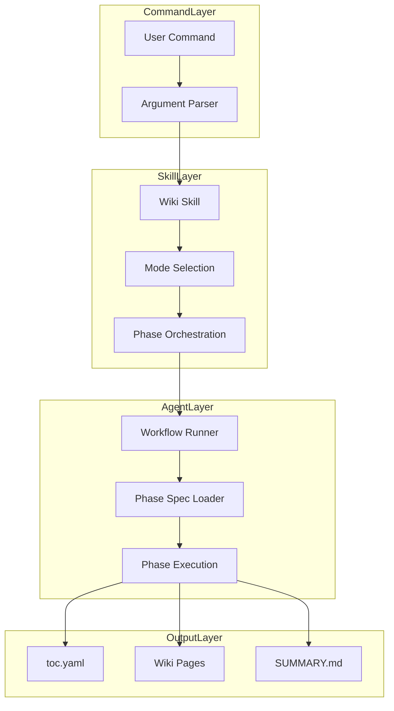
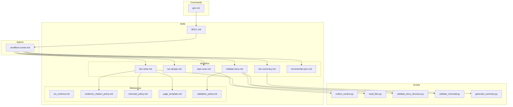

<!-- PAGE_ID: deepwiki-skill_02_architecture -->

Relevant source files

The following files were used as context for generating this wiki page:

- [SKILL.md:1-97](https://github.com/natsu1211/deepwiki-skill/blob/38f3e4f642cfbc9511d4cc1421b2c1ded9febd97/skills/wiki/SKILL.md#L1-L97)
- [workflow-runner.md:1-51](https://github.com/natsu1211/deepwiki-skill/blob/38f3e4f642cfbc9511d4cc1421b2c1ded9febd97/agents/workflow-runner.md#L1-L51)
- [gen.md:1-27](https://github.com/natsu1211/deepwiki-skill/blob/38f3e4f642cfbc9511d4cc1421b2c1ded9febd97/commands/gen.md#L1-L27)

# Architecture

> **Related Pages**: [[Overview|01_overview.md]], [[Workflow Phases|03_workflow-phases.md]]

---

<!-- BEGIN:AUTOGEN deepwiki-skill_02_architecture_system-overview -->
## System Overview

This section describes the high-level architecture of deepwiki-skill, showing how the skill, agent, and commands interact to generate wiki documentation.

The deepwiki-skill system is built on a three-layer architecture that separates concerns between user-facing commands, orchestration logic, and phase-specific execution ([SKILL.md:8-9](https://github.com/natsu1211/deepwiki-skill/blob/38f3e4f642cfbc9511d4cc1421b2c1ded9febd97/skills/wiki/SKILL.md#L8-L9)).

### Architecture Layers

| Layer | Component | Responsibility |
|-------|-----------|----------------|
| Command Layer | `commands/gen.md` | Parse user arguments, determine execution mode ([gen.md:6-12](https://github.com/natsu1211/deepwiki-skill/blob/38f3e4f642cfbc9511d4cc1421b2c1ded9febd97/commands/gen.md#L6-L12)) |
| Skill Layer | `skills/wiki/SKILL.md` | Define workflow phases, manage execution order ([SKILL.md:16-25](https://github.com/natsu1211/deepwiki-skill/blob/38f3e4f642cfbc9511d4cc1421b2c1ded9febd97/skills/wiki/SKILL.md#L16-L25)) |
| Agent Layer | `agents/workflow-runner.md` | Execute individual phases according to phase specs ([workflow-runner.md:1-6](https://github.com/natsu1211/deepwiki-skill/blob/38f3e4f642cfbc9511d4cc1421b2c1ded9febd97/agents/workflow-runner.md#L1-L6)) |

### System Flow

The workflow runner acts as a generic executor that loads phase specifications and produces outputs according to the phase spec contract ([workflow-runner.md:22-32](https://github.com/natsu1211/deepwiki-skill/blob/38f3e4f642cfbc9511d4cc1421b2c1ded9febd97/agents/workflow-runner.md#L22-L32)). Each phase spec must define a Goal, Inputs, Outputs, Scripts, Workflow, and Validation criteria.

Sources: [SKILL.md:8-25](https://github.com/natsu1211/deepwiki-skill/blob/38f3e4f642cfbc9511d4cc1421b2c1ded9febd97/skills/wiki/SKILL.md#L8-L25), [workflow-runner.md:1-32](https://github.com/natsu1211/deepwiki-skill/blob/38f3e4f642cfbc9511d4cc1421b2c1ded9febd97/agents/workflow-runner.md#L1-L32), [gen.md:1-12](https://github.com/natsu1211/deepwiki-skill/blob/38f3e4f642cfbc9511d4cc1421b2c1ded9febd97/commands/gen.md#L1-L12)
<!-- END:AUTOGEN deepwiki-skill_02_architecture_system-overview -->

---

<!-- BEGIN:AUTOGEN deepwiki-skill_02_architecture_component-structure -->
## Component Structure

This section explains the directory organization and the role of each component in the deepwiki-skill project.

### Directory Layout

The project follows a modular structure with clear separation between skills, agents, commands, and scripts:

| Directory | Purpose |
|-----------|---------|
| `skills/wiki/` | Main skill definition and workflow references ([SKILL.md:1-4](https://github.com/natsu1211/deepwiki-skill/blob/38f3e4f642cfbc9511d4cc1421b2c1ded9febd97/skills/wiki/SKILL.md#L1-L4)) |
| `skills/wiki/references/` | Policy files and phase specifications |
| `skills/wiki/scripts/` | Python utility scripts for execution |
| `agents/` | Subagent definitions for parallel execution ([workflow-runner.md:1-8](https://github.com/natsu1211/deepwiki-skill/blob/38f3e4f642cfbc9511d4cc1421b2c1ded9febd97/agents/workflow-runner.md#L1-L8)) |
| `commands/` | User-facing command definitions ([gen.md:1-6](https://github.com/natsu1211/deepwiki-skill/blob/38f3e4f642cfbc9511d4cc1421b2c1ded9febd97/commands/gen.md#L1-L6)) |

### Component Relationships

### Reference Files

The skill includes reference files that define policies for documentation generation ([SKILL.md:38-50](https://github.com/natsu1211/deepwiki-skill/blob/38f3e4f642cfbc9511d4cc1421b2c1ded9febd97/skills/wiki/SKILL.md#L38-L50)):

| Reference | Usage Phase | Purpose |
|-----------|-------------|---------|
| `toc_schema.md` | Phase 2 (TOC Design) | YAML schema specification |
| `evidence_citation_policy.md` | Phase 3 (Doc Write) | Source citation rules |
| `page_template.md` | Phase 3 (Doc Write) | Page structure and markers |
| `mermaid_policy.md` | Phase 3, 4 | Mermaid syntax rules |
| `validation_policy.md` | Phase 4 (Validate) | Structure validation rules |
| `doc_update_policy.md` | Phase 6 (Incremental) | Update algorithm details |

Sources: [SKILL.md:38-50](https://github.com/natsu1211/deepwiki-skill/blob/38f3e4f642cfbc9511d4cc1421b2c1ded9febd97/skills/wiki/SKILL.md#L38-L50), [workflow-runner.md:40-41](https://github.com/natsu1211/deepwiki-skill/blob/38f3e4f642cfbc9511d4cc1421b2c1ded9febd97/agents/workflow-runner.md#L40-L41)
<!-- END:AUTOGEN deepwiki-skill_02_architecture_component-structure -->

---

<!-- BEGIN:AUTOGEN deepwiki-skill_02_architecture_execution-modes -->
## Execution Modes

This section documents the different execution modes supported by deepwiki-skill and their corresponding phase sequences.

The skill supports four execution modes, each designed for different use cases ([SKILL.md:27-36](https://github.com/natsu1211/deepwiki-skill/blob/38f3e4f642cfbc9511d4cc1421b2c1ded9febd97/skills/wiki/SKILL.md#L27-L36)):

### Mode Overview

| Mode | Command | Phases | Use Case |
|------|---------|--------|----------|
| Automatic | `/gen` | 1 -> 2 -> 3 -> 4 -> 5 | Full pipeline for new documentation ([gen.md:8](https://github.com/natsu1211/deepwiki-skill/blob/38f3e4f642cfbc9511d4cc1421b2c1ded9febd97/commands/gen.md#L8)) |
| Structure-only | `/gen --structure` | 1 -> 2 | Generate TOC only, stop before docs ([gen.md:9](https://github.com/natsu1211/deepwiki-skill/blob/38f3e4f642cfbc9511d4cc1421b2c1ded9febd97/commands/gen.md#L9)) |
| TOC-based | `/gen <toc.yaml>` | 3 -> 4 -> 5 | Generate docs from existing TOC ([gen.md:10](https://github.com/natsu1211/deepwiki-skill/blob/38f3e4f642cfbc9511d4cc1421b2c1ded9febd97/commands/gen.md#L10)) |
| Incremental | `/gen <toc.yaml> --update` | 6 -> 3 -> 4 -> 5 | Update docs after code changes ([gen.md:11](https://github.com/natsu1211/deepwiki-skill/blob/38f3e4f642cfbc9511d4cc1421b2c1ded9febd97/commands/gen.md#L11)) |

### Phase Flow by Mode

```mermaid
graph TD
    subgraph AutomaticMode
        A1["1: repo-scan"] --> A2["2: toc-design"]
        A2 --> A3["3: doc-write"]
        A3 --> A4["4: validate-docs"]
        A4 --> A5["5: doc-summary"]
    end

    subgraph StructureOnlyMode
        S1["1: repo-scan"] --> S2["2: toc-design"]
        S2 --> S3["Stop"]
    end

    subgraph TOCBasedMode
        T1["3: doc-write"] --> T2["4: validate-docs"]
        T2 --> T3["5: doc-summary"]
    end

    subgraph IncrementalMode
        I1["6: incremental-sync"] --> I2["3: doc-write"]
        I2 --> I3["4: validate-docs"]
        I3 --> I4["5: doc-summary"]
    end
```

### Workflow Inputs

The workflow runner accepts the following inputs for phase execution ([workflow-runner.md:10-20](https://github.com/natsu1211/deepwiki-skill/blob/38f3e4f642cfbc9511d4cc1421b2c1ded9febd97/agents/workflow-runner.md#L10-L20)):

| Input | Required | Default | Description |
|-------|----------|---------|-------------|
| `phase_id` | Yes | - | The workflow phase to run |
| `phase_spec` | Yes | - | Absolute path to the phase spec file |
| `repo_path` | Yes | - | Absolute path to the target repository |
| `output_dir` | No | `docs/wiki` | Documentation output directory |
| `toc_file` | No | - | Path to `toc.yaml` |
| `doc_dir` | No | `output_dir` | Documentation directory containing `.md` files |
| `language` | No | `en-US` | Language locale code for output |
| `mode` | No | - | Execution mode for phase-specific branching |

### Command Arguments

The `/gen` command supports the following arguments ([gen.md:14-24](https://github.com/natsu1211/deepwiki-skill/blob/38f3e4f642cfbc9511d4cc1421b2c1ded9febd97/commands/gen.md#L14-L24)):

| Argument | Description |
|----------|-------------|
| `<toc.yaml>` | Path to existing TOC file |
| `--structure` | Generate only TOC structure, stop before docs |
| `--update` | Incremental update mode (requires TOC file) |
| `--output <dir>` | Output directory (default: `./docs/wiki/`) |
| `--language <locale>` | Output language (default: `en-US`) |
| `--include <pattern>` | Include files matching pattern |
| `--exclude <pattern>` | Exclude files matching pattern |

### Parallel Execution Support

When subagent support is available, the `doc-write` phase (Phase 3) can execute in parallel by spawning one subagent per page ([SKILL.md:69-97](https://github.com/natsu1211/deepwiki-skill/blob/38f3e4f642cfbc9511d4cc1421b2c1ded9febd97/skills/wiki/SKILL.md#L69-L97)). The parallel execution rules specify that each subagent generates exactly one page, all subagents run in foreground (not background), and the system waits for all page subagents to complete before proceeding to Phase 4.

Sources: [SKILL.md:27-36](https://github.com/natsu1211/deepwiki-skill/blob/38f3e4f642cfbc9511d4cc1421b2c1ded9febd97/skills/wiki/SKILL.md#L27-L36), [SKILL.md:69-97](https://github.com/natsu1211/deepwiki-skill/blob/38f3e4f642cfbc9511d4cc1421b2c1ded9febd97/skills/wiki/SKILL.md#L69-L97), [workflow-runner.md:10-20](https://github.com/natsu1211/deepwiki-skill/blob/38f3e4f642cfbc9511d4cc1421b2c1ded9febd97/agents/workflow-runner.md#L10-L20), [gen.md:14-24](https://github.com/natsu1211/deepwiki-skill/blob/38f3e4f642cfbc9511d4cc1421b2c1ded9febd97/commands/gen.md#L14-L24)
<!-- END:AUTOGEN deepwiki-skill_02_architecture_execution-modes -->

---
