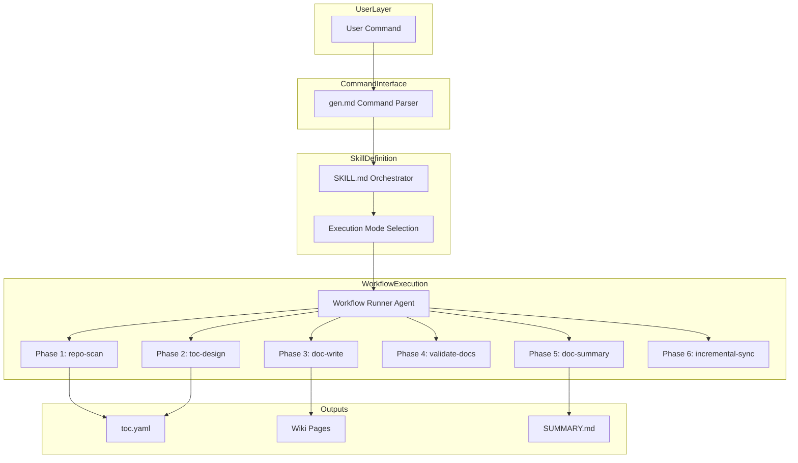
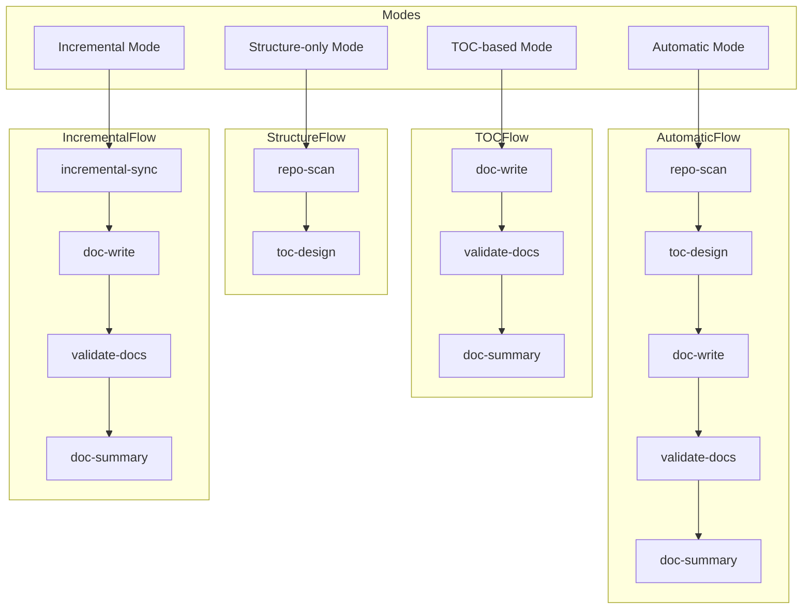

<!-- PAGE_ID: deepwiki-skill_02_architecture -->
<details>
<summary>Relevant source files</summary>

The following files were used as context for generating this wiki page:

- [SKILL.md:1-83](https://github.com/natsu1211/deepwiki-skill/blob/784d30af68157f49d7f829f85d49dafe9fba65cd/skills/wiki/SKILL.md#L1-L83)
- [gen.md:1-27](https://github.com/natsu1211/deepwiki-skill/blob/784d30af68157f49d7f829f85d49dafe9fba65cd/commands/gen.md#L1-L27)
- [workflow-runner.md:1-51](https://github.com/natsu1211/deepwiki-skill/blob/784d30af68157f49d7f829f85d49dafe9fba65cd/agents/workflow-runner.md#L1-L51)

</details>

# Architecture

> **Related Pages**: [[Overview|01_overview.md]], [[Workflow Phases|03_workflow.md]]

---

<!-- BEGIN:AUTOGEN deepwiki-skill_02_architecture_overview -->
## System Overview

This section provides a high-level view of the deepwiki-skill architecture and how its components interact to generate comprehensive wiki documentation.

The deepwiki-skill follows a layered architecture with three primary components: the command interface, the skill definition, and the workflow runner agent. The command interface (`commands/gen.md`) parses user input and determines the execution mode ([gen.md:7-12](https://github.com/natsu1211/deepwiki-skill/blob/784d30af68157f49d7f829f85d49dafe9fba65cd/commands/gen.md#L7-L12)). The skill definition (`skills/wiki/SKILL.md`) orchestrates the workflow by defining phases and execution order ([SKILL.md:16-25](https://github.com/natsu1211/deepwiki-skill/blob/784d30af68157f49d7f829f85d49dafe9fba65cd/skills/wiki/SKILL.md#L16-L25)). The workflow runner agent executes individual phases according to their specifications ([workflow-runner.md:1-6](https://github.com/natsu1211/deepwiki-skill/blob/784d30af68157f49d7f829f85d49dafe9fba65cd/agents/workflow-runner.md#L1-L6)).



The workflow runner agent is a generic subagent responsible for executing exactly one phase at a time, loading only the files explicitly referenced in each phase specification ([workflow-runner.md:3-6](https://github.com/natsu1211/deepwiki-skill/blob/784d30af68157f49d7f829f85d49dafe9fba65cd/agents/workflow-runner.md#L3-L6)).

Sources: [SKILL.md:8-25](https://github.com/natsu1211/deepwiki-skill/blob/784d30af68157f49d7f829f85d49dafe9fba65cd/skills/wiki/SKILL.md#L8-L25), [gen.md:1-12](https://github.com/natsu1211/deepwiki-skill/blob/784d30af68157f49d7f829f85d49dafe9fba65cd/commands/gen.md#L1-L12), [workflow-runner.md:1-8](https://github.com/natsu1211/deepwiki-skill/blob/784d30af68157f49d7f829f85d49dafe9fba65cd/agents/workflow-runner.md#L1-L8)
<!-- END:AUTOGEN deepwiki-skill_02_architecture_overview -->

---

<!-- BEGIN:AUTOGEN deepwiki-skill_02_architecture_skill-definition -->
## Skill Definition

The skill definition in `SKILL.md` serves as the central orchestrator for the wiki generation workflow. It defines the complete set of workflow phases and determines how they are executed based on the selected mode.

### Workflow Phase Definitions

The skill defines six workflow phases, each with a unique identifier and specification file ([SKILL.md:16-25](https://github.com/natsu1211/deepwiki-skill/blob/784d30af68157f49d7f829f85d49dafe9fba65cd/skills/wiki/SKILL.md#L16-L25)):

| Phase | Phase ID | Phase Spec | Purpose |
|-------|----------|------------|---------|
| 1 | `repo-scan` | `/references/workflow/repo-scan.md` | Scan repository to get context for TOC design ([SKILL.md:20](https://github.com/natsu1211/deepwiki-skill/blob/784d30af68157f49d7f829f85d49dafe9fba65cd/skills/wiki/SKILL.md#L20)) |
| 2 | `toc-design` | `/references/workflow/toc-design.md` | Design TOC structure ([SKILL.md:21](https://github.com/natsu1211/deepwiki-skill/blob/784d30af68157f49d7f829f85d49dafe9fba65cd/skills/wiki/SKILL.md#L21)) |
| 3 | `doc-write` | `/references/workflow/doc-write.md` | Generate documentation pages ([SKILL.md:22](https://github.com/natsu1211/deepwiki-skill/blob/784d30af68157f49d7f829f85d49dafe9fba65cd/skills/wiki/SKILL.md#L22)) |
| 4 | `validate-docs` | `/references/workflow/validate-docs.md` | Validate diagrams and structure ([SKILL.md:23](https://github.com/natsu1211/deepwiki-skill/blob/784d30af68157f49d7f829f85d49dafe9fba65cd/skills/wiki/SKILL.md#L23)) |
| 5 | `doc-summary` | `/references/workflow/doc-summary.md` | Generate SUMMARY.md report ([SKILL.md:24](https://github.com/natsu1211/deepwiki-skill/blob/784d30af68157f49d7f829f85d49dafe9fba65cd/skills/wiki/SKILL.md#L24)) |
| 6 | `incremental-sync` | `/references/workflow/incremental-sync.md` | Detect TOC and source changes ([SKILL.md:25](https://github.com/natsu1211/deepwiki-skill/blob/784d30af68157f49d7f829f85d49dafe9fba65cd/skills/wiki/SKILL.md#L25)) |

### Subagent Invocation

When subagent support is available, the skill spawns workflow runner subagents with specific inputs for each phase ([SKILL.md:41-53](https://github.com/natsu1211/deepwiki-skill/blob/784d30af68157f49d7f829f85d49dafe9fba65cd/skills/wiki/SKILL.md#L41-L53)):

```
subagent: deepwiki:workflow-runner
inputs:
  phase_id: "{phase_id}"
  phase_spec: "absolute path of {phase_spec}"
  repo_path: "{repo_path}"
  output_dir: "{output_dir}"
  toc_file: "{toc_file}"
  page_id: "{page_id}"
  language: "{language}"
```

### Parallel Execution for doc-write

The `doc-write` phase supports parallel execution when subagent support is available. Instead of generating all pages sequentially, the skill spawns multiple subagents in foreground, one per page ([SKILL.md:55-58](https://github.com/natsu1211/deepwiki-skill/blob/784d30af68157f49d7f829f85d49dafe9fba65cd/skills/wiki/SKILL.md#L55-L58)). The parallel execution rules require each subagent to generate exactly one page, run in foreground (not background), and wait for all subagents to complete before proceeding to validation ([SKILL.md:79-83](https://github.com/natsu1211/deepwiki-skill/blob/784d30af68157f49d7f829f85d49dafe9fba65cd/skills/wiki/SKILL.md#L79-L83)).

Sources: [SKILL.md:1-83](https://github.com/natsu1211/deepwiki-skill/blob/784d30af68157f49d7f829f85d49dafe9fba65cd/skills/wiki/SKILL.md#L1-L83)
<!-- END:AUTOGEN deepwiki-skill_02_architecture_skill-definition -->

---

<!-- BEGIN:AUTOGEN deepwiki-skill_02_architecture_command-interface -->
## Command Interface

The command interface defined in `commands/gen.md` provides the user-facing entry point for wiki generation. It supports multiple invocation patterns that map to different execution modes.

### Command Usage

The command supports four primary usage patterns ([gen.md:7-12](https://github.com/natsu1211/deepwiki-skill/blob/784d30af68157f49d7f829f85d49dafe9fba65cd/commands/gen.md#L7-L12)):

| Pattern | Mode |
|---------|------|
| `/deepwiki-local:gen` | Automatic mode: full pipeline |
| `/deepwiki-local:gen --structure` | Structure-only mode: generate TOC only |
| `/deepwiki-local:gen <toc.yaml>` | TOC-based mode: generate from existing TOC |
| `/deepwiki-local:gen <toc.yaml> --update` | Incremental update mode: update based on changes |

### Arguments

The command accepts the following arguments ([gen.md:14-25](https://github.com/natsu1211/deepwiki-skill/blob/784d30af68157f49d7f829f85d49dafe9fba65cd/commands/gen.md#L14-L25)):

| Argument | Description |
|----------|-------------|
| `<toc.yaml>` | Path to existing TOC file |
| `--structure` | Generate only TOC structure, stop before docs |
| `--update` | Incremental update mode (requires TOC file) |
| `--output <dir>` | Output directory (default: `./docs/wiki/`) |
| `--language <locale>` | Output language (default: `en-US`) |
| `--include <pattern>` | Include files matching pattern |
| `--exclude <pattern>` | Exclude files matching pattern |

The command parses these arguments and uses the `wiki` skill to generate wiki documentation for the current repository ([gen.md:26-27](https://github.com/natsu1211/deepwiki-skill/blob/784d30af68157f49d7f829f85d49dafe9fba65cd/commands/gen.md#L26-L27)).

Sources: [gen.md:1-27](https://github.com/natsu1211/deepwiki-skill/blob/784d30af68157f49d7f829f85d49dafe9fba65cd/commands/gen.md#L1-L27)
<!-- END:AUTOGEN deepwiki-skill_02_architecture_command-interface -->

---

<!-- BEGIN:AUTOGEN deepwiki-skill_02_architecture_workflow-runner -->
## Workflow Runner Agent

The workflow runner agent (`agents/workflow-runner.md`) is a generic subagent responsible for executing individual workflow phases. It follows a strict contract to ensure consistent and predictable phase execution.

### Core Responsibilities

The workflow runner executes exactly one phase per invocation by ([workflow-runner.md:3-6](https://github.com/natsu1211/deepwiki-skill/blob/784d30af68157f49d7f829f85d49dafe9fba65cd/agents/workflow-runner.md#L3-L6)):

1. Loading the phase specification file from `phase_spec`
2. Loading only the additional files that spec explicitly references (references/scripts/templates)
3. Producing the declared outputs and validations

### Input Parameters

The workflow runner receives the following inputs ([workflow-runner.md:10-20](https://github.com/natsu1211/deepwiki-skill/blob/784d30af68157f49d7f829f85d49dafe9fba65cd/agents/workflow-runner.md#L10-L20)):

| Parameter | Required | Description |
|-----------|----------|-------------|
| `phase_id` | Yes | The workflow phase to run (must match a file in `skills/wiki/references/workflow/`) |
| `phase_spec` | Yes | Absolute path to the phase spec file |
| `repo_path` | Yes | Absolute path to the target repository |
| `output_dir` | No | Documentation output directory (default: `docs/wiki`) |
| `toc_file` | No | Path to `toc.yaml` |
| `doc_dir` | No | Documentation directory containing `.md` files (defaults to `output_dir`) |
| `language` | No | Language locale code of output (default: en-US) |
| `mode` | No | Execution mode for phase-specific branching |

### Phase Spec Contract

Each phase specification file must define ([workflow-runner.md:22-32](https://github.com/natsu1211/deepwiki-skill/blob/784d30af68157f49d7f829f85d49dafe9fba65cd/agents/workflow-runner.md#L22-L32)):

- **Goal**: A concise statement describing what the phase accomplishes
- **Inputs**: Parameters the phase receives (table with Name, Required, Default, Description columns)
- **Outputs**: Files or directories the phase produces (table with Path, Description columns)
- **Scripts**: Available scripts with function signatures, parameters, and return values
- **Workflow**: Step-by-step instructions to accomplish the goal
- **Validation**: Concrete checks to run before declaring success

### Execution Rules

The workflow runner follows strict execution rules ([workflow-runner.md:34-51](https://github.com/natsu1211/deepwiki-skill/blob/784d30af68157f49d7f829f85d49dafe9fba65cd/agents/workflow-runner.md#L34-L51)):

1. **Path Resolution**: Resolve `doc_dir` to `output_dir` if not specified, treat all relative paths as relative to workspace root
2. **Reference Loading**: Load the phase spec first, then load only files listed under the References section
3. **Output Discipline**: Produce only the outputs declared in the step spec, do not modify other files
4. **Failure Handling**: Stop at the failing action and report the command/output that failed
5. **Output Path Discipline**: Only create files at `output_dir` and its sub-directories

Sources: [workflow-runner.md:1-51](https://github.com/natsu1211/deepwiki-skill/blob/784d30af68157f49d7f829f85d49dafe9fba65cd/agents/workflow-runner.md#L1-L51)
<!-- END:AUTOGEN deepwiki-skill_02_architecture_workflow-runner -->

---

<!-- BEGIN:AUTOGEN deepwiki-skill_02_architecture_execution-modes -->
## Execution Modes

The deepwiki-skill supports four execution modes, each designed for different use cases and executing a specific sequence of workflow phases.

### Mode Overview

The skill provides the following execution modes ([SKILL.md:27-36](https://github.com/natsu1211/deepwiki-skill/blob/784d30af68157f49d7f829f85d49dafe9fba65cd/skills/wiki/SKILL.md#L27-L36)):

| Mode | Phases | Description |
|------|--------|-------------|
| **Automatic** | 1 -> 2 -> 3 -> 4 -> 5 | Full pipeline for new documentation |
| **Structure-only** | 1 -> 2 | Generate TOC only, stop before docs |
| **TOC-based** | 3 -> 4 -> 5 | Generate docs from existing `toc.yaml` |
| **Incremental** | 6 -> 3 -> 4 -> 5 | Update docs after code changes |



### Automatic Mode

The automatic mode runs the complete pipeline (phases 1 through 5) for generating new documentation from scratch. It scans the repository, designs the TOC structure, writes all documentation pages, validates the output, and generates a summary report.

### Structure-only Mode

The structure-only mode (triggered by `--structure` flag) runs only phases 1 and 2. It scans the repository and generates the `toc.yaml` file without producing any documentation pages. This mode is useful for reviewing and customizing the proposed structure before generating full documentation.

### TOC-based Mode

The TOC-based mode (triggered by providing a `toc.yaml` path without `--update`) skips repository scanning and TOC design. It generates documentation directly from an existing `toc.yaml` file, validates the output, and produces a summary. This mode is useful when using a manually crafted or previously generated TOC.

### Incremental Mode

The incremental mode (triggered by providing a `toc.yaml` path with `--update`) is designed for updating existing documentation after code changes. It first runs the incremental-sync phase to detect changes between the source files and existing documentation, then regenerates only the affected pages, validates the output, and updates the summary.

Sources: [SKILL.md:27-36](https://github.com/natsu1211/deepwiki-skill/blob/784d30af68157f49d7f829f85d49dafe9fba65cd/skills/wiki/SKILL.md#L27-L36), [gen.md:7-12](https://github.com/natsu1211/deepwiki-skill/blob/784d30af68157f49d7f829f85d49dafe9fba65cd/commands/gen.md#L7-L12)
<!-- END:AUTOGEN deepwiki-skill_02_architecture_execution-modes -->

---
