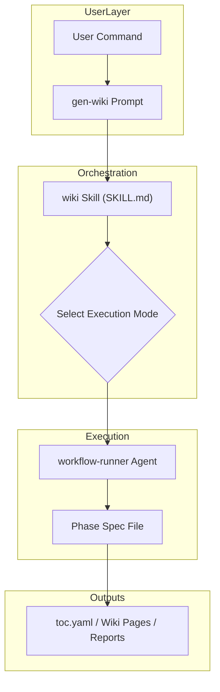
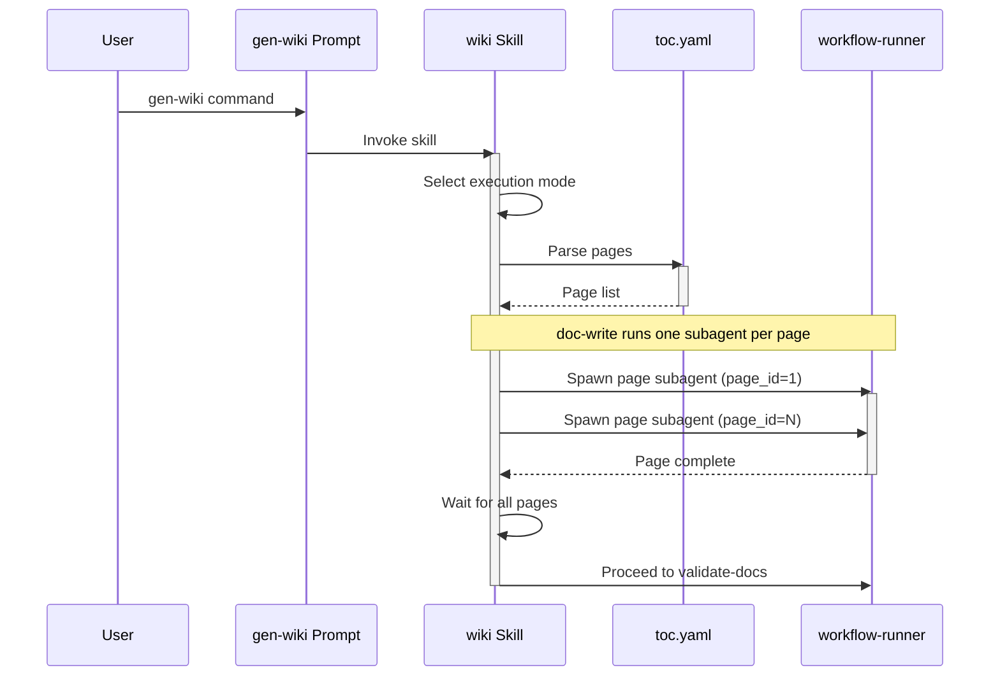

<!-- PAGE_ID: deepwiki-skill_02_architecture -->

📚 Relevant source files

The following files were used as context for generating this wiki page:

- [SKILL.md:1-83](https://github.com/natsu1211/deepwiki-skill/blob/5623db8cf158176a7d55791d6fb9bcb992834262/.apm/skills/wiki/SKILL.md#L1-L83)
- [workflow-runner.agent.md:1-55](https://github.com/natsu1211/deepwiki-skill/blob/5623db8cf158176a7d55791d6fb9bcb992834262/.apm/agents/workflow-runner.agent.md#L1-L55)
- [gen-wiki.prompt.md:1-31](https://github.com/natsu1211/deepwiki-skill/blob/5623db8cf158176a7d55791d6fb9bcb992834262/.apm/prompts/gen-wiki.prompt.md#L1-L31)
- [apm.yml:1-22](https://github.com/natsu1211/deepwiki-skill/blob/5623db8cf158176a7d55791d6fb9bcb992834262/apm.yml#L1-L22)

# Architecture

> **Related Pages**: [[Overview|01_overview.md]], [[Workflow Phases and Execution Modes|03_workflow.md]]

---

<!-- BEGIN:AUTOGEN deepwiki-skill_02_architecture_overview -->
## System Architecture Overview

deepwiki-skill is composed of three cooperating apm primitives that turn a single user command into validated, evidence-based wiki documentation: a command prompt that parses arguments, a skill that orchestrates the workflow, and an agent that executes individual phases. These primitives are bundled as a single apm `hybrid` package ([apm.yml:9-10](https://github.com/natsu1211/deepwiki-skill/blob/5623db8cf158176a7d55791d6fb9bcb992834262/apm.yml#L9-L10)).

The entry point is the `gen-wiki` prompt, whose only workflow step is to parse the CLI-style argument and delegate to the `wiki` skill to generate documentation for the current repository ([gen-wiki.prompt.md:30-31](https://github.com/natsu1211/deepwiki-skill/blob/5623db8cf158176a7d55791d6fb9bcb992834262/.apm/prompts/gen-wiki.prompt.md#L30-L31)). The `wiki` skill (`SKILL.md`) is the orchestrator: it defines the workflow phases, selects an execution mode, and dispatches each phase to the `workflow-runner` agent when subagents are supported ([SKILL.md:11-25](https://github.com/natsu1211/deepwiki-skill/blob/5623db8cf158176a7d55791d6fb9bcb992834262/.apm/skills/wiki/SKILL.md#L11-L25)). The `workflow-runner` agent executes exactly one phase from its phase spec and produces that phase's declared outputs ([workflow-runner.agent.md:5-12](https://github.com/natsu1211/deepwiki-skill/blob/5623db8cf158176a7d55791d6fb9bcb992834262/.apm/agents/workflow-runner.agent.md#L5-L12)).

The diagram below shows how a user command flows through these layers to the documentation outputs.

```mermaid
graph TD
    subgraph UserLayer
        U["User Command"]
        P["gen-wiki Prompt"]
    end

    subgraph Orchestration
        S["wiki Skill (SKILL.md)"]
        M{"Select Execution Mode"}
    end

    subgraph Execution
        A["workflow-runner Agent"]
        PS["Phase Spec File"]
    end

    subgraph Outputs
        O["toc.yaml / Wiki Pages / Reports"]
    end

    U --> P
    P --> S
    S --> M
    M --> A
    A --> PS
    PS --> O
```

When subagents are not supported, the skill falls back to reading each phase spec and reference file and executing the phases sequentially itself, rather than dispatching to the agent ([SKILL.md:14](https://github.com/natsu1211/deepwiki-skill/blob/5623db8cf158176a7d55791d6fb9bcb992834262/.apm/skills/wiki/SKILL.md#L14)).

Sources: [SKILL.md:11-25](https://github.com/natsu1211/deepwiki-skill/blob/5623db8cf158176a7d55791d6fb9bcb992834262/.apm/skills/wiki/SKILL.md#L11-L25), [gen-wiki.prompt.md:30-31](https://github.com/natsu1211/deepwiki-skill/blob/5623db8cf158176a7d55791d6fb9bcb992834262/.apm/prompts/gen-wiki.prompt.md#L30-L31), [workflow-runner.agent.md:5-12](https://github.com/natsu1211/deepwiki-skill/blob/5623db8cf158176a7d55791d6fb9bcb992834262/.apm/agents/workflow-runner.agent.md#L5-L12), [apm.yml:9-10](https://github.com/natsu1211/deepwiki-skill/blob/5623db8cf158176a7d55791d6fb9bcb992834262/apm.yml#L9-L10)
<!-- END:AUTOGEN deepwiki-skill_02_architecture_overview -->

---

<!-- BEGIN:AUTOGEN deepwiki-skill_02_architecture_primitives -->
## Core Primitives

The architecture rests on three apm primitives, each authored as a Markdown file with YAML frontmatter under `.apm/`. The package declares its type as `hybrid` precisely because it bundles a skill, an agent, and a prompt together ([apm.yml:9-10](https://github.com/natsu1211/deepwiki-skill/blob/5623db8cf158176a7d55791d6fb9bcb992834262/apm.yml#L9-L10)).

| Primitive | File | Responsibility |
|-----------|------|----------------|
| Skill | `.apm/skills/wiki/SKILL.md` | Orchestrates the full workflow, defines phases and execution modes, and dispatches work ([SKILL.md:8-14](https://github.com/natsu1211/deepwiki-skill/blob/5623db8cf158176a7d55791d6fb9bcb992834262/.apm/skills/wiki/SKILL.md#L8-L14)) |
| Agent | `.apm/agents/workflow-runner.agent.md` | Executes exactly one phase from its phase spec and produces declared outputs ([workflow-runner.agent.md:5-12](https://github.com/natsu1211/deepwiki-skill/blob/5623db8cf158176a7d55791d6fb9bcb992834262/.apm/agents/workflow-runner.agent.md#L5-L12)) |
| Prompt | `.apm/prompts/gen-wiki.prompt.md` | Parses CLI-style arguments and invokes the skill in the appropriate mode ([gen-wiki.prompt.md:2-3](https://github.com/natsu1211/deepwiki-skill/blob/5623db8cf158176a7d55791d6fb9bcb992834262/.apm/prompts/gen-wiki.prompt.md#L2-L3)) |

The **wiki skill** is the heart of the system. Its description states it provides a complete workflow for generating and updating wiki-style documentation with evidence-based citations and Mermaid diagram validation ([SKILL.md:8-9](https://github.com/natsu1211/deepwiki-skill/blob/5623db8cf158176a7d55791d6fb9bcb992834262/.apm/skills/wiki/SKILL.md#L8-L9)). It instructs the runtime to fully execute the workflow until completion without asking for user confirmation ([SKILL.md:12](https://github.com/natsu1211/deepwiki-skill/blob/5623db8cf158176a7d55791d6fb9bcb992834262/.apm/skills/wiki/SKILL.md#L12)).

The **workflow-runner agent** is deliberately narrow. It loads the phase specification from `phase_spec`, loads only the additional files that spec explicitly references, and produces the declared outputs and validations — explicitly avoiding improvised steps or unrelated references ([workflow-runner.agent.md:7-12](https://github.com/natsu1211/deepwiki-skill/blob/5623db8cf158176a7d55791d6fb9bcb992834262/.apm/agents/workflow-runner.agent.md#L7-L12)). It treats the phase spec file as the source of truth, which must define a Goal, Inputs, Outputs, Scripts, Workflow, and Validation ([workflow-runner.agent.md:26-36](https://github.com/natsu1211/deepwiki-skill/blob/5623db8cf158176a7d55791d6fb9bcb992834262/.apm/agents/workflow-runner.agent.md#L26-L36)). It accepts a defined set of inputs including `phase_id`, `phase_spec`, `repo_path`, `output_dir`, `toc_file`, `doc_dir`, `language`, and `mode` ([workflow-runner.agent.md:16-24](https://github.com/natsu1211/deepwiki-skill/blob/5623db8cf158176a7d55791d6fb9bcb992834262/.apm/agents/workflow-runner.agent.md#L16-L24)).

The **gen-wiki prompt** is the thinnest layer. Its frontmatter describes it as parsing CLI-style arguments and invoking the skill in the appropriate execution mode ([gen-wiki.prompt.md:2-3](https://github.com/natsu1211/deepwiki-skill/blob/5623db8cf158176a7d55791d6fb9bcb992834262/.apm/prompts/gen-wiki.prompt.md#L2-L3)), and its single workflow step is to parse the argument and use the `wiki` skill ([gen-wiki.prompt.md:30-31](https://github.com/natsu1211/deepwiki-skill/blob/5623db8cf158176a7d55791d6fb9bcb992834262/.apm/prompts/gen-wiki.prompt.md#L30-L31)).

All three primitives share a language directive instructing output in the language specified by the locale code, defaulting to `en-US` ([SKILL.md:6](https://github.com/natsu1211/deepwiki-skill/blob/5623db8cf158176a7d55791d6fb9bcb992834262/.apm/skills/wiki/SKILL.md#L6), [gen-wiki.prompt.md:7](https://github.com/natsu1211/deepwiki-skill/blob/5623db8cf158176a7d55791d6fb9bcb992834262/.apm/prompts/gen-wiki.prompt.md#L7), [workflow-runner.agent.md:23](https://github.com/natsu1211/deepwiki-skill/blob/5623db8cf158176a7d55791d6fb9bcb992834262/.apm/agents/workflow-runner.agent.md#L23)).

Sources: [SKILL.md:6-14](https://github.com/natsu1211/deepwiki-skill/blob/5623db8cf158176a7d55791d6fb9bcb992834262/.apm/skills/wiki/SKILL.md#L6-L14), [workflow-runner.agent.md:7-36](https://github.com/natsu1211/deepwiki-skill/blob/5623db8cf158176a7d55791d6fb9bcb992834262/.apm/agents/workflow-runner.agent.md#L7-L36), [gen-wiki.prompt.md:2-31](https://github.com/natsu1211/deepwiki-skill/blob/5623db8cf158176a7d55791d6fb9bcb992834262/.apm/prompts/gen-wiki.prompt.md#L2-L31), [apm.yml:9-10](https://github.com/natsu1211/deepwiki-skill/blob/5623db8cf158176a7d55791d6fb9bcb992834262/apm.yml#L9-L10)
<!-- END:AUTOGEN deepwiki-skill_02_architecture_primitives -->

---

<!-- BEGIN:AUTOGEN deepwiki-skill_02_architecture_orchestration -->
## Orchestration and Subagent Dispatch

The wiki skill orchestrates documentation generation by selecting an execution mode and dispatching the resulting phase sequence. The skill defines six workflow phases — `repo-scan`, `toc-design`, `doc-write`, `validate-docs`, `doc-summary`, and `incremental-sync` — each bound to a phase spec under `references/workflow/` ([SKILL.md:18-25](https://github.com/natsu1211/deepwiki-skill/blob/5623db8cf158176a7d55791d6fb9bcb992834262/.apm/skills/wiki/SKILL.md#L18-L25)). Each execution mode runs a different subset of phases in a defined order ([SKILL.md:31-36](https://github.com/natsu1211/deepwiki-skill/blob/5623db8cf158176a7d55791d6fb9bcb992834262/.apm/skills/wiki/SKILL.md#L31-L36)).

| Mode | Phases | Description |
|------|--------|-------------|
| Automatic | 1 → 2 → 3 → 4 → 5 | Full pipeline for new documentation ([SKILL.md:33](https://github.com/natsu1211/deepwiki-skill/blob/5623db8cf158176a7d55791d6fb9bcb992834262/.apm/skills/wiki/SKILL.md#L33)) |
| Structure-only | 1 → 2 | Generate TOC only, stop before docs ([SKILL.md:34](https://github.com/natsu1211/deepwiki-skill/blob/5623db8cf158176a7d55791d6fb9bcb992834262/.apm/skills/wiki/SKILL.md#L34)) |
| TOC-based | 3 → 4 → 5 | Generate docs from existing `toc.yaml` ([SKILL.md:35](https://github.com/natsu1211/deepwiki-skill/blob/5623db8cf158176a7d55791d6fb9bcb992834262/.apm/skills/wiki/SKILL.md#L35)) |
| Incremental | 6 → 3 → 4 → 5 | Update docs after code changes ([SKILL.md:36](https://github.com/natsu1211/deepwiki-skill/blob/5623db8cf158176a7d55791d6fb9bcb992834262/.apm/skills/wiki/SKILL.md#L36)) |

When subagents are supported, the skill spawns a `deepwiki:workflow-runner` subagent per phase, passing inputs such as `phase_id`, `phase_spec`, `repo_path`, `output_dir`, `toc_file`, `page_id`, and `language` ([SKILL.md:41-53](https://github.com/natsu1211/deepwiki-skill/blob/5623db8cf158176a7d55791d6fb9bcb992834262/.apm/skills/wiki/SKILL.md#L41-L53)).

The `doc-write` phase receives special handling for performance. Rather than generating all pages sequentially in a single subagent, the skill spawns multiple foreground subagents — one per page — by parsing `toc.yaml` to obtain the page list and dispatching a runner for each `page.id` ([SKILL.md:55-77](https://github.com/natsu1211/deepwiki-skill/blob/5623db8cf158176a7d55791d6fb9bcb992834262/.apm/skills/wiki/SKILL.md#L55-L77)). The following sequence illustrates this parallel dispatch.

```mermaid
sequenceDiagram
    participant U as User
    participant P as gen-wiki Prompt
    participant S as wiki Skill
    participant T as toc.yaml
    participant R as workflow-runner

    U->>P: gen-wiki command
    P->>S: Invoke skill
    activate S
    S->>S: Select execution mode
    S->>T: Parse pages
    activate T
    T-->>S: Page list
    deactivate T
    Note over S,R: doc-write runs one subagent per page
    S->>R: Spawn page subagent (page_id=1)
    activate R
    S->>R: Spawn page subagent (page_id=N)
    R-->>S: Page complete
    deactivate R
    S->>S: Wait for all pages
    S->>R: Proceed to validate-docs
    deactivate S
```

The parallel execution rules constrain this dispatch: each subagent generates exactly one page specified by `page_id`, all subagents run in the foreground rather than the background, the skill waits for all page subagents to complete before proceeding to the validation phase, and if any subagent fails a new subagent is re-spawned to finish that page ([SKILL.md:79-83](https://github.com/natsu1211/deepwiki-skill/blob/5623db8cf158176a7d55791d6fb9bcb992834262/.apm/skills/wiki/SKILL.md#L79-L83)).

On the execution side, the agent enforces strict discipline. It resolves `doc_dir` to `output_dir` when unset, treats relative paths as relative to the workspace root, produces only the outputs declared in the spec, and stops at the failing action on error while reporting the failed command and the minimal next action ([workflow-runner.agent.md:40-51](https://github.com/natsu1211/deepwiki-skill/blob/5623db8cf158176a7d55791d6fb9bcb992834262/.apm/agents/workflow-runner.agent.md#L40-L51)). It also restricts file creation to `output_dir` and its subdirectories ([workflow-runner.agent.md:53-55](https://github.com/natsu1211/deepwiki-skill/blob/5623db8cf158176a7d55791d6fb9bcb992834262/.apm/agents/workflow-runner.agent.md#L53-L55)).

Sources: [SKILL.md:18-83](https://github.com/natsu1211/deepwiki-skill/blob/5623db8cf158176a7d55791d6fb9bcb992834262/.apm/skills/wiki/SKILL.md#L18-L83), [workflow-runner.agent.md:40-55](https://github.com/natsu1211/deepwiki-skill/blob/5623db8cf158176a7d55791d6fb9bcb992834262/.apm/agents/workflow-runner.agent.md#L40-L55)
<!-- END:AUTOGEN deepwiki-skill_02_architecture_orchestration -->

---
