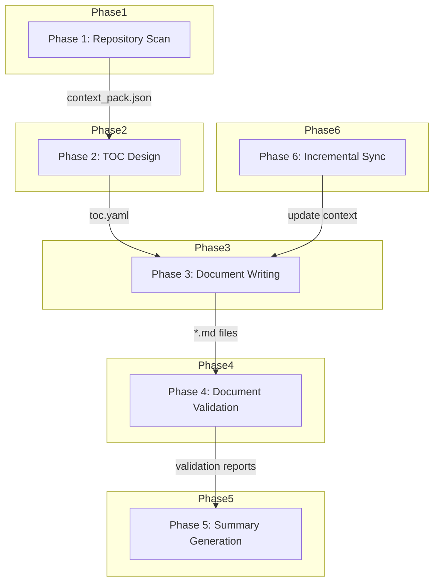

<!-- PAGE_ID: deepwiki-skill_03_workflow -->
<details>
<summary>Relevant source files</summary>

The following files were used as context for generating this wiki page:

- [repo-scan.md:1-94](https://github.com/natsu1211/deepwiki-skill/blob/784d30af68157f49d7f829f85d49dafe9fba65cd/skills/wiki/references/workflow/repo-scan.md#L1-L94)
- [toc-design.md:1-116](https://github.com/natsu1211/deepwiki-skill/blob/784d30af68157f49d7f829f85d49dafe9fba65cd/skills/wiki/references/workflow/toc-design.md#L1-L116)
- [doc-write.md:1-127](https://github.com/natsu1211/deepwiki-skill/blob/784d30af68157f49d7f829f85d49dafe9fba65cd/skills/wiki/references/workflow/doc-write.md#L1-L127)
- [validate-docs.md:1-202](https://github.com/natsu1211/deepwiki-skill/blob/784d30af68157f49d7f829f85d49dafe9fba65cd/skills/wiki/references/workflow/validate-docs.md#L1-L202)
- [doc-summary.md:1-127](https://github.com/natsu1211/deepwiki-skill/blob/784d30af68157f49d7f829f85d49dafe9fba65cd/skills/wiki/references/workflow/doc-summary.md#L1-L127)
- [incremental-sync.md:1-162](https://github.com/natsu1211/deepwiki-skill/blob/784d30af68157f49d7f829f85d49dafe9fba65cd/skills/wiki/references/workflow/incremental-sync.md#L1-L162)

</details>

# Workflow Phases

> **Related Pages**: [[Architecture|02_architecture.md]], [[Python Scripts|04_scripts.md]]

---

<!-- BEGIN:AUTOGEN deepwiki-skill_03_workflow_phase-overview -->
## Phase Overview

The deepwiki-skill workflow consists of six sequential phases that transform a codebase into comprehensive, evidence-based wiki documentation. Each phase has a specific goal, defined inputs and outputs, and relies on dedicated Python scripts for execution ([repo-scan.md:1-5](https://github.com/natsu1211/deepwiki-skill/blob/784d30af68157f49d7f829f85d49dafe9fba65cd/skills/wiki/references/workflow/repo-scan.md#L1-L5)).

The workflow supports multiple execution modes, allowing users to run the complete pipeline or specific phases depending on their needs.



| Phase | Name | Purpose | Primary Output |
|-------|------|---------|----------------|
| 1 | Repository Scan | Collect project context and structure | `context_pack.json` |
| 2 | TOC Design | Design wiki structure from context | `toc.yaml` |
| 3 | Document Writing | Generate evidence-based pages | `*.md` files |
| 4 | Document Validation | Validate structure and diagrams | Validation reports |
| 5 | Summary Generation | Generate documentation summary | `SUMMARY.md` |
| 6 | Incremental Sync | Detect changes for updates | Update context |

Sources: [repo-scan.md:1-5](https://github.com/natsu1211/deepwiki-skill/blob/784d30af68157f49d7f829f85d49dafe9fba65cd/skills/wiki/references/workflow/repo-scan.md#L1-L5), [toc-design.md:1-5](https://github.com/natsu1211/deepwiki-skill/blob/784d30af68157f49d7f829f85d49dafe9fba65cd/skills/wiki/references/workflow/toc-design.md#L1-L5), [doc-write.md:1-9](https://github.com/natsu1211/deepwiki-skill/blob/784d30af68157f49d7f829f85d49dafe9fba65cd/skills/wiki/references/workflow/doc-write.md#L1-L9), [validate-docs.md:1-8](https://github.com/natsu1211/deepwiki-skill/blob/784d30af68157f49d7f829f85d49dafe9fba65cd/skills/wiki/references/workflow/validate-docs.md#L1-L8), [doc-summary.md:1-9](https://github.com/natsu1211/deepwiki-skill/blob/784d30af68157f49d7f829f85d49dafe9fba65cd/skills/wiki/references/workflow/doc-summary.md#L1-L9), [incremental-sync.md:1-9](https://github.com/natsu1211/deepwiki-skill/blob/784d30af68157f49d7f829f85d49dafe9fba65cd/skills/wiki/references/workflow/incremental-sync.md#L1-L9)
<!-- END:AUTOGEN deepwiki-skill_03_workflow_phase-overview -->

---

<!-- BEGIN:AUTOGEN deepwiki-skill_03_workflow_repo-scan -->
## Phase 1: Repository Scan

The repository scan phase collects project context needed for TOC design and documentation generation. It analyzes the repository structure, identifies programming languages, and extracts README content ([repo-scan.md:3-5](https://github.com/natsu1211/deepwiki-skill/blob/784d30af68157f49d7f829f85d49dafe9fba65cd/skills/wiki/references/workflow/repo-scan.md#L3-L5)).

### Inputs and Outputs

| Type | Name | Required | Default | Description |
|------|------|----------|---------|-------------|
| Input | `repo_path` | Yes | - | Absolute path to the target repository ([repo-scan.md:11](https://github.com/natsu1211/deepwiki-skill/blob/784d30af68157f49d7f829f85d49dafe9fba65cd/skills/wiki/references/workflow/repo-scan.md#L11)) |
| Input | `output_dir` | No | `docs/wiki` | Documentation output directory ([repo-scan.md:12](https://github.com/natsu1211/deepwiki-skill/blob/784d30af68157f49d7f829f85d49dafe9fba65cd/skills/wiki/references/workflow/repo-scan.md#L12)) |
| Input | `max_depth` | No | `10` | Max scan depth ([repo-scan.md:15](https://github.com/natsu1211/deepwiki-skill/blob/784d30af68157f49d7f829f85d49dafe9fba65cd/skills/wiki/references/workflow/repo-scan.md#L15)) |
| Output | `context_pack.json` | - | - | Project context JSON for `toc-design` ([repo-scan.md:21](https://github.com/natsu1211/deepwiki-skill/blob/784d30af68157f49d7f829f85d49dafe9fba65cd/skills/wiki/references/workflow/repo-scan.md#L21)) |

### Script: collect_context.py

The phase uses `collect_context.py` to collect project context ([repo-scan.md:25](https://github.com/natsu1211/deepwiki-skill/blob/784d30af68157f49d7f829f85d49dafe9fba65cd/skills/wiki/references/workflow/repo-scan.md#L25)):

```bash
python3 /scripts/collect_context.py \
  --repo-path "{repo_path}" \
  --max-depth 10 \
  --output "{output_dir}/_context/context_pack.json"
```

### Output Structure

The generated `context_pack.json` contains the repository structure, README content, and metadata ([repo-scan.md:45-67](https://github.com/natsu1211/deepwiki-skill/blob/784d30af68157f49d7f829f85d49dafe9fba65cd/skills/wiki/references/workflow/repo-scan.md#L45-L67)):

```json
{
  "structure": {
    "tree": "...",
    "file_count": 42,
    "directory_count": 8,
    "total_size": 156300,
    "languages": {"Python": 25, "JavaScript": 10}
  },
  "readme": {
    "content": "...",
    "path": "README.md"
  },
  "metadata": {
    "repo_path": "/path/to/repo",
    "has_readme": true
  }
}
```

### Workflow Steps

1. **Validate repository**: Verify `repo_path` exists and is a directory, check if it's a git repository ([repo-scan.md:72-74](https://github.com/natsu1211/deepwiki-skill/blob/784d30af68157f49d7f829f85d49dafe9fba65cd/skills/wiki/references/workflow/repo-scan.md#L72-L74))
2. **Collect git metadata**: Get repo root, remote URL, and commit hash ([repo-scan.md:76-81](https://github.com/natsu1211/deepwiki-skill/blob/784d30af68157f49d7f829f85d49dafe9fba65cd/skills/wiki/references/workflow/repo-scan.md#L76-L81))
3. **Run context collection**: Execute the `collect_context.py` script ([repo-scan.md:83-88](https://github.com/natsu1211/deepwiki-skill/blob/784d30af68157f49d7f829f85d49dafe9fba65cd/skills/wiki/references/workflow/repo-scan.md#L83-L88))

Sources: [repo-scan.md:1-94](https://github.com/natsu1211/deepwiki-skill/blob/784d30af68157f49d7f829f85d49dafe9fba65cd/skills/wiki/references/workflow/repo-scan.md#L1-L94)
<!-- END:AUTOGEN deepwiki-skill_03_workflow_repo-scan -->

---

<!-- BEGIN:AUTOGEN deepwiki-skill_03_workflow_toc-design -->
## Phase 2: TOC Design

The TOC design phase analyzes the collected project context and creates a logical wiki structure. It produces a `toc.yaml` file that defines pages, sections, source file mappings, and diagram requirements ([toc-design.md:3-5](https://github.com/natsu1211/deepwiki-skill/blob/784d30af68157f49d7f829f85d49dafe9fba65cd/skills/wiki/references/workflow/toc-design.md#L3-L5)).

### Inputs and Outputs

| Type | Name | Required | Default | Description |
|------|------|----------|---------|-------------|
| Input | `repo_path` | Yes | - | Absolute repository path ([toc-design.md:11](https://github.com/natsu1211/deepwiki-skill/blob/784d30af68157f49d7f829f85d49dafe9fba65cd/skills/wiki/references/workflow/toc-design.md#L11)) |
| Input | `context_pack` | No | `{output_dir}/_context/context_pack.json` | Context JSON from Phase 1 ([toc-design.md:13](https://github.com/natsu1211/deepwiki-skill/blob/784d30af68157f49d7f829f85d49dafe9fba65cd/skills/wiki/references/workflow/toc-design.md#L13)) |
| Input | `language` | No | `en-US` | Output language/locale ([toc-design.md:14](https://github.com/natsu1211/deepwiki-skill/blob/784d30af68157f49d7f829f85d49dafe9fba65cd/skills/wiki/references/workflow/toc-design.md#L14)) |
| Output | `toc.yaml` | - | - | TOC definition following schema ([toc-design.md:20](https://github.com/natsu1211/deepwiki-skill/blob/784d30af68157f49d7f829f85d49dafe9fba65cd/skills/wiki/references/workflow/toc-design.md#L20)) |

### Structure Design Process

The workflow for designing the wiki structure involves several key steps ([toc-design.md:46-72](https://github.com/natsu1211/deepwiki-skill/blob/784d30af68157f49d7f829f85d49dafe9fba65cd/skills/wiki/references/workflow/toc-design.md#L46-L72)):

1. **Review Context**: Examine project structure and README to understand purpose and features
2. **Deep Dive into Code**: Read representative files using `read_files.py` to understand actual implementation
3. **Identify Logical Groupings**: Group related functionality based on actual code content
4. **Design Wiki Structure**: Create pages based on logical groupings with appropriate source file mappings
5. **Write toc.yaml**: Generate the TOC file following the schema specification

### Design Principles

The phase considers the project type when deciding page categories ([toc-design.md:76-97](https://github.com/natsu1211/deepwiki-skill/blob/784d30af68157f49d7f829f85d49dafe9fba65cd/skills/wiki/references/workflow/toc-design.md#L76-L97)):

| Project Type | Typical Categories |
|--------------|-------------------|
| Web application | Frontend, Backend, API, Deployment |
| Library/Framework | Architecture, Core APIs, Usage Guide, Extension |
| Data pipeline | Data Sources, Processing, Storage, Orchestration |
| DevOps tool | Configuration, Workflow, Integration, Monitoring |

### Page Count Guidelines

| Project Size | Files | Recommended Pages |
|--------------|-------|-------------------|
| Small | < 10 | 3-5 pages |
| Medium | 10-50 | 5-8 pages |
| Large | 50-200 | 8-12 pages |
| Very Large | > 200 | 10-15 pages |

([toc-design.md:99-105](https://github.com/natsu1211/deepwiki-skill/blob/784d30af68157f49d7f829f85d49dafe9fba65cd/skills/wiki/references/workflow/toc-design.md#L99-L105))

Sources: [toc-design.md:1-116](https://github.com/natsu1211/deepwiki-skill/blob/784d30af68157f49d7f829f85d49dafe9fba65cd/skills/wiki/references/workflow/toc-design.md#L1-L116)
<!-- END:AUTOGEN deepwiki-skill_03_workflow_toc-design -->

---

<!-- BEGIN:AUTOGEN deepwiki-skill_03_workflow_doc-write -->
## Phase 3: Document Writing

The document writing phase generates evidence-based wiki pages from the `toc.yaml` specification. Each generated page includes stable PAGE_ID markers, AUTOGEN markers for all generated sections, strict source citations with line numbers, and Mermaid diagrams where requested ([doc-write.md:3-9](https://github.com/natsu1211/deepwiki-skill/blob/784d30af68157f49d7f829f85d49dafe9fba65cd/skills/wiki/references/workflow/doc-write.md#L3-L9)).

### Script: read_files.py

The phase uses `read_files.py` to read source files with line numbers for accurate citations ([doc-write.md:19-21](https://github.com/natsu1211/deepwiki-skill/blob/784d30af68157f49d7f829f85d49dafe9fba65cd/skills/wiki/references/workflow/doc-write.md#L19-L21)):

```bash
python3 /scripts/read_files.py \
  --repo-path "{repo_path}" \
  --files '["path/to/file1", "src/**/*.cs"]' \
  --line-numbers
```

The script supports glob patterns for file selection ([doc-write.md:41-45](https://github.com/natsu1211/deepwiki-skill/blob/784d30af68157f49d7f829f85d49dafe9fba65cd/skills/wiki/references/workflow/doc-write.md#L41-L45)):
- `*` matches any characters except `/`
- `**` matches any characters including `/` (recursive)
- `?` matches a single character

### Page Generation Process

For each page in `toc.yaml`, the phase follows this process ([doc-write.md:67-76](https://github.com/natsu1211/deepwiki-skill/blob/784d30af68157f49d7f829f85d49dafe9fba65cd/skills/wiki/references/workflow/doc-write.md#L67-L76)):

1. **Parse TOC Structure**: Read page definition, extract page-level source_files, extract all sections with their attributes
2. **Collect Evidence**: For each autogen section, merge page-level and section-level source files, read files with line numbers
3. **Generate Content**: Combine sections following the page template, add source citations, generate Mermaid diagrams where needed

### Section Processing Algorithm

The section processing follows a recursive pattern that handles nested sections ([doc-write.md:78-114](https://github.com/natsu1211/deepwiki-skill/blob/784d30af68157f49d7f829f85d49dafe9fba65cd/skills/wiki/references/workflow/doc-write.md#L78-L114)):

```
function process_section(section, page_source_files, heading_level):
    if section.autogen == true:
        # Merge page-level and section-level source files
        all_source_files = page_source_files + section.source_files

        # Read files for citation
        section_files = read_files(all_source_files)

    # Process nested sections recursively
    for each subsection in section.sections:
        process_section(subsection, page_source_files, heading_level + 1)
```

### Output Requirements

The generated pages must follow strict formatting requirements ([doc-write.md:122-127](https://github.com/natsu1211/deepwiki-skill/blob/784d30af68157f49d7f829f85d49dafe9fba65cd/skills/wiki/references/workflow/doc-write.md#L122-L127)):
- Output format strictly follows the page template specification
- Each section cites from its specific source files
- Markdown files are output to the designated output directory

Sources: [doc-write.md:1-127](https://github.com/natsu1211/deepwiki-skill/blob/784d30af68157f49d7f829f85d49dafe9fba65cd/skills/wiki/references/workflow/doc-write.md#L1-L127)
<!-- END:AUTOGEN deepwiki-skill_03_workflow_doc-write -->

---

<!-- BEGIN:AUTOGEN deepwiki-skill_03_workflow_validate-docs -->
## Phase 4: Document Validation

The validation phase ensures the generated documentation is correct and consistent. It validates Mermaid diagrams, checks document structure for proper markers, and applies safe fixes where needed ([validate-docs.md:3-8](https://github.com/natsu1211/deepwiki-skill/blob/784d30af68157f49d7f829f85d49dafe9fba65cd/skills/wiki/references/workflow/validate-docs.md#L3-L8)).

### Outputs

| Path | Description |
|------|-------------|
| `{output_dir}/_reports/mermaid_invalid.json` | Invalid Mermaid blocks report ([validate-docs.md:22](https://github.com/natsu1211/deepwiki-skill/blob/784d30af68157f49d7f829f85d49dafe9fba65cd/skills/wiki/references/workflow/validate-docs.md#L22)) |
| `{output_dir}/_reports/structure_validation.json` | Document structure validation report ([validate-docs.md:23](https://github.com/natsu1211/deepwiki-skill/blob/784d30af68157f49d7f829f85d49dafe9fba65cd/skills/wiki/references/workflow/validate-docs.md#L23)) |
| `{doc_dir}/*.md` | In-place fixes for Mermaid blocks and structural markers ([validate-docs.md:24](https://github.com/natsu1211/deepwiki-skill/blob/784d30af68157f49d7f829f85d49dafe9fba65cd/skills/wiki/references/workflow/validate-docs.md#L24)) |

### Script: validate_docs_structure.py

Validates document structure against TOC specification, checking PAGE_ID markers, AUTOGEN markers, and internal links ([validate-docs.md:28-30](https://github.com/natsu1211/deepwiki-skill/blob/784d30af68157f49d7f829f85d49dafe9fba65cd/skills/wiki/references/workflow/validate-docs.md#L28-L30)):

```bash
python scripts/validate_docs_structure.py \
    --doc-dir "{doc_dir}" \
    --toc-file "{toc_file}"
```

Issue categories detected by the script ([validate-docs.md:75-83](https://github.com/natsu1211/deepwiki-skill/blob/784d30af68157f49d7f829f85d49dafe9fba65cd/skills/wiki/references/workflow/validate-docs.md#L75-L83)):

| Category | Description |
|----------|-------------|
| `page_id` | PAGE_ID marker missing or incorrect |
| `autogen` | AUTOGEN marker issues (missing, mismatched, orphaned) |
| `structure` | Basic structure issues (H1 headings, file size) |
| `link` | Internal link issues (broken or undefined targets) |
| `toc` | TOC alignment issues (missing pages, extra files) |

### Script: validate_mermaid.py

Extracts and validates Mermaid diagrams using the Mermaid CLI (`mmdc`) ([validate-docs.md:85-87](https://github.com/natsu1211/deepwiki-skill/blob/784d30af68157f49d7f829f85d49dafe9fba65cd/skills/wiki/references/workflow/validate-docs.md#L85-L87)):

```bash
python3 scripts/validate_mermaid.py \
    --input "{doc_dir}" \
    --invalid-only
```

Mermaid error types and their fixes ([validate-docs.md:139-148](https://github.com/natsu1211/deepwiki-skill/blob/784d30af68157f49d7f829f85d49dafe9fba65cd/skills/wiki/references/workflow/validate-docs.md#L139-L148)):

| Type | Description | Common Fix |
|------|-------------|------------|
| `lexical_error` | Unrecognized text/characters | Quote node text with special characters |
| `syntax_error` | General syntax issues | Check diagram type and arrow syntax |
| `node_error` | Node definition problems | Balance brackets, quote labels |
| `edge_error` | Arrow/edge problems | Use valid arrows (-->, ---) |
| `cli_unavailable` | mmdc not installed | Install @mermaid-js/mermaid-cli |

### Validation Workflow

1. **Mermaid Diagram Validation** ([validate-docs.md:152-171](https://github.com/natsu1211/deepwiki-skill/blob/784d30af68157f49d7f829f85d49dafe9fba65cd/skills/wiki/references/workflow/validate-docs.md#L152-L171)):
   - Run `validate_mermaid.py` script
   - If CLI unavailable, record limitation and leave diagrams unchanged
   - Fix invalid diagrams (max 3 attempts per diagram)
   - Comment out diagrams still invalid after 3 attempts

2. **Document Structure Validation** ([validate-docs.md:173-197](https://github.com/natsu1211/deepwiki-skill/blob/784d30af68157f49d7f829f85d49dafe9fba65cd/skills/wiki/references/workflow/validate-docs.md#L173-L197)):
   - Run `validate_docs_structure.py` script
   - Fix PAGE_ID issues (add missing, correct incorrect)
   - Fix AUTOGEN marker issues (add missing BEGIN/END, correct mismatched IDs)
   - Re-run to confirm all errors are fixed

Sources: [validate-docs.md:1-202](https://github.com/natsu1211/deepwiki-skill/blob/784d30af68157f49d7f829f85d49dafe9fba65cd/skills/wiki/references/workflow/validate-docs.md#L1-L202)
<!-- END:AUTOGEN deepwiki-skill_03_workflow_validate-docs -->

---

<!-- BEGIN:AUTOGEN deepwiki-skill_03_workflow_doc-summary -->
## Phase 5: Summary Generation

The summary generation phase produces a documentation summary report (`SUMMARY.md`) that provides an overview of the generation results, including completion status, citation statistics, diagram counts, and any issues from validation ([doc-summary.md:3-9](https://github.com/natsu1211/deepwiki-skill/blob/784d30af68157f49d7f829f85d49dafe9fba65cd/skills/wiki/references/workflow/doc-summary.md#L3-L9)).

### Script: generate_summary.py

The phase uses `generate_summary.py` to create the summary report ([doc-summary.md:13-15](https://github.com/natsu1211/deepwiki-skill/blob/784d30af68157f49d7f829f85d49dafe9fba65cd/skills/wiki/references/workflow/doc-summary.md#L13-L15)):

```bash
python3 /scripts/generate_summary.py \
  --doc-dir "{doc_dir}" \
  --toc-file "{toc_file}" \
  --output "{output_dir}/_reports/SUMMARY.md"
```

Parameters ([doc-summary.md:25-33](https://github.com/natsu1211/deepwiki-skill/blob/784d30af68157f49d7f829f85d49dafe9fba65cd/skills/wiki/references/workflow/doc-summary.md#L25-L33)):

| Parameter | Required | Default | Description |
|-----------|----------|---------|-------------|
| `--doc-dir` | Yes | - | Directory containing generated .md docs |
| `--toc-file` | Yes | - | Path to toc.yaml file |
| `--structure-report` | No | auto-detected | Structure validation report |
| `--mermaid-report` | No | auto-detected | Mermaid validation report |
| `--output` | No | `{doc_dir}/_reports/SUMMARY.md` | Output path |

### Report Contents

The generated `SUMMARY.md` includes ([doc-summary.md:37-82](https://github.com/natsu1211/deepwiki-skill/blob/784d30af68157f49d7f829f85d49dafe9fba65cd/skills/wiki/references/workflow/doc-summary.md#L37-L82)):

1. **Generation Status**: Overall status with metrics table
2. **Page Details**: Per-page breakdown of sections, citations, and diagrams
3. **Source Coverage**: Lists covered and uncovered source files
4. **Issues**: Errors, warnings, and recommendations from validation

### Status Indicators

| Status | Meaning |
|--------|---------|
| Complete | All pages/sections generated, no errors ([doc-summary.md:118](https://github.com/natsu1211/deepwiki-skill/blob/784d30af68157f49d7f829f85d49dafe9fba65cd/skills/wiki/references/workflow/doc-summary.md#L118)) |
| Incomplete | Some sections missing or has warnings ([doc-summary.md:119](https://github.com/natsu1211/deepwiki-skill/blob/784d30af68157f49d7f829f85d49dafe9fba65cd/skills/wiki/references/workflow/doc-summary.md#L119)) |
| Has Errors | Validation errors present ([doc-summary.md:120](https://github.com/natsu1211/deepwiki-skill/blob/784d30af68157f49d7f829f85d49dafe9fba65cd/skills/wiki/references/workflow/doc-summary.md#L120)) |

Sources: [doc-summary.md:1-127](https://github.com/natsu1211/deepwiki-skill/blob/784d30af68157f49d7f829f85d49dafe9fba65cd/skills/wiki/references/workflow/doc-summary.md#L1-L127)
<!-- END:AUTOGEN deepwiki-skill_03_workflow_doc-summary -->

---

<!-- BEGIN:AUTOGEN deepwiki-skill_03_workflow_incremental-sync -->
## Phase 6: Incremental Sync

The incremental sync phase collects context needed to update existing documentation safely after code changes. It operates in two sub-phases: detecting TOC structure changes and detecting source code changes relevant to the TOC mappings ([incremental-sync.md:3-9](https://github.com/natsu1211/deepwiki-skill/blob/784d30af68157f49d7f829f85d49dafe9fba65cd/skills/wiki/references/workflow/incremental-sync.md#L3-L9)).

This phase does not rewrite documentation directly; it produces change context that the `doc-write` phase uses to regenerate only affected pages and sections.

### Inputs and Outputs

| Type | Name | Required | Default | Description |
|------|------|----------|---------|-------------|
| Input | `repo_path` | Yes | - | Absolute repository path ([incremental-sync.md:15](https://github.com/natsu1211/deepwiki-skill/blob/784d30af68157f49d7f829f85d49dafe9fba65cd/skills/wiki/references/workflow/incremental-sync.md#L15)) |
| Input | `target_commit` | No | `HEAD` | Target commit for change detection ([incremental-sync.md:19](https://github.com/natsu1211/deepwiki-skill/blob/784d30af68157f49d7f829f85d49dafe9fba65cd/skills/wiki/references/workflow/incremental-sync.md#L19)) |
| Output | `sync_context.json` | - | - | TOC sync result from Phase A ([incremental-sync.md:27](https://github.com/natsu1211/deepwiki-skill/blob/784d30af68157f49d7f829f85d49dafe9fba65cd/skills/wiki/references/workflow/incremental-sync.md#L27)) |
| Output | `update_context.json` | - | - | Source update context from Phase B ([incremental-sync.md:28](https://github.com/natsu1211/deepwiki-skill/blob/784d30af68157f49d7f829f85d49dafe9fba65cd/skills/wiki/references/workflow/incremental-sync.md#L28)) |

### Phase A: collect_sync_context.py

Detects structural differences between `toc.yaml` and existing documentation files ([incremental-sync.md:36-38](https://github.com/natsu1211/deepwiki-skill/blob/784d30af68157f49d7f829f85d49dafe9fba65cd/skills/wiki/references/workflow/incremental-sync.md#L36-L38)):

```bash
python3 /scripts/collect_sync_context.py \
  --repo-path "{repo_path}" \
  --toc-file "{toc_file}" \
  --doc-dir "{doc_dir}" \
  --output "{output_dir}/_context/sync_context.json"
```

Output structure ([incremental-sync.md:59-71](https://github.com/natsu1211/deepwiki-skill/blob/784d30af68157f49d7f829f85d49dafe9fba65cd/skills/wiki/references/workflow/incremental-sync.md#L59-L71)):

```json
{
  "status": "sync_needed|up_to_date|full_rebuild_needed",
  "changes": {
    "added_pages": ["04_new_page"],
    "removed_pages": ["03_old_page"],
    "modified_pages": ["01_overview"],
    "added_sections": [{"page": "01_overview", "section": "new_section"}],
    "removed_sections": []
  },
  "recommendation": "Regenerate modified pages and added pages"
}
```

### Phase B: collect_update_context.py

Detects source code changes and maps them to affected wiki pages and sections ([incremental-sync.md:73-75](https://github.com/natsu1211/deepwiki-skill/blob/784d30af68157f49d7f829f85d49dafe9fba65cd/skills/wiki/references/workflow/incremental-sync.md#L73-L75)):

```bash
python3 /scripts/collect_update_context.py \
  --repo-path "{repo_path}" \
  --toc-file "{toc_file}" \
  --doc-dir "{doc_dir}" \
  --target-commit "{target_commit}" \
  --output "{output_dir}/_context/update_context.json"
```

Output structure ([incremental-sync.md:100-121](https://github.com/natsu1211/deepwiki-skill/blob/784d30af68157f49d7f829f85d49dafe9fba65cd/skills/wiki/references/workflow/incremental-sync.md#L100-L121)):

```json
{
  "base_commit": "abc123",
  "target_commit": "def456",
  "affected_pages": [
    {
      "page_id": "myapp_01_overview",
      "filename": "01_overview.md",
      "affected_sections": ["myapp_01_overview_intro"],
      "changed_files": ["src/main.ts"]
    }
  ],
  "unaffected_pages": ["myapp_02_architecture"]
}
```

### Workflow

1. Run Phase A (`collect_sync_context.py`) to detect TOC drift ([incremental-sync.md:151-152](https://github.com/natsu1211/deepwiki-skill/blob/784d30af68157f49d7f829f85d49dafe9fba65cd/skills/wiki/references/workflow/incremental-sync.md#L151-L152))
2. If full rebuild needed, stop and recommend rerunning full generation
3. Run Phase B (`collect_update_context.py`) to map code changes to pages/sections ([incremental-sync.md:153](https://github.com/natsu1211/deepwiki-skill/blob/784d30af68157f49d7f829f85d49dafe9fba65cd/skills/wiki/references/workflow/incremental-sync.md#L153))
4. Hand off to `doc-write` to regenerate only affected pages/sections, without touching manual sections or content outside AUTOGEN markers ([incremental-sync.md:154-156](https://github.com/natsu1211/deepwiki-skill/blob/784d30af68157f49d7f829f85d49dafe9fba65cd/skills/wiki/references/workflow/incremental-sync.md#L154-L156))

Sources: [incremental-sync.md:1-162](https://github.com/natsu1211/deepwiki-skill/blob/784d30af68157f49d7f829f85d49dafe9fba65cd/skills/wiki/references/workflow/incremental-sync.md#L1-L162)
<!-- END:AUTOGEN deepwiki-skill_03_workflow_incremental-sync -->

---
