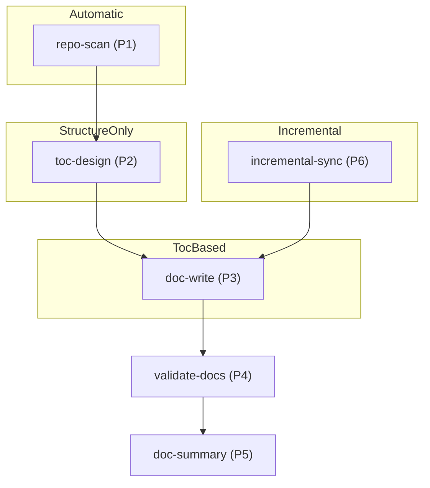
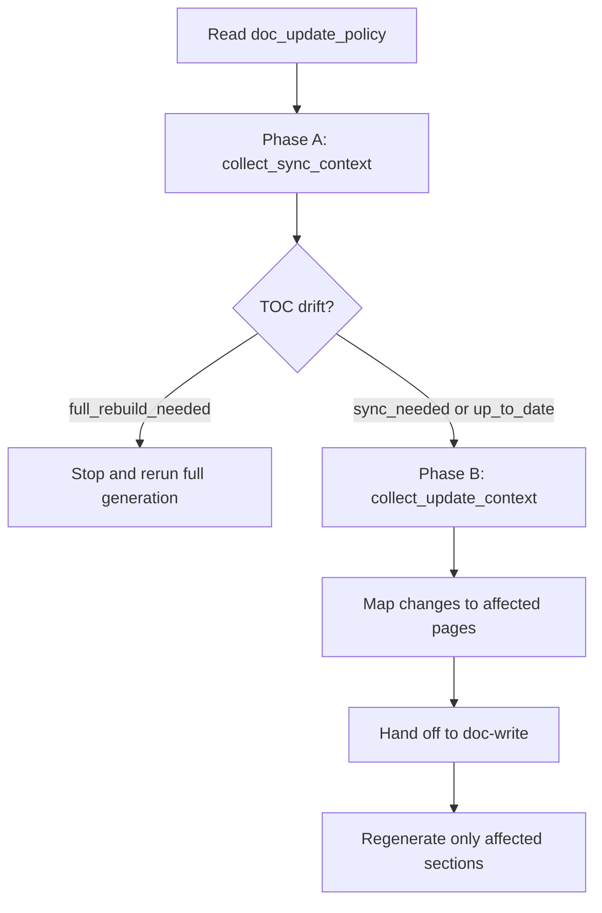

<!-- PAGE_ID: deepwiki-skill_03_workflow -->

📚 Relevant source files

The following files were used as context for generating this wiki page:

- [repo-scan.md:1-94](https://github.com/natsu1211/deepwiki-skill/blob/5623db8cf158176a7d55791d6fb9bcb992834262/.apm/skills/wiki/references/workflow/repo-scan.md#L1-L94)
- [toc-design.md:1-116](https://github.com/natsu1211/deepwiki-skill/blob/5623db8cf158176a7d55791d6fb9bcb992834262/.apm/skills/wiki/references/workflow/toc-design.md#L1-L116)
- [doc-write.md:1-127](https://github.com/natsu1211/deepwiki-skill/blob/5623db8cf158176a7d55791d6fb9bcb992834262/.apm/skills/wiki/references/workflow/doc-write.md#L1-L127)
- [validate-docs.md:1-202](https://github.com/natsu1211/deepwiki-skill/blob/5623db8cf158176a7d55791d6fb9bcb992834262/.apm/skills/wiki/references/workflow/validate-docs.md#L1-L202)
- [doc-summary.md:1-127](https://github.com/natsu1211/deepwiki-skill/blob/5623db8cf158176a7d55791d6fb9bcb992834262/.apm/skills/wiki/references/workflow/doc-summary.md#L1-L127)
- [incremental-sync.md:1-162](https://github.com/natsu1211/deepwiki-skill/blob/5623db8cf158176a7d55791d6fb9bcb992834262/.apm/skills/wiki/references/workflow/incremental-sync.md#L1-L162)

# Workflow Phases and Execution Modes

> **Related Pages**: [[Architecture|02_architecture.md]], [[Python Helper Scripts|04_scripts.md]]

---

<!-- BEGIN:AUTOGEN deepwiki-skill_03_workflow_modes -->
## Execution Modes

Documentation generation is decomposed into six discrete phases, each defined by its own specification file under `.apm/skills/wiki/references/workflow/`. The phases are numbered to reflect their default ordering: repo-scan (Phase 1), toc-design (Phase 2), doc-write (Phase 3), validate-docs (Phase 4), doc-summary (Phase 5), and incremental-sync (Phase 6) ([repo-scan.md:1](https://github.com/natsu1211/deepwiki-skill/blob/5623db8cf158176a7d55791d6fb9bcb992834262/.apm/skills/wiki/references/workflow/repo-scan.md#L1), [doc-summary.md:1](https://github.com/natsu1211/deepwiki-skill/blob/5623db8cf158176a7d55791d6fb9bcb992834262/.apm/skills/wiki/references/workflow/doc-summary.md#L1), [incremental-sync.md:1](https://github.com/natsu1211/deepwiki-skill/blob/5623db8cf158176a7d55791d6fb9bcb992834262/.apm/skills/wiki/references/workflow/incremental-sync.md#L1)).

Execution modes are different entry points and chains over these phases. The phase specs themselves expose hooks that distinguish the modes: each phase that consumes prior output declares that input with a default pointing at the previous phase's artifact, so the phases form a chain that can be entered at any point where its inputs already exist.

- A **full (automatic) generation** runs the chain end to end: repo-scan produces `context_pack.json`, which feeds toc-design to produce `toc.yaml`, which feeds doc-write to produce the pages, which validate-docs and doc-summary then check and report on. The chaining is visible in the input defaults — toc-design defaults its `context_pack` input to `{output_dir}/_context/context_pack.json`, the artifact written by repo-scan ([toc-design.md:13](https://github.com/natsu1211/deepwiki-skill/blob/5623db8cf158176a7d55791d6fb9bcb992834262/.apm/skills/wiki/references/workflow/toc-design.md#L13), [repo-scan.md:21](https://github.com/natsu1211/deepwiki-skill/blob/5623db8cf158176a7d55791d6fb9bcb992834262/.apm/skills/wiki/references/workflow/repo-scan.md#L21)).
- A **structure-only** entry stops after toc-design, producing only `{output_dir}/toc.yaml` without writing any pages ([toc-design.md:18-20](https://github.com/natsu1211/deepwiki-skill/blob/5623db8cf158176a7d55791d6fb9bcb992834262/.apm/skills/wiki/references/workflow/toc-design.md#L18-L20)).
- A **TOC-based** entry skips scanning and design and begins at doc-write, which generates pages directly from an existing `{toc_file}` ([doc-write.md:5](https://github.com/natsu1211/deepwiki-skill/blob/5623db8cf158176a7d55791d6fb9bcb992834262/.apm/skills/wiki/references/workflow/doc-write.md#L5)).
- An **incremental** entry begins at incremental-sync, which detects what changed and hands off to a scoped doc-write that regenerates only affected pages and sections ([incremental-sync.md:5-9](https://github.com/natsu1211/deepwiki-skill/blob/5623db8cf158176a7d55791d6fb9bcb992834262/.apm/skills/wiki/references/workflow/incremental-sync.md#L5-L9), [incremental-sync.md:154-156](https://github.com/natsu1211/deepwiki-skill/blob/5623db8cf158176a7d55791d6fb9bcb992834262/.apm/skills/wiki/references/workflow/incremental-sync.md#L154-L156)).

The following diagram shows how the four entry points map onto the shared phase chain.

```mermaid
graph TD
    A["repo-scan (P1)"] --> B["toc-design (P2)"]
    B --> C["doc-write (P3)"]
    C --> D["validate-docs (P4)"]
    D --> E["doc-summary (P5)"]
    F["incremental-sync (P6)"] --> C

    subgraph Automatic
        A
    end
    subgraph StructureOnly
        B
    end
    subgraph TocBased
        C
    end
    subgraph Incremental
        F
    end
```

Sources: [repo-scan.md:1-21](https://github.com/natsu1211/deepwiki-skill/blob/5623db8cf158176a7d55791d6fb9bcb992834262/.apm/skills/wiki/references/workflow/repo-scan.md#L1-L21), [toc-design.md:1-20](https://github.com/natsu1211/deepwiki-skill/blob/5623db8cf158176a7d55791d6fb9bcb992834262/.apm/skills/wiki/references/workflow/toc-design.md#L1-L20), [doc-write.md:1-5](https://github.com/natsu1211/deepwiki-skill/blob/5623db8cf158176a7d55791d6fb9bcb992834262/.apm/skills/wiki/references/workflow/doc-write.md#L1-L5), [incremental-sync.md:1-9](https://github.com/natsu1211/deepwiki-skill/blob/5623db8cf158176a7d55791d6fb9bcb992834262/.apm/skills/wiki/references/workflow/incremental-sync.md#L1-L9)
<!-- END:AUTOGEN deepwiki-skill_03_workflow_modes -->

---

<!-- BEGIN:AUTOGEN deepwiki-skill_03_workflow_generation-phases -->
## Generation Phases (repo-scan, toc-design, doc-write)

The three generation phases turn a raw repository into evidence-based wiki pages. Each phase declares a single, deterministic Python script as its only sanctioned tool and writes a well-defined artifact that the next phase consumes.

### repo-scan (Phase 1)

The goal of repo-scan is to "collect project context needed for TOC design and documentation generation" ([repo-scan.md:5](https://github.com/natsu1211/deepwiki-skill/blob/5623db8cf158176a7d55791d6fb9bcb992834262/.apm/skills/wiki/references/workflow/repo-scan.md#L5)). It validates that `repo_path` exists and checks for a `.git` folder, collects git metadata (`git rev-parse --show-toplevel`, `git remote get-url origin`, `git rev-parse HEAD`), then runs `collect_context.py` to scan the tree ([repo-scan.md:72-89](https://github.com/natsu1211/deepwiki-skill/blob/5623db8cf158176a7d55791d6fb9bcb992834262/.apm/skills/wiki/references/workflow/repo-scan.md#L72-L89)). The spec is emphatic that `collect_context.py` is the only collector: "DO NOT use any other ad-hoc script" ([repo-scan.md:25](https://github.com/natsu1211/deepwiki-skill/blob/5623db8cf158176a7d55791d6fb9bcb992834262/.apm/skills/wiki/references/workflow/repo-scan.md#L25)). Its single output is `{output_dir}/_context/context_pack.json`, a JSON document containing the directory tree, file/language statistics, and README content ([repo-scan.md:21](https://github.com/natsu1211/deepwiki-skill/blob/5623db8cf158176a7d55791d6fb9bcb992834262/.apm/skills/wiki/references/workflow/repo-scan.md#L21), [repo-scan.md:45-67](https://github.com/natsu1211/deepwiki-skill/blob/5623db8cf158176a7d55791d6fb9bcb992834262/.apm/skills/wiki/references/workflow/repo-scan.md#L45-L67)).

### toc-design (Phase 2)

toc-design consumes `context_pack.json` and produces `{output_dir}/toc.yaml` following the schema ([toc-design.md:13](https://github.com/natsu1211/deepwiki-skill/blob/5623db8cf158176a7d55791d6fb9bcb992834262/.apm/skills/wiki/references/workflow/toc-design.md#L13), [toc-design.md:18-20](https://github.com/natsu1211/deepwiki-skill/blob/5623db8cf158176a7d55791d6fb9bcb992834262/.apm/skills/wiki/references/workflow/toc-design.md#L18-L20)). Rather than mechanically mapping folders to pages, the phase mandates a content-driven design: it reviews context, reads representative files with `read_files.py`, identifies logical groupings, then designs pages and sections around them. The spec explicitly warns "DO NOT simply map folder names to pages" ([toc-design.md:50-72](https://github.com/natsu1211/deepwiki-skill/blob/5623db8cf158176a7d55791d6fb9bcb992834262/.apm/skills/wiki/references/workflow/toc-design.md#L50-L72)). Its validation gates require that all page/section IDs are unique, use kebab-case with no special characters, every page has at least one `source_files` entry, and nesting is at most three levels deep ([toc-design.md:112-116](https://github.com/natsu1211/deepwiki-skill/blob/5623db8cf158176a7d55791d6fb9bcb992834262/.apm/skills/wiki/references/workflow/toc-design.md#L112-L116)).

### doc-write (Phase 3)

doc-write generates the actual Markdown pages from `{toc_file}`, with "stable PAGE_ID markers", AUTOGEN markers for every generated section, "strict source citations with line numbers", and Mermaid diagrams where the TOC requests them ([doc-write.md:5-9](https://github.com/natsu1211/deepwiki-skill/blob/5623db8cf158176a7d55791d6fb9bcb992834262/.apm/skills/wiki/references/workflow/doc-write.md#L5-L9)). For accurate citations it relies on `read_files.py`, instructing the runner to "Never use ad-hoc file reads if citation is needed" ([doc-write.md:21](https://github.com/natsu1211/deepwiki-skill/blob/5623db8cf158176a7d55791d6fb9bcb992834262/.apm/skills/wiki/references/workflow/doc-write.md#L21)).

The phase walks the TOC recursively. Page-level `source_files` are shared by all sections, and each section may add its own; for every `autogen` section the two lists are merged, glob patterns are resolved, and the files are read with line numbers ([doc-write.md:80-104](https://github.com/natsu1211/deepwiki-skill/blob/5623db8cf158176a7d55791d6fb9bcb992834262/.apm/skills/wiki/references/workflow/doc-write.md#L80-L104)). The `source_files` are treated as the primary reference, but the runner may read additional files (base classes, interfaces, referenced types) when comprehension requires it ([doc-write.md:105-109](https://github.com/natsu1211/deepwiki-skill/blob/5623db8cf158176a7d55791d6fb9bcb992834262/.apm/skills/wiki/references/workflow/doc-write.md#L105-L109)). Output is written to `{output_dir}/` following the page template, with diagrams generated where `diagrams_needed: true` ([doc-write.md:117-127](https://github.com/natsu1211/deepwiki-skill/blob/5623db8cf158176a7d55791d6fb9bcb992834262/.apm/skills/wiki/references/workflow/doc-write.md#L117-L127)).

The table below summarizes the input, primary script, and output artifact of each generation phase.

| Phase | Primary Script | Key Output |
|-------|----------------|------------|
| repo-scan | `collect_context.py` ([repo-scan.md:25](https://github.com/natsu1211/deepwiki-skill/blob/5623db8cf158176a7d55791d6fb9bcb992834262/.apm/skills/wiki/references/workflow/repo-scan.md#L25)) | `_context/context_pack.json` ([repo-scan.md:21](https://github.com/natsu1211/deepwiki-skill/blob/5623db8cf158176a7d55791d6fb9bcb992834262/.apm/skills/wiki/references/workflow/repo-scan.md#L21)) |
| toc-design | `read_files.py` ([toc-design.md:24](https://github.com/natsu1211/deepwiki-skill/blob/5623db8cf158176a7d55791d6fb9bcb992834262/.apm/skills/wiki/references/workflow/toc-design.md#L24)) | `toc.yaml` ([toc-design.md:20](https://github.com/natsu1211/deepwiki-skill/blob/5623db8cf158176a7d55791d6fb9bcb992834262/.apm/skills/wiki/references/workflow/toc-design.md#L20)) |
| doc-write | `read_files.py` ([doc-write.md:19-21](https://github.com/natsu1211/deepwiki-skill/blob/5623db8cf158176a7d55791d6fb9bcb992834262/.apm/skills/wiki/references/workflow/doc-write.md#L19-L21)) | `{output_dir}/*.md` pages ([doc-write.md:127](https://github.com/natsu1211/deepwiki-skill/blob/5623db8cf158176a7d55791d6fb9bcb992834262/.apm/skills/wiki/references/workflow/doc-write.md#L127)) |

Sources: [repo-scan.md:5-89](https://github.com/natsu1211/deepwiki-skill/blob/5623db8cf158176a7d55791d6fb9bcb992834262/.apm/skills/wiki/references/workflow/repo-scan.md#L5-L89), [toc-design.md:13-116](https://github.com/natsu1211/deepwiki-skill/blob/5623db8cf158176a7d55791d6fb9bcb992834262/.apm/skills/wiki/references/workflow/toc-design.md#L13-L116), [doc-write.md:5-127](https://github.com/natsu1211/deepwiki-skill/blob/5623db8cf158176a7d55791d6fb9bcb992834262/.apm/skills/wiki/references/workflow/doc-write.md#L5-L127)
<!-- END:AUTOGEN deepwiki-skill_03_workflow_generation-phases -->

---

<!-- BEGIN:AUTOGEN deepwiki-skill_03_workflow_validation-phases -->
## Validation and Summary Phases (validate-docs, doc-summary)

After pages are written, two phases enforce quality and produce a human-readable report.

### validate-docs (Phase 4)

validate-docs checks that "Mermaid diagrams compile" and that "Document structure is consistent (PAGE_ID markers, AUTOGEN markers, no overlaps)" ([validate-docs.md:5-7](https://github.com/natsu1211/deepwiki-skill/blob/5623db8cf158176a7d55791d6fb9bcb992834262/.apm/skills/wiki/references/workflow/validate-docs.md#L5-L7)). It runs two scripts and emits two reports plus in-place fixes restricted to "Mermaid blocks and/or missing structural markers only" ([validate-docs.md:20-24](https://github.com/natsu1211/deepwiki-skill/blob/5623db8cf158176a7d55791d6fb9bcb992834262/.apm/skills/wiki/references/workflow/validate-docs.md#L20-L24)).

The first script, `validate_mermaid.py`, extracts and validates Mermaid diagrams using the Mermaid CLI (`mmdc`) and writes invalid blocks to `{output_dir}/_reports/mermaid_invalid.json` ([validate-docs.md:85-87](https://github.com/natsu1211/deepwiki-skill/blob/5623db8cf158176a7d55791d6fb9bcb992834262/.apm/skills/wiki/references/workflow/validate-docs.md#L85-L87), [validate-docs.md:154-171](https://github.com/natsu1211/deepwiki-skill/blob/5623db8cf158176a7d55791d6fb9bcb992834262/.apm/skills/wiki/references/workflow/validate-docs.md#L154-L171)). The workflow handles three outcomes explicitly: if the CLI is unavailable (`error_type: cli_unavailable`) it must not attempt fixes and instead records the limitation; if invalid blocks exist it fixes each diagram for up to three attempts guided by `mermaid_policy.md` and the `fix_hint`, then re-runs; and if a diagram is still invalid after three attempts it comments out the block and adds a TODO ([validate-docs.md:162-169](https://github.com/natsu1211/deepwiki-skill/blob/5623db8cf158176a7d55791d6fb9bcb992834262/.apm/skills/wiki/references/workflow/validate-docs.md#L162-L169)).

The second script, `validate_docs_structure.py`, validates structure against the TOC: PAGE_ID markers, AUTOGEN markers, and internal links, classifying issues into categories such as `page_id`, `autogen`, `structure`, `link`, and `toc` ([validate-docs.md:28-30](https://github.com/natsu1211/deepwiki-skill/blob/5623db8cf158176a7d55791d6fb9bcb992834262/.apm/skills/wiki/references/workflow/validate-docs.md#L28-L30), [validate-docs.md:75-83](https://github.com/natsu1211/deepwiki-skill/blob/5623db8cf158176a7d55791d6fb9bcb992834262/.apm/skills/wiki/references/workflow/validate-docs.md#L75-L83)). When `summary.is_valid == false`, the runner applies safe fixes (adding missing PAGE_ID/AUTOGEN markers, correcting mismatched section IDs, removing orphaned markers) and re-runs to confirm, but must "NOT rewrite page content" ([validate-docs.md:183-202](https://github.com/natsu1211/deepwiki-skill/blob/5623db8cf158176a7d55791d6fb9bcb992834262/.apm/skills/wiki/references/workflow/validate-docs.md#L183-L202)).

### doc-summary (Phase 5)

doc-summary produces `SUMMARY.md` capturing generation status, citation statistics and source coverage, a diagram count, and any issues drawn from the validation reports ([doc-summary.md:5-9](https://github.com/natsu1211/deepwiki-skill/blob/5623db8cf158176a7d55791d6fb9bcb992834262/.apm/skills/wiki/references/workflow/doc-summary.md#L5-L9)). It runs a single script, `generate_summary.py`, against `--doc-dir` and `--toc-file`, writing to `{output_dir}/_reports/SUMMARY.md` ([doc-summary.md:13-23](https://github.com/natsu1211/deepwiki-skill/blob/5623db8cf158176a7d55791d6fb9bcb992834262/.apm/skills/wiki/references/workflow/doc-summary.md#L13-L23)). The script auto-detects the structure and Mermaid validation reports produced by validate-docs, parses the TOC to enumerate expected pages and sections, scans the generated docs for completion, counts citations and diagrams, and analyzes cited-versus-uncited source coverage ([doc-summary.md:31-33](https://github.com/natsu1211/deepwiki-skill/blob/5623db8cf158176a7d55791d6fb9bcb992834262/.apm/skills/wiki/references/workflow/doc-summary.md#L31-L33), [doc-summary.md:97-104](https://github.com/natsu1211/deepwiki-skill/blob/5623db8cf158176a7d55791d6fb9bcb992834262/.apm/skills/wiki/references/workflow/doc-summary.md#L97-L104)). The overall status is one of three indicators ([doc-summary.md:114-120](https://github.com/natsu1211/deepwiki-skill/blob/5623db8cf158176a7d55791d6fb9bcb992834262/.apm/skills/wiki/references/workflow/doc-summary.md#L114-L120)):

| Status | Meaning |
|--------|---------|
| ✅ Complete | All pages/sections generated, no errors ([doc-summary.md:118](https://github.com/natsu1211/deepwiki-skill/blob/5623db8cf158176a7d55791d6fb9bcb992834262/.apm/skills/wiki/references/workflow/doc-summary.md#L118)) |
| ⚠️ Incomplete | Some sections missing or has warnings ([doc-summary.md:119](https://github.com/natsu1211/deepwiki-skill/blob/5623db8cf158176a7d55791d6fb9bcb992834262/.apm/skills/wiki/references/workflow/doc-summary.md#L119)) |
| ❌ Has Errors | Validation errors present ([doc-summary.md:120](https://github.com/natsu1211/deepwiki-skill/blob/5623db8cf158176a7d55791d6fb9bcb992834262/.apm/skills/wiki/references/workflow/doc-summary.md#L120)) |

Because the summary reads the validation reports rather than regenerating them, missing reports are non-fatal: "Missing validation reports: Script continues without error/warning data" ([doc-summary.md:126](https://github.com/natsu1211/deepwiki-skill/blob/5623db8cf158176a7d55791d6fb9bcb992834262/.apm/skills/wiki/references/workflow/doc-summary.md#L126)).

Sources: [validate-docs.md:5-202](https://github.com/natsu1211/deepwiki-skill/blob/5623db8cf158176a7d55791d6fb9bcb992834262/.apm/skills/wiki/references/workflow/validate-docs.md#L5-L202), [doc-summary.md:5-127](https://github.com/natsu1211/deepwiki-skill/blob/5623db8cf158176a7d55791d6fb9bcb992834262/.apm/skills/wiki/references/workflow/doc-summary.md#L5-L127)
<!-- END:AUTOGEN deepwiki-skill_03_workflow_validation-phases -->

---

<!-- BEGIN:AUTOGEN deepwiki-skill_03_workflow_incremental -->
## Incremental Sync Phase

The incremental-sync phase collects the context needed to "update existing docs safely after changes" without a full regeneration. It is explicitly a context-gathering step: "This step does not rewrite docs; it produces change context that `doc-write` uses to regenerate only affected pages/sections" ([incremental-sync.md:5-9](https://github.com/natsu1211/deepwiki-skill/blob/5623db8cf158176a7d55791d6fb9bcb992834262/.apm/skills/wiki/references/workflow/incremental-sync.md#L5-L9)).

It operates in two phases that produce two JSON artifacts ([incremental-sync.md:23-28](https://github.com/natsu1211/deepwiki-skill/blob/5623db8cf158176a7d55791d6fb9bcb992834262/.apm/skills/wiki/references/workflow/incremental-sync.md#L23-L28)):

- **Phase A — `collect_sync_context.py`** detects structural differences between `toc.yaml` and the existing documentation files, writing `{output_dir}/_context/sync_context.json`. Its status field is one of `sync_needed`, `up_to_date`, or `full_rebuild_needed`, and its `changes` object enumerates added, removed, and modified pages and sections ([incremental-sync.md:36-71](https://github.com/natsu1211/deepwiki-skill/blob/5623db8cf158176a7d55791d6fb9bcb992834262/.apm/skills/wiki/references/workflow/incremental-sync.md#L36-L71)).
- **Phase B — `collect_update_context.py`** detects source-code changes and maps them to affected wiki pages and sections, writing `{output_dir}/_context/update_context.json`. It records `base_commit`, `target_commit`, an `affected_pages` list (each with its `affected_sections` and `changed_files`), and an `unaffected_pages` list ([incremental-sync.md:73-120](https://github.com/natsu1211/deepwiki-skill/blob/5623db8cf158176a7d55791d6fb9bcb992834262/.apm/skills/wiki/references/workflow/incremental-sync.md#L73-L120)).

An optional helper, `get_section_update_diff.py`, can produce focused, line-numbered diffs for a specific set of files when detailed section updates are needed ([incremental-sync.md:123-146](https://github.com/natsu1211/deepwiki-skill/blob/5623db8cf158176a7d55791d6fb9bcb992834262/.apm/skills/wiki/references/workflow/incremental-sync.md#L123-L146)).

The phase's workflow first reads `doc_update_policy.md`, then runs Phase A and Phase B, and finally hands off to doc-write. Crucially, if Phase A "indicates TOC drift that requires a full rebuild, stop and recommend rerunning full generation", and the handoff to doc-write must "regenerate only affected pages/sections" while it does "not touch manual sections or content outside AUTOGEN markers" ([incremental-sync.md:148-156](https://github.com/natsu1211/deepwiki-skill/blob/5623db8cf158176a7d55791d6fb9bcb992834262/.apm/skills/wiki/references/workflow/incremental-sync.md#L148-L156)). The diagram below shows this decision flow.

```mermaid
graph TD
    A["Read doc_update_policy"] --> B["Phase A: collect_sync_context"]
    B --> C{"TOC drift?"}
    C -->|"full_rebuild_needed"| D["Stop and rerun full generation"]
    C -->|"sync_needed or up_to_date"| E["Phase B: collect_update_context"]
    E --> F["Map changes to affected pages"]
    F --> G["Hand off to doc-write"]
    G --> H["Regenerate only affected sections"]
```

Validation requires that both `sync_context.json` and `update_context.json` exist and are valid JSON, and that each "explicitly lists changes or states 'no changes'" ([incremental-sync.md:158-162](https://github.com/natsu1211/deepwiki-skill/blob/5623db8cf158176a7d55791d6fb9bcb992834262/.apm/skills/wiki/references/workflow/incremental-sync.md#L158-L162)).

Sources: [incremental-sync.md:5-162](https://github.com/natsu1211/deepwiki-skill/blob/5623db8cf158176a7d55791d6fb9bcb992834262/.apm/skills/wiki/references/workflow/incremental-sync.md#L5-L162)
<!-- END:AUTOGEN deepwiki-skill_03_workflow_incremental -->

---
