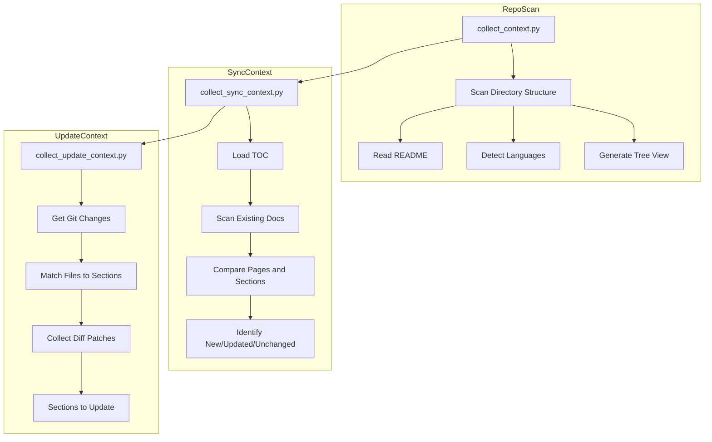

<!-- PAGE_ID: deepwiki-skill_04_python-scripts -->
<details>
<summary>Relevant source files</summary>

The following files were used as context for generating this wiki page:

- [collect_context.py:1-768](https://github.com/natsu1211/deepwiki-skill/blob/38f3e4f642cfbc9511d4cc1421b2c1ded9febd97/skills/wiki/scripts/collect_context.py#L1-L768)
- [collect_sync_context.py:1-325](https://github.com/natsu1211/deepwiki-skill/blob/38f3e4f642cfbc9511d4cc1421b2c1ded9febd97/skills/wiki/scripts/collect_sync_context.py#L1-L325)
- [collect_update_context.py:1-594](https://github.com/natsu1211/deepwiki-skill/blob/38f3e4f642cfbc9511d4cc1421b2c1ded9febd97/skills/wiki/scripts/collect_update_context.py#L1-L594)
- [read_files.py:1-390](https://github.com/natsu1211/deepwiki-skill/blob/38f3e4f642cfbc9511d4cc1421b2c1ded9febd97/skills/wiki/scripts/read_files.py#L1-L390)
- [collect_git_diff.py:1-369](https://github.com/natsu1211/deepwiki-skill/blob/38f3e4f642cfbc9511d4cc1421b2c1ded9febd97/skills/wiki/scripts/collect_git_diff.py#L1-L369)
- [get_section_update_diff.py:1-262](https://github.com/natsu1211/deepwiki-skill/blob/38f3e4f642cfbc9511d4cc1421b2c1ded9febd97/skills/wiki/scripts/get_section_update_diff.py#L1-L262)
- [validate_docs_structure.py:1-597](https://github.com/natsu1211/deepwiki-skill/blob/38f3e4f642cfbc9511d4cc1421b2c1ded9febd97/skills/wiki/scripts/validate_docs_structure.py#L1-L597)
- [validate_mermaid.py:1-826](https://github.com/natsu1211/deepwiki-skill/blob/38f3e4f642cfbc9511d4cc1421b2c1ded9febd97/skills/wiki/scripts/validate_mermaid.py#L1-L826)
- [generate_summary.py:1-502](https://github.com/natsu1211/deepwiki-skill/blob/38f3e4f642cfbc9511d4cc1421b2c1ded9febd97/skills/wiki/scripts/generate_summary.py#L1-L502)

</details>

# Python Scripts

> **Related Pages**: [[Workflow Phases|03_workflow-phases.md]], [[Documentation Policies|05_policies.md]]

---

<!-- BEGIN:AUTOGEN deepwiki-skill_04_python-scripts_context-collection -->
## Context Collection Scripts

This section documents the scripts responsible for collecting repository and synchronization context used during wiki generation phases.

### collect_context.py

The `collect_context.py` script scans a repository and collects project structure and README content for use in wiki documentation generation ([collect_context.py:2-7](https://github.com/natsu1211/deepwiki-skill/blob/38f3e4f642cfbc9511d4cc1421b2c1ded9febd97/skills/wiki/scripts/collect_context.py#L2-L7)).

**Command-line Parameters:**

| Parameter | Required | Default | Description |
|-----------|----------|---------|-------------|
| `--repo-path` | Yes | - | Repository path to scan ([collect_context.py:12](https://github.com/natsu1211/deepwiki-skill/blob/38f3e4f642cfbc9511d4cc1421b2c1ded9febd97/skills/wiki/scripts/collect_context.py#L12)) |
| `--max-depth` | No | 10 | Maximum scan depth for directory traversal ([collect_context.py:13](https://github.com/natsu1211/deepwiki-skill/blob/38f3e4f642cfbc9511d4cc1421b2c1ded9febd97/skills/wiki/scripts/collect_context.py#L13)) |
| `--include` | No | - | Include patterns for filtering files ([collect_context.py:14](https://github.com/natsu1211/deepwiki-skill/blob/38f3e4f642cfbc9511d4cc1421b2c1ded9febd97/skills/wiki/scripts/collect_context.py#L14)) |
| `--exclude` | No | - | Exclude patterns for filtering files ([collect_context.py:15](https://github.com/natsu1211/deepwiki-skill/blob/38f3e4f642cfbc9511d4cc1421b2c1ded9febd97/skills/wiki/scripts/collect_context.py#L15)) |
| `--output` | No | stdout | Output file path ([collect_context.py:16](https://github.com/natsu1211/deepwiki-skill/blob/38f3e4f642cfbc9511d4cc1421b2c1ded9febd97/skills/wiki/scripts/collect_context.py#L16)) |

**Key Features:**

- Budget-controlled context collection with configurable maximum bytes (default: 600KB) to fit within model context limits ([collect_context.py:30-32](https://github.com/natsu1211/deepwiki-skill/blob/38f3e4f642cfbc9511d4cc1421b2c1ded9febd97/skills/wiki/scripts/collect_context.py#L30-L32))
- Automatic language detection for 40+ programming languages based on file extensions ([collect_context.py:66-127](https://github.com/natsu1211/deepwiki-skill/blob/38f3e4f642cfbc9511d4cc1421b2c1ded9febd97/skills/wiki/scripts/collect_context.py#L66-L127))
- Binary file detection to exclude non-text files ([collect_context.py:196-230](https://github.com/natsu1211/deepwiki-skill/blob/38f3e4f642cfbc9511d4cc1421b2c1ded9febd97/skills/wiki/scripts/collect_context.py#L196-L230))
- Tree structure generation for visual repository layout ([collect_context.py:420-483](https://github.com/natsu1211/deepwiki-skill/blob/38f3e4f642cfbc9511d4cc1421b2c1ded9febd97/skills/wiki/scripts/collect_context.py#L420-L483))
- Default exclusion patterns for common non-source directories like `.git`, `node_modules`, `__pycache__` ([collect_context.py:38-63](https://github.com/natsu1211/deepwiki-skill/blob/38f3e4f642cfbc9511d4cc1421b2c1ded9febd97/skills/wiki/scripts/collect_context.py#L38-L63))

### collect_sync_context.py

The `collect_sync_context.py` script compares TOC structure with existing documentation to determine what needs to be synced during incremental updates ([collect_sync_context.py:2-6](https://github.com/natsu1211/deepwiki-skill/blob/38f3e4f642cfbc9511d4cc1421b2c1ded9febd97/skills/wiki/scripts/collect_sync_context.py#L2-L6)).

**Command-line Parameters:**

| Parameter | Required | Default | Description |
|-----------|----------|---------|-------------|
| `--repo-path` | Yes | - | Repository path ([collect_sync_context.py:12](https://github.com/natsu1211/deepwiki-skill/blob/38f3e4f642cfbc9511d4cc1421b2c1ded9febd97/skills/wiki/scripts/collect_sync_context.py#L12)) |
| `--toc-file` | Yes | - | TOC YAML file path ([collect_sync_context.py:13](https://github.com/natsu1211/deepwiki-skill/blob/38f3e4f642cfbc9511d4cc1421b2c1ded9febd97/skills/wiki/scripts/collect_sync_context.py#L13)) |
| `--doc-dir` | Yes | - | Documentation directory ([collect_sync_context.py:14](https://github.com/natsu1211/deepwiki-skill/blob/38f3e4f642cfbc9511d4cc1421b2c1ded9febd97/skills/wiki/scripts/collect_sync_context.py#L14)) |
| `--output` | No | stdout | Output file path ([collect_sync_context.py:15](https://github.com/natsu1211/deepwiki-skill/blob/38f3e4f642cfbc9511d4cc1421b2c1ded9febd97/skills/wiki/scripts/collect_sync_context.py#L15)) |

**Key Features:**

- Extracts PAGE_ID markers from existing documentation ([collect_sync_context.py:28-32](https://github.com/natsu1211/deepwiki-skill/blob/38f3e4f642cfbc9511d4cc1421b2c1ded9febd97/skills/wiki/scripts/collect_sync_context.py#L28-L32))
- Detects AUTOGEN section markers and identifies empty sections ([collect_sync_context.py:35-65](https://github.com/natsu1211/deepwiki-skill/blob/38f3e4f642cfbc9511d4cc1421b2c1ded9febd97/skills/wiki/scripts/collect_sync_context.py#L35-L65))
- Identifies new pages, pages to update, and unchanged pages ([collect_sync_context.py:202-244](https://github.com/natsu1211/deepwiki-skill/blob/38f3e4f642cfbc9511d4cc1421b2c1ded9febd97/skills/wiki/scripts/collect_sync_context.py#L202-L244))
- Tracks new sections, deleted sections, and existing sections with content ([collect_sync_context.py:229-241](https://github.com/natsu1211/deepwiki-skill/blob/38f3e4f642cfbc9511d4cc1421b2c1ded9febd97/skills/wiki/scripts/collect_sync_context.py#L229-L241))

### collect_update_context.py

The `collect_update_context.py` script analyzes git changes and TOC structure to determine which documentation sections need to be regenerated ([collect_update_context.py:2-7](https://github.com/natsu1211/deepwiki-skill/blob/38f3e4f642cfbc9511d4cc1421b2c1ded9febd97/skills/wiki/scripts/collect_update_context.py#L2-L7)).

**Command-line Parameters:**

| Parameter | Required | Default | Description |
|-----------|----------|---------|-------------|
| `--repo-path` | Yes | - | Repository path ([collect_update_context.py:12](https://github.com/natsu1211/deepwiki-skill/blob/38f3e4f642cfbc9511d4cc1421b2c1ded9febd97/skills/wiki/scripts/collect_update_context.py#L12)) |
| `--toc-file` | Yes | - | TOC YAML file path ([collect_update_context.py:13](https://github.com/natsu1211/deepwiki-skill/blob/38f3e4f642cfbc9511d4cc1421b2c1ded9febd97/skills/wiki/scripts/collect_update_context.py#L13)) |
| `--doc-dir` | Yes | - | Documentation directory ([collect_update_context.py:14](https://github.com/natsu1211/deepwiki-skill/blob/38f3e4f642cfbc9511d4cc1421b2c1ded9febd97/skills/wiki/scripts/collect_update_context.py#L14)) |
| `--target-commit` | No | HEAD | Target commit reference ([collect_update_context.py:15](https://github.com/natsu1211/deepwiki-skill/blob/38f3e4f642cfbc9511d4cc1421b2c1ded9febd97/skills/wiki/scripts/collect_update_context.py#L15)) |
| `--include-diff` | No | false | Include line-numbered patch data ([collect_update_context.py:16](https://github.com/natsu1211/deepwiki-skill/blob/38f3e4f642cfbc9511d4cc1421b2c1ded9febd97/skills/wiki/scripts/collect_update_context.py#L16)) |
| `--diff-context` | No | 0 | Diff context lines ([collect_update_context.py:17](https://github.com/natsu1211/deepwiki-skill/blob/38f3e4f642cfbc9511d4cc1421b2c1ded9febd97/scripts/wiki/scripts/collect_update_context.py#L17)) |
| `--no-line-numbers` | No | false | Disable line numbers in diff patches ([collect_update_context.py:18](https://github.com/natsu1211/deepwiki-skill/blob/38f3e4f642cfbc9511d4cc1421b2c1ded9febd97/skills/wiki/scripts/collect_update_context.py#L18)) |

**Key Features:**

- Compares base commit from TOC with target commit to detect changes ([collect_update_context.py:324-329](https://github.com/natsu1211/deepwiki-skill/blob/38f3e4f642cfbc9511d4cc1421b2c1ded9febd97/skills/wiki/scripts/collect_update_context.py#L324-L329))
- Matches changed files to section source patterns ([collect_update_context.py:168-190](https://github.com/natsu1211/deepwiki-skill/blob/38f3e4f642cfbc9511d4cc1421b2c1ded9febd97/skills/wiki/scripts/collect_update_context.py#L168-L190))
- Identifies sections needing update based on file changes ([collect_update_context.py:407-449](https://github.com/natsu1211/deepwiki-skill/blob/38f3e4f642cfbc9511d4cc1421b2c1ded9febd97/skills/wiki/scripts/collect_update_context.py#L407-L449))
- Converts patches to line-numbered format for accurate citations ([collect_update_context.py:103-155](https://github.com/natsu1211/deepwiki-skill/blob/38f3e4f642cfbc9511d4cc1421b2c1ded9febd97/skills/wiki/scripts/collect_update_context.py#L103-L155))
- Tracks uncovered new files that may need TOC updates ([collect_update_context.py:456-464](https://github.com/natsu1211/deepwiki-skill/blob/38f3e4f642cfbc9511d4cc1421b2c1ded9febd97/skills/wiki/scripts/collect_update_context.py#L456-L464))

### Context Collection Flow



Sources: [collect_context.py:584-706](https://github.com/natsu1211/deepwiki-skill/blob/38f3e4f642cfbc9511d4cc1421b2c1ded9febd97/skills/wiki/scripts/collect_context.py#L584-L706), [collect_sync_context.py:166-268](https://github.com/natsu1211/deepwiki-skill/blob/38f3e4f642cfbc9511d4cc1421b2c1ded9febd97/skills/wiki/scripts/collect_sync_context.py#L166-L268), [collect_update_context.py:284-506](https://github.com/natsu1211/deepwiki-skill/blob/38f3e4f642cfbc9511d4cc1421b2c1ded9febd97/skills/wiki/scripts/collect_update_context.py#L284-L506)
<!-- END:AUTOGEN deepwiki-skill_04_python-scripts_context-collection -->

---

<!-- BEGIN:AUTOGEN deepwiki-skill_04_python-scripts_file-utilities -->
## File Utilities

This section documents the scripts for reading files with line numbers and working with git diff operations.

### read_files.py

The `read_files.py` script reads multiple files and returns their contents with line numbers for citation purposes in wiki documentation generation ([read_files.py:2-6](https://github.com/natsu1211/deepwiki-skill/blob/38f3e4f642cfbc9511d4cc1421b2c1ded9febd97/skills/wiki/scripts/read_files.py#L2-L6)).

**Command-line Parameters:**

| Parameter | Required | Default | Description |
|-----------|----------|---------|-------------|
| `--repo-path` | Yes | - | Repository path ([read_files.py:15](https://github.com/natsu1211/deepwiki-skill/blob/38f3e4f642cfbc9511d4cc1421b2c1ded9febd97/skills/wiki/scripts/read_files.py#L15)) |
| `--files` | Yes | - | JSON array of file paths or glob patterns ([read_files.py:16](https://github.com/natsu1211/deepwiki-skill/blob/38f3e4f642cfbc9511d4cc1421b2c1ded9febd97/skills/wiki/scripts/read_files.py#L16)) |
| `--line-numbers` | No | true | Add line numbers to content ([read_files.py:17](https://github.com/natsu1211/deepwiki-skill/blob/38f3e4f642cfbc9511d4cc1421b2c1ded9febd97/skills/wiki/scripts/read_files.py#L17)) |
| `--max-size` | No | 1MB | Maximum file size in bytes ([read_files.py:18](https://github.com/natsu1211/deepwiki-skill/blob/38f3e4f642cfbc9511d4cc1421b2c1ded9febd97/skills/wiki/scripts/read_files.py#L18)) |
| `--output` | No | stdout | Output file path ([read_files.py:19](https://github.com/natsu1211/deepwiki-skill/blob/38f3e4f642cfbc9511d4cc1421b2c1ded9febd97/skills/wiki/scripts/read_files.py#L19)) |

**Key Features:**

- Glob pattern expansion for recursive file matching (e.g., `src/**/*.py`) ([read_files.py:30-68](https://github.com/natsu1211/deepwiki-skill/blob/38f3e4f642cfbc9511d4cc1421b2c1ded9febd97/skills/wiki/scripts/read_files.py#L30-L68))
- Line number format uses arrow delimiter: `{line_num}->{content}` ([read_files.py:239-241](https://github.com/natsu1211/deepwiki-skill/blob/38f3e4f642cfbc9511d4cc1421b2c1ded9febd97/skills/wiki/scripts/read_files.py#L239-L241))
- Automatic encoding detection for multiple encodings ([read_files.py:103-117](https://github.com/natsu1211/deepwiki-skill/blob/38f3e4f642cfbc9511d4cc1421b2c1ded9febd97/skills/wiki/scripts/read_files.py#L103-L117))
- Binary file detection to skip non-text files ([read_files.py:120-151](https://github.com/natsu1211/deepwiki-skill/blob/38f3e4f642cfbc9511d4cc1421b2c1ded9febd97/skills/wiki/scripts/read_files.py#L120-L151))
- Language detection for 40+ programming languages ([read_files.py:71-100](https://github.com/natsu1211/deepwiki-skill/blob/38f3e4f642cfbc9511d4cc1421b2c1ded9febd97/skills/wiki/scripts/read_files.py#L71-L100))

**Output Format:**

```json
{
  "files": [
    {
      "path": "src/main.ts",
      "content": "     1->import { App } from './app';\n     2->...",
      "size": 4096,
      "encoding": "utf-8",
      "language": "TypeScript"
    }
  ],
  "total_size": 4096,
  "files_read": 1,
  "files_failed": 0
}
```

### collect_git_diff.py

The `collect_git_diff.py` script collects git diff data between commits with optional line numbers and context extension ([collect_git_diff.py:2-6](https://github.com/natsu1211/deepwiki-skill/blob/38f3e4f642cfbc9511d4cc1421b2c1ded9febd97/skills/wiki/scripts/collect_git_diff.py#L2-L6)).

**Command-line Parameters:**

| Parameter | Required | Default | Description |
|-----------|----------|---------|-------------|
| `--repo-path` | Yes | - | Repository path ([collect_git_diff.py:12](https://github.com/natsu1211/deepwiki-skill/blob/38f3e4f642cfbc9511d4cc1421b2c1ded9febd97/skills/wiki/scripts/collect_git_diff.py#L12)) |
| `--base-ref` | No | origin/main | Base reference for diff ([collect_git_diff.py:13](https://github.com/natsu1211/deepwiki-skill/blob/38f3e4f642cfbc9511d4cc1421b2c1ded9febd97/skills/wiki/scripts/collect_git_diff.py#L13)) |
| `--head-ref` | No | HEAD | Head reference for diff ([collect_git_diff.py:14](https://github.com/natsu1211/deepwiki-skill/blob/38f3e4f642cfbc9511d4cc1421b2c1ded9febd97/skills/wiki/scripts/collect_git_diff.py#L14)) |
| `--include-uncommitted` | No | false | Include staged/unstaged changes ([collect_git_diff.py:15](https://github.com/natsu1211/deepwiki-skill/blob/38f3e4f642cfbc9511d4cc1421b2c1ded9febd97/skills/wiki/scripts/collect_git_diff.py#L15)) |
| `--context` | No | 3 | Context lines for diff ([collect_git_diff.py:16](https://github.com/natsu1211/deepwiki-skill/blob/38f3e4f642cfbc9511d4cc1421b2c1ded9febd97/skills/wiki/scripts/collect_git_diff.py#L16)) |
| `--no-line-numbers` | No | false | Disable line numbers in patches ([collect_git_diff.py:17](https://github.com/natsu1211/deepwiki-skill/blob/38f3e4f642cfbc9511d4cc1421b2c1ded9febd97/skills/wiki/scripts/collect_git_diff.py#L17)) |

**Key Features:**

- Uses merge base for proper diff calculation between branches ([collect_git_diff.py:48-50](https://github.com/natsu1211/deepwiki-skill/blob/38f3e4f642cfbc9511d4cc1421b2c1ded9febd97/skills/wiki/scripts/collect_git_diff.py#L48-L50))
- Converts patches to line-numbered format with `+`/`-` prefixes ([collect_git_diff.py:120-172](https://github.com/natsu1211/deepwiki-skill/blob/38f3e4f642cfbc9511d4cc1421b2c1ded9febd97/skills/wiki/scripts/collect_git_diff.py#L120-L172))
- Supports staged and unstaged changes collection ([collect_git_diff.py:98-117](https://github.com/natsu1211/deepwiki-skill/blob/38f3e4f642cfbc9511d4cc1421b2c1ded9febd97/skills/wiki/scripts/collect_git_diff.py#L98-L117))
- Tracks file status (Added, Modified, Deleted, Renamed) ([collect_git_diff.py:53-73](https://github.com/natsu1211/deepwiki-skill/blob/38f3e4f642cfbc9511d4cc1421b2c1ded9febd97/skills/wiki/scripts/collect_git_diff.py#L53-L73))

### get_section_update_diff.py

The `get_section_update_diff.py` script retrieves line-numbered diffs for specific files in a commit range, used for targeted section updates ([get_section_update_diff.py:2-8](https://github.com/natsu1211/deepwiki-skill/blob/38f3e4f642cfbc9511d4cc1421b2c1ded9febd97/skills/wiki/scripts/get_section_update_diff.py#L2-L8)).

**Command-line Parameters:**

| Parameter | Required | Default | Description |
|-----------|----------|---------|-------------|
| `--repo-path` | Yes | - | Repository path ([get_section_update_diff.py:191-194](https://github.com/natsu1211/deepwiki-skill/blob/38f3e4f642cfbc9511d4cc1421b2c1ded9febd97/skills/wiki/scripts/get_section_update_diff.py#L191-L194)) |
| `--base-commit` | Yes | - | Base commit hash ([get_section_update_diff.py:196-199](https://github.com/natsu1211/deepwiki-skill/blob/38f3e4f642cfbc9511d4cc1421b2c1ded9febd97/skills/wiki/scripts/get_section_update_diff.py#L196-L199)) |
| `--target-commit` | Yes | - | Target commit hash ([get_section_update_diff.py:200-204](https://github.com/natsu1211/deepwiki-skill/blob/38f3e4f642cfbc9511d4cc1421b2c1ded9febd97/skills/wiki/scripts/get_section_update_diff.py#L200-L204)) |
| `--file-paths` | Yes | - | JSON array of file paths ([get_section_update_diff.py:205-208](https://github.com/natsu1211/deepwiki-skill/blob/38f3e4f642cfbc9511d4cc1421b2c1ded9febd97/skills/wiki/scripts/get_section_update_diff.py#L205-L208)) |
| `--context` | No | 0 | Context lines for diff ([get_section_update_diff.py:209-213](https://github.com/natsu1211/deepwiki-skill/blob/38f3e4f642cfbc9511d4cc1421b2c1ded9febd97/skills/wiki/scripts/get_section_update_diff.py#L209-L213)) |

**Key Features:**

- Focused diff retrieval for specific files only ([get_section_update_diff.py:128-184](https://github.com/natsu1211/deepwiki-skill/blob/38f3e4f642cfbc9511d4cc1421b2c1ded9febd97/skills/wiki/scripts/get_section_update_diff.py#L128-L184))
- Line-numbered patch formatting identical to `collect_git_diff.py` ([get_section_update_diff.py:73-125](https://github.com/natsu1211/deepwiki-skill/blob/38f3e4f642cfbc9511d4cc1421b2c1ded9febd97/skills/wiki/scripts/get_section_update_diff.py#L73-L125))
- Returns file sizes before and after changes for impact assessment ([get_section_update_diff.py:163-166](https://github.com/natsu1211/deepwiki-skill/blob/38f3e4f642cfbc9511d4cc1421b2c1ded9febd97/skills/wiki/scripts/get_section_update_diff.py#L163-L166))

Sources: [read_files.py:179-309](https://github.com/natsu1211/deepwiki-skill/blob/38f3e4f642cfbc9511d4cc1421b2c1ded9febd97/skills/wiki/scripts/read_files.py#L179-L309), [collect_git_diff.py:175-292](https://github.com/natsu1211/deepwiki-skill/blob/38f3e4f642cfbc9511d4cc1421b2c1ded9febd97/skills/wiki/scripts/collect_git_diff.py#L175-L292), [get_section_update_diff.py:128-184](https://github.com/natsu1211/deepwiki-skill/blob/38f3e4f642cfbc9511d4cc1421b2c1ded9febd97/skills/wiki/scripts/get_section_update_diff.py#L128-L184)
<!-- END:AUTOGEN deepwiki-skill_04_python-scripts_file-utilities -->

---

<!-- BEGIN:AUTOGEN deepwiki-skill_04_python-scripts_validation -->
## Validation Scripts

This section documents the scripts for validating document structure and Mermaid diagrams.

### validate_docs_structure.py

The `validate_docs_structure.py` script validates wiki documentation structure against the TOC specification ([validate_docs_structure.py:2-11](https://github.com/natsu1211/deepwiki-skill/blob/38f3e4f642cfbc9511d4cc1421b2c1ded9febd97/skills/wiki/scripts/validate_docs_structure.py#L2-L11)).

**Validation Checks:**

| Category | Description |
|----------|-------------|
| PAGE_ID | Validates presence and correctness of PAGE_ID markers ([validate_docs_structure.py:373-394](https://github.com/natsu1211/deepwiki-skill/blob/38f3e4f642cfbc9511d4cc1421b2c1ded9febd97/skills/wiki/scripts/validate_docs_structure.py#L373-L394)) |
| AUTOGEN | Validates BEGIN/END marker pairs and no overlaps ([validate_docs_structure.py:155-248](https://github.com/natsu1211/deepwiki-skill/blob/38f3e4f642cfbc9511d4cc1421b2c1ded9febd97/skills/wiki/scripts/validate_docs_structure.py#L155-L248)) |
| TOC Alignment | Verifies all pages and sections defined in TOC exist ([validate_docs_structure.py:462-503](https://github.com/natsu1211/deepwiki-skill/blob/38f3e4f642cfbc9511d4cc1421b2c1ded9febd97/skills/wiki/scripts/validate_docs_structure.py#L462-L503)) |
| Internal Links | Validates internal markdown links point to valid targets ([validate_docs_structure.py:251-296](https://github.com/natsu1211/deepwiki-skill/blob/38f3e4f642cfbc9511d4cc1421b2c1ded9febd97/skills/wiki/scripts/validate_docs_structure.py#L251-L296)) |
| Structure | Validates H1 headings and basic structure ([validate_docs_structure.py:299-342](https://github.com/natsu1211/deepwiki-skill/blob/38f3e4f642cfbc9511d4cc1421b2c1ded9febd97/skills/wiki/scripts/validate_docs_structure.py#L299-L342)) |

**Command-line Parameters:**

| Parameter | Required | Default | Description |
|-----------|----------|---------|-------------|
| `--doc-dir` | Yes | - | Directory containing .md docs ([validate_docs_structure.py:531-534](https://github.com/natsu1211/deepwiki-skill/blob/38f3e4f642cfbc9511d4cc1421b2c1ded9febd97/skills/wiki/scripts/validate_docs_structure.py#L531-L534)) |
| `--toc-file` | Yes | - | Path to toc.yaml file ([validate_docs_structure.py:535-538](https://github.com/natsu1211/deepwiki-skill/blob/38f3e4f642cfbc9511d4cc1421b2c1ded9febd97/skills/wiki/scripts/validate_docs_structure.py#L535-L538)) |
| `--output` | No | stdout | Output JSON report path ([validate_docs_structure.py:539-542](https://github.com/natsu1211/deepwiki-skill/blob/38f3e4f642cfbc9511d4cc1421b2c1ded9febd97/skills/wiki/scripts/validate_docs_structure.py#L539-L542)) |
| `--errors-only` | No | false | Only report errors, not warnings ([validate_docs_structure.py:543-546](https://github.com/natsu1211/deepwiki-skill/blob/38f3e4f642cfbc9511d4cc1421b2c1ded9febd97/skills/wiki/scripts/validate_docs_structure.py#L543-L546)) |

**Issue Data Structure:**

The script uses an `Issue` dataclass to represent validation problems ([validate_docs_structure.py:45-63](https://github.com/natsu1211/deepwiki-skill/blob/38f3e4f642cfbc9511d4cc1421b2c1ded9febd97/skills/wiki/scripts/validate_docs_structure.py#L45-L63)):

```python
@dataclass
class Issue:
    file: str           # Affected filename
    line: Optional[int] # Line number where issue occurs
    severity: str       # "error" or "warning"
    category: str       # "page_id", "autogen", "structure", "link", "toc"
    message: str        # Description of the issue
    fix_hint: str       # Suggested fix
```

### validate_mermaid.py

The `validate_mermaid.py` script extracts and validates Mermaid diagram syntax using mermaid-cli ([validate_mermaid.py:2-7](https://github.com/natsu1211/deepwiki-skill/blob/38f3e4f642cfbc9511d4cc1421b2c1ded9febd97/skills/wiki/scripts/validate_mermaid.py#L2-L7)).

**Command-line Parameters:**

| Parameter | Required | Default | Description |
|-----------|----------|---------|-------------|
| `--input` | Yes* | - | Input file (.mmd) or directory ([validate_mermaid.py:689-692](https://github.com/natsu1211/deepwiki-skill/blob/38f3e4f642cfbc9511d4cc1421b2c1ded9febd97/skills/wiki/scripts/validate_mermaid.py#L689-L692)) |
| `--code` | Yes* | - | Mermaid code string directly ([validate_mermaid.py:693-696](https://github.com/natsu1211/deepwiki-skill/blob/38f3e4f642cfbc9511d4cc1421b2c1ded9febd97/skills/wiki/scripts/validate_mermaid.py#L693-L696)) |
| `--blocks` | Yes* | - | JSON file with pre-extracted blocks ([validate_mermaid.py:697-700](https://github.com/natsu1211/deepwiki-skill/blob/38f3e4f642cfbc9511d4cc1421b2c1ded9febd97/skills/wiki/scripts/validate_mermaid.py#L697-L700)) |
| `--invalid-only` | No | false | Only output invalid blocks ([validate_mermaid.py:715-718](https://github.com/natsu1211/deepwiki-skill/blob/38f3e4f642cfbc9511d4cc1421b2c1ded9febd97/skills/wiki/scripts/validate_mermaid.py#L715-L718)) |
| `--extract-only` | No | false | Only extract blocks, skip validation ([validate_mermaid.py:719-722](https://github.com/natsu1211/deepwiki-skill/blob/38f3e4f642cfbc9511d4cc1421b2c1ded9febd97/skills/wiki/scripts/validate_mermaid.py#L719-L722)) |

*One of `--input`, `--code`, or `--blocks` is required

**Key Features:**

- Extracts Mermaid code blocks from Markdown files ([validate_mermaid.py:86-141](https://github.com/natsu1211/deepwiki-skill/blob/38f3e4f642cfbc9511d4cc1421b2c1ded9febd97/skills/wiki/scripts/validate_mermaid.py#L86-L141))
- Detects diagram types (flowchart, sequence, class, state, er, gantt) ([validate_mermaid.py:144-167](https://github.com/natsu1211/deepwiki-skill/blob/38f3e4f642cfbc9511d4cc1421b2c1ded9febd97/skills/wiki/scripts/validate_mermaid.py#L144-L167))
- Validates using mermaid-cli (mmdc) executable ([validate_mermaid.py:477-563](https://github.com/natsu1211/deepwiki-skill/blob/38f3e4f642cfbc9511d4cc1421b2c1ded9febd97/skills/wiki/scripts/validate_mermaid.py#L477-L563))
- Classifies errors and provides fix hints ([validate_mermaid.py:376-443](https://github.com/natsu1211/deepwiki-skill/blob/38f3e4f642cfbc9511d4cc1421b2c1ded9febd97/skills/wiki/scripts/validate_mermaid.py#L376-L443))
- Caches mmdc availability check for performance ([validate_mermaid.py:335-347](https://github.com/natsu1211/deepwiki-skill/blob/38f3e4f642cfbc9511d4cc1421b2c1ded9febd97/skills/wiki/scripts/validate_mermaid.py#L335-L347))

**Error Types:**

| Type | Description |
|------|-------------|
| `lexical_error` | Unrecognized text or character issues ([validate_mermaid.py:381](https://github.com/natsu1211/deepwiki-skill/blob/38f3e4f642cfbc9511d4cc1421b2c1ded9febd97/skills/wiki/scripts/validate_mermaid.py#L381)) |
| `syntax_error` | General syntax issues ([validate_mermaid.py:382-383](https://github.com/natsu1211/deepwiki-skill/blob/38f3e4f642cfbc9511d4cc1421b2c1ded9febd97/skills/wiki/scripts/validate_mermaid.py#L382-L383)) |
| `node_error` | Problems with node definitions ([validate_mermaid.py:384-385](https://github.com/natsu1211/deepwiki-skill/blob/38f3e4f642cfbc9511d4cc1421b2c1ded9febd97/skills/wiki/scripts/validate_mermaid.py#L384-L385)) |
| `edge_error` | Problems with arrows/edges ([validate_mermaid.py:386-387](https://github.com/natsu1211/deepwiki-skill/blob/38f3e4f642cfbc9511d4cc1421b2c1ded9febd97/skills/wiki/scripts/validate_mermaid.py#L386-L387)) |
| `graph_structure_error` | Issues with diagram structure ([validate_mermaid.py:388-389](https://github.com/natsu1211/deepwiki-skill/blob/38f3e4f642cfbc9511d4cc1421b2c1ded9febd97/skills/wiki/scripts/validate_mermaid.py#L388-L389)) |
| `cli_unavailable` | mmdc not installed ([validate_mermaid.py:546-549](https://github.com/natsu1211/deepwiki-skill/blob/38f3e4f642cfbc9511d4cc1421b2c1ded9febd97/skills/wiki/scripts/validate_mermaid.py#L546-L549)) |
| `timeout` | Validation timeout ([validate_mermaid.py:535-541](https://github.com/natsu1211/deepwiki-skill/blob/38f3e4f642cfbc9511d4cc1421b2c1ded9febd97/skills/wiki/scripts/validate_mermaid.py#L535-L541)) |

Sources: [validate_docs_structure.py:433-524](https://github.com/natsu1211/deepwiki-skill/blob/38f3e4f642cfbc9511d4cc1421b2c1ded9febd97/skills/wiki/scripts/validate_docs_structure.py#L433-L524), [validate_mermaid.py:590-681](https://github.com/natsu1211/deepwiki-skill/blob/38f3e4f642cfbc9511d4cc1421b2c1ded9febd97/skills/wiki/scripts/validate_mermaid.py#L590-L681)
<!-- END:AUTOGEN deepwiki-skill_04_python-scripts_validation -->

---

<!-- BEGIN:AUTOGEN deepwiki-skill_04_python-scripts_summary-generation -->
## Summary Generation

This section documents the script for generating documentation summary reports.

### generate_summary.py

The `generate_summary.py` script analyzes generated documentation and produces a summary report (SUMMARY.md) with generation status, citation statistics, diagram validation summary, and recommendations ([generate_summary.py:2-9](https://github.com/natsu1211/deepwiki-skill/blob/38f3e4f642cfbc9511d4cc1421b2c1ded9febd97/skills/wiki/scripts/generate_summary.py#L2-L9)).

**Command-line Parameters:**

| Parameter | Required | Default | Description |
|-----------|----------|---------|-------------|
| `--doc-dir` | Yes | - | Directory containing generated .md docs ([generate_summary.py:420-423](https://github.com/natsu1211/deepwiki-skill/blob/38f3e4f642cfbc9511d4cc1421b2c1ded9febd97/skills/wiki/scripts/generate_summary.py#L420-L423)) |
| `--toc-file` | Yes | - | Path to toc.yaml file ([generate_summary.py:424-427](https://github.com/natsu1211/deepwiki-skill/blob/38f3e4f642cfbc9511d4cc1421b2c1ded9febd97/skills/wiki/scripts/generate_summary.py#L424-L427)) |
| `--structure-report` | No | - | Path to structure_validation.json ([generate_summary.py:428-431](https://github.com/natsu1211/deepwiki-skill/blob/38f3e4f642cfbc9511d4cc1421b2c1ded9febd97/skills/wiki/scripts/generate_summary.py#L428-L431)) |
| `--mermaid-report` | No | - | Path to mermaid_invalid.json ([generate_summary.py:432-435](https://github.com/natsu1211/deepwiki-skill/blob/38f3e4f642cfbc9511d4cc1421b2c1ded9febd97/skills/wiki/scripts/generate_summary.py#L432-L435)) |
| `--output` | No | `{doc_dir}/_reports/SUMMARY.md` | Output path for summary ([generate_summary.py:436-439](https://github.com/natsu1211/deepwiki-skill/blob/38f3e4f642cfbc9511d4cc1421b2c1ded9febd97/skills/wiki/scripts/generate_summary.py#L436-L439)) |

**Summary Report Contents:**

1. **Generation Status** - Overall completion status, pages/sections counts, citation and diagram statistics ([generate_summary.py:303-328](https://github.com/natsu1211/deepwiki-skill/blob/38f3e4f642cfbc9511d4cc1421b2c1ded9febd97/skills/wiki/scripts/generate_summary.py#L303-L328))

2. **Page Details** - Per-page breakdown with section completion, citations, and diagrams ([generate_summary.py:331-342](https://github.com/natsu1211/deepwiki-skill/blob/38f3e4f642cfbc9511d4cc1421b2c1ded9febd97/skills/wiki/scripts/generate_summary.py#L331-L342))

3. **Source Coverage** - Lists covered files with their citing pages and uncovered files needing attention ([generate_summary.py:344-363](https://github.com/natsu1211/deepwiki-skill/blob/38f3e4f642cfbc9511d4cc1421b2c1ded9febd97/skills/wiki/scripts/generate_summary.py#L344-L363))

4. **Issues** - Errors that must be fixed and warnings from validation reports ([generate_summary.py:365-390](https://github.com/natsu1211/deepwiki-skill/blob/38f3e4f642cfbc9511d4cc1421b2c1ded9febd97/skills/wiki/scripts/generate_summary.py#L365-L390))

5. **Recommendations** - Actionable suggestions based on analysis ([generate_summary.py:392-411](https://github.com/natsu1211/deepwiki-skill/blob/38f3e4f642cfbc9511d4cc1421b2c1ded9febd97/skills/wiki/scripts/generate_summary.py#L392-L411))

**Key Features:**

- Extracts citations from markdown content using regex pattern matching ([generate_summary.py:134-146](https://github.com/natsu1211/deepwiki-skill/blob/38f3e4f642cfbc9511d4cc1421b2c1ded9febd97/skills/wiki/scripts/generate_summary.py#L134-L146))
- Counts Mermaid diagram blocks in each page ([generate_summary.py:149-152](https://github.com/natsu1211/deepwiki-skill/blob/38f3e4f642cfbc9511d4cc1421b2c1ded9febd97/skills/wiki/scripts/generate_summary.py#L149-L152))
- Analyzes source file coverage by matching cited files to TOC source files ([generate_summary.py:249-270](https://github.com/natsu1211/deepwiki-skill/blob/38f3e4f642cfbc9511d4cc1421b2c1ded9febd97/skills/wiki/scripts/generate_summary.py#L249-L270))
- Integrates with validation reports from structure and Mermaid validation ([generate_summary.py:272-286](https://github.com/natsu1211/deepwiki-skill/blob/38f3e4f642cfbc9511d4cc1421b2c1ded9febd97/scripts/wiki/scripts/generate_summary.py#L272-L286))
- Uses emoji status indicators for quick visual assessment ([generate_summary.py:55-62](https://github.com/natsu1211/deepwiki-skill/blob/38f3e4f642cfbc9511d4cc1421b2c1ded9febd97/skills/wiki/scripts/generate_summary.py#L55-L62))

**Data Structures:**

```python
@dataclass
class PageStats:
    filename: str
    title: str
    expected_sections: int
    found_sections: int
    citations: int
    diagrams: int
    has_page_id: bool
    issues: List[str]
```

([generate_summary.py:43-62](https://github.com/natsu1211/deepwiki-skill/blob/38f3e4f642cfbc9511d4cc1421b2c1ded9febd97/skills/wiki/scripts/generate_summary.py#L43-L62))

Sources: [generate_summary.py:173-287](https://github.com/natsu1211/deepwiki-skill/blob/38f3e4f642cfbc9511d4cc1421b2c1ded9febd97/skills/wiki/scripts/generate_summary.py#L173-L287), [generate_summary.py:290-413](https://github.com/natsu1211/deepwiki-skill/blob/38f3e4f642cfbc9511d4cc1421b2c1ded9febd97/skills/wiki/scripts/generate_summary.py#L290-L413)
<!-- END:AUTOGEN deepwiki-skill_04_python-scripts_summary-generation -->

---
