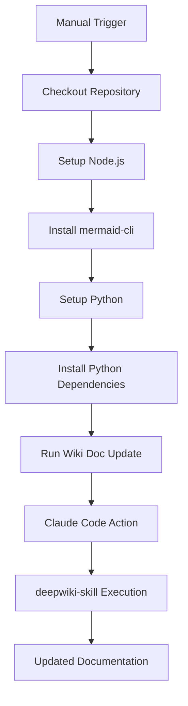

<!-- PAGE_ID: deepwiki-skill_06_cicd -->
<details>
<summary>Relevant source files</summary>

The following files were used as context for generating this wiki page:

- [README.md:1-290](https://github.com/natsu1211/deepwiki-skill/blob/784d30af68157f49d7f829f85d49dafe9fba65cd/README.md#L1-L290)

</details>

# CI/CD Integration

> **Related Pages**: [[Overview|01_overview.md]]

---

<!-- BEGIN:AUTOGEN deepwiki-skill_06_cicd_overview -->
## CI/CD Overview

This section describes the benefits and approach for integrating deepwiki-skill into CI/CD pipelines to automate documentation generation and updates.

### Benefits of CI/CD Integration

One of the key advantages of deepwiki-skill is its built-in support for CI/CD integration. As stated in the project documentation, deepwiki-skill is "CI/CD Ready" with built-in incremental updates feature that makes it easy to deploy in CI/CD pipelines, keeping docs synchronized with code changes ([README.md:11](https://github.com/natsu1211/deepwiki-skill/blob/784d30af68157f49d7f829f85d49dafe9fba65cd/README.md#L11)).

Key benefits include:

| Benefit | Description |
|---------|-------------|
| Automated Documentation | Documentation is automatically generated or updated as part of your CI/CD workflow |
| Incremental Updates | Only affected sections are updated after code changes, reducing processing time ([README.md:11](https://github.com/natsu1211/deepwiki-skill/blob/784d30af68157f49d7f829f85d49dafe9fba65cd/README.md#L11)) |
| Code-Doc Synchronization | Ensures documentation stays in sync with the latest code changes |
| Headless Execution | Supports running from CLI in headless mode for automation ([README.md:127-130](https://github.com/natsu1211/deepwiki-skill/blob/784d30af68157f49d7f829f85d49dafe9fba65cd/README.md#L127-L130)) |

### Headless Mode

For CI/CD environments, deepwiki-skill can be run in headless mode (also called "yolo mode") using the Claude CLI:

```bash
claude -p "/deepwiki-skill:gen" --dangerously-skip-permissions
```

This allows the tool to run without interactive prompts, suitable for automated pipelines ([README.md:127-130](https://github.com/natsu1211/deepwiki-skill/blob/784d30af68157f49d7f829f85d49dafe9fba65cd/README.md#L127-L130)).

Sources: [README.md:11](https://github.com/natsu1211/deepwiki-skill/blob/784d30af68157f49d7f829f85d49dafe9fba65cd/README.md#L11), [README.md:127-130](https://github.com/natsu1211/deepwiki-skill/blob/784d30af68157f49d7f829f85d49dafe9fba65cd/README.md#L127-L130)
<!-- END:AUTOGEN deepwiki-skill_06_cicd_overview -->

---

<!-- BEGIN:AUTOGEN deepwiki-skill_06_cicd_github-actions -->
## GitHub Actions Integration

This section provides detailed guidance on integrating deepwiki-skill with GitHub Actions using Claude Code.

### Authentication Setup

Before setting up the GitHub Actions workflow, you need to configure authentication. If you have a Pro/Max subscription, create an OAuth token first ([README.md:151](https://github.com/natsu1211/deepwiki-skill/blob/784d30af68157f49d7f829f85d49dafe9fba65cd/README.md#L151)):

```bash
claude setup-token
```

Record the token output in your terminal and save it to GitHub secrets for your repository, giving it a name like `CLAUDE_CODE_OAUTH_TOKEN` ([README.md:153-158](https://github.com/natsu1211/deepwiki-skill/blob/784d30af68157f49d7f829f85d49dafe9fba65cd/README.md#L153-L158)).

If you prefer to use an API key instead, save the API key to GitHub secrets rather than an OAuth token ([README.md:151](https://github.com/natsu1211/deepwiki-skill/blob/784d30af68157f49d7f829f85d49dafe9fba65cd/README.md#L151)).

### Workflow Architecture

The following diagram illustrates the GitHub Actions workflow for wiki documentation updates:



### Example Workflow Configuration

The following is a complete GitHub Actions workflow example that can be triggered manually to incrementally update existing documentation ([README.md:161-212](https://github.com/natsu1211/deepwiki-skill/blob/784d30af68157f49d7f829f85d49dafe9fba65cd/README.md#L161-L212)):

```yaml
name: Wiki Doc Update

on:
  workflow_dispatch:

jobs:
  generate:
    runs-on: ubuntu-latest
    permissions:
      contents: write
      pull-requests: write
      issues: write
      id-token: write
    steps:
      - name: Checkout repository
        uses: actions/checkout@v4
        with:
          fetch-depth: 1

      - name: Setup Node.js
        uses: actions/setup-node@v4
        with:
          node-version: '20'

      - name: Install mermaid-cli
        run: npm install -g @mermaid-js/mermaid-cli

      - name: Setup Python
        uses: actions/setup-python@v5
        with:
          python-version: '3.12'

      - name: Install Python dependencies
        run: |
          if [ -f skills/wiki/scripts/requirements.txt ]; then
            pip install -r skills/wiki/scripts/requirements.txt
          fi

      - name: Run Wiki Doc Update
        id: deepwiki-skill
        uses: anthropics/claude-code-action@v1
        with:
          plugin_marketplaces: 'https://github.com/natsu1211/deepwiki-skill.git'
          plugins: 'deepwiki-skill@deepwiki-skill-marketplace'
          claude_code_oauth_token: ${{ secrets.CLAUDE_CODE_OAUTH_TOKEN }}
          prompt: '/deepwiki-skill:gen docs/wiki/toc.yaml --update'
          additional_permissions: |
            actions: read
```

### Key Workflow Components

| Component | Purpose |
|-----------|---------|
| `workflow_dispatch` | Enables manual triggering of the workflow ([README.md:165-166](https://github.com/natsu1211/deepwiki-skill/blob/784d30af68157f49d7f829f85d49dafe9fba65cd/README.md#L165-L166)) |
| `permissions` | Grants necessary permissions for writing content and pull requests ([README.md:171-175](https://github.com/natsu1211/deepwiki-skill/blob/784d30af68157f49d7f829f85d49dafe9fba65cd/README.md#L171-L175)) |
| Node.js setup | Required for mermaid-cli diagram validation ([README.md:182-188](https://github.com/natsu1211/deepwiki-skill/blob/784d30af68157f49d7f829f85d49dafe9fba65cd/README.md#L182-L188)) |
| Python setup | Required for deepwiki-skill scripts (Python 3.12) ([README.md:190-193](https://github.com/natsu1211/deepwiki-skill/blob/784d30af68157f49d7f829f85d49dafe9fba65cd/README.md#L190-L193)) |
| `claude-code-action@v1` | The official Anthropic GitHub Action for running Claude Code ([README.md:203](https://github.com/natsu1211/deepwiki-skill/blob/784d30af68157f49d7f829f85d49dafe9fba65cd/README.md#L203)) |
| `--update` flag | Triggers incremental update mode for efficient documentation updates ([README.md:208](https://github.com/natsu1211/deepwiki-skill/blob/784d30af68157f49d7f829f85d49dafe9fba65cd/README.md#L208)) |

### Prerequisites in CI Environment

The workflow ensures all prerequisites are installed:

1. **Node.js 20** - Required for mermaid-cli
2. **mermaid-cli** - For diagram validation (`npm install -g @mermaid-js/mermaid-cli`) ([README.md:187-188](https://github.com/natsu1211/deepwiki-skill/blob/784d30af68157f49d7f829f85d49dafe9fba65cd/README.md#L187-L188))
3. **Python 3.12** - For deepwiki-skill scripts ([README.md:192-193](https://github.com/natsu1211/deepwiki-skill/blob/784d30af68157f49d7f829f85d49dafe9fba65cd/README.md#L192-L193))
4. **Python dependencies** - Installed from `skills/wiki/scripts/requirements.txt` if present ([README.md:195-199](https://github.com/natsu1211/deepwiki-skill/blob/784d30af68157f49d7f829f85d49dafe9fba65cd/README.md#L195-L199))

Sources: [README.md:147-212](https://github.com/natsu1211/deepwiki-skill/blob/784d30af68157f49d7f829f85d49dafe9fba65cd/README.md#L147-L212)
<!-- END:AUTOGEN deepwiki-skill_06_cicd_github-actions -->

---

<!-- BEGIN:AUTOGEN deepwiki-skill_06_cicd_other-platforms -->
## Other Platforms

While Claude Code provides the best subagent support for deepwiki-skill, the skill can also be integrated with other AI coding assistants in CI/CD pipelines.

### Gemini CLI Integration

For integrating deepwiki-skill with Gemini CLI in CI/CD, refer to the official Gemini CLI GitHub Action:

- **GitHub Action**: https://github.com/google-github-actions/run-gemini-cli ([README.md:214-215](https://github.com/natsu1211/deepwiki-skill/blob/784d30af68157f49d7f829f85d49dafe9fba65cd/README.md#L214-L215))

Note that Gemini CLI version 0.24.0 or higher is required to use agent skills. Manual installation will not include subagents, and generation quality may degrade due to the limited context window ([README.md:47](https://github.com/natsu1211/deepwiki-skill/blob/784d30af68157f49d7f829f85d49dafe9fba65cd/README.md#L47)).

### Codex Integration

For integrating deepwiki-skill with Codex in CI/CD, refer to the official Codex GitHub Action:

- **GitHub Action**: https://github.com/openai/codex-action ([README.md:217-218](https://github.com/natsu1211/deepwiki-skill/blob/784d30af68157f49d7f829f85d49dafe9fba65cd/README.md#L217-L218))

Note that generation quality may degrade with Codex due to the limited context window ([README.md:65](https://github.com/natsu1211/deepwiki-skill/blob/784d30af68157f49d7f829f85d49dafe9fba65cd/README.md#L65)).

### Platform Comparison

| Platform | CI/CD Action | Notes |
|----------|--------------|-------|
| Claude Code | `anthropics/claude-code-action@v1` | Best subagent support, recommended for optimal results ([README.md:33](https://github.com/natsu1211/deepwiki-skill/blob/784d30af68157f49d7f829f85d49dafe9fba65cd/README.md#L33)) |
| Gemini CLI | `google-github-actions/run-gemini-cli` | Requires v0.24.0+, limited context window ([README.md:47](https://github.com/natsu1211/deepwiki-skill/blob/784d30af68157f49d7f829f85d49dafe9fba65cd/README.md#L47)) |
| Codex | `openai/codex-action` | Limited context window may affect quality ([README.md:65](https://github.com/natsu1211/deepwiki-skill/blob/784d30af68157f49d7f829f85d49dafe9fba65cd/README.md#L65)) |

Sources: [README.md:33](https://github.com/natsu1211/deepwiki-skill/blob/784d30af68157f49d7f829f85d49dafe9fba65cd/README.md#L33), [README.md:47](https://github.com/natsu1211/deepwiki-skill/blob/784d30af68157f49d7f829f85d49dafe9fba65cd/README.md#L47), [README.md:65](https://github.com/natsu1211/deepwiki-skill/blob/784d30af68157f49d7f829f85d49dafe9fba65cd/README.md#L65), [README.md:214-218](https://github.com/natsu1211/deepwiki-skill/blob/784d30af68157f49d7f829f85d49dafe9fba65cd/README.md#L214-L218)
<!-- END:AUTOGEN deepwiki-skill_06_cicd_other-platforms -->

---
