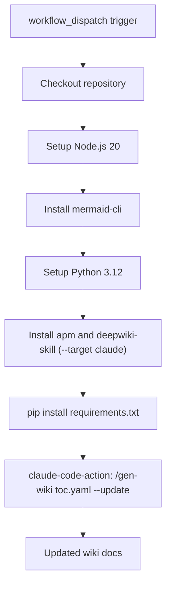

<!-- PAGE_ID: deepwiki-skill_06_cicd-installation -->
<details>
<summary>📚 Relevant source files</summary>

The following files were used as context for generating this wiki page:

- [README.md:1-333](https://github.com/natsu1211/deepwiki-skill/blob/5623db8cf158176a7d55791d6fb9bcb992834262/README.md#L1-L333)
- [apm.yml:1-23](https://github.com/natsu1211/deepwiki-skill/blob/5623db8cf158176a7d55791d6fb9bcb992834262/apm.yml#L1-L23)
- [requirements.txt:1-2](https://github.com/natsu1211/deepwiki-skill/blob/5623db8cf158176a7d55791d6fb9bcb992834262/.apm/skills/wiki/scripts/requirements.txt#L1-L2)

</details>

# Installation and CI/CD Integration

> **Related Pages**: [[Overview|01_overview.md]], [[Workflow Phases and Execution Modes|03_workflow.md]]

---

<!-- BEGIN:AUTOGEN deepwiki-skill_06_cicd-installation_prerequisites -->
## Prerequisites and Installation

This section covers the runtime dependencies deepwiki-skill needs and how to install the package into an AI coding agent using apm.

### Prerequisites

deepwiki-skill relies on a Python runtime for its deterministic helper scripts and on the Mermaid CLI for validating generated diagrams ([README.md:41-46](https://github.com/natsu1211/deepwiki-skill/blob/5623db8cf158176a7d55791d6fb9bcb992834262/README.md#L41-L46)). The Mermaid CLI is installed globally via npm, so Node.js is also required ([README.md:43-46](https://github.com/natsu1211/deepwiki-skill/blob/5623db8cf158176a7d55791d6fb9bcb992834262/README.md#L43-L46)).

| Requirement | Version / Detail | Purpose |
|-------------|------------------|---------|
| Python | `>=3.12` | Runs the phase helper scripts ([README.md:42](https://github.com/natsu1211/deepwiki-skill/blob/5623db8cf158176a7d55791d6fb9bcb992834262/README.md#L42)) |
| Node.js + Mermaid CLI | `@mermaid-js/mermaid-cli` (global) | Validates generated Mermaid diagrams ([README.md:43-46](https://github.com/natsu1211/deepwiki-skill/blob/5623db8cf158176a7d55791d6fb9bcb992834262/README.md#L43-L46)) |
| PyYAML | `>=6.0` | Parses `toc.yaml` inside the scripts ([requirements.txt:1-2](https://github.com/natsu1211/deepwiki-skill/blob/5623db8cf158176a7d55791d6fb9bcb992834262/.apm/skills/wiki/scripts/requirements.txt#L1-L2)) |

The only declared Python package dependency is `PyYAML>=6.0`, which is listed in the scripts' `requirements.txt` ([requirements.txt:1-2](https://github.com/natsu1211/deepwiki-skill/blob/5623db8cf158176a7d55791d6fb9bcb992834262/.apm/skills/wiki/scripts/requirements.txt#L1-L2)). The Mermaid CLI is installed with:

```bash
npm install -g @mermaid-js/mermaid-cli
```

### Installation via apm

deepwiki-skill is distributed as an apm package. Its manifest declares the package `name`, `version`, and a `type: hybrid`, meaning it bundles a skill together with the `workflow-runner` agent and the `gen-wiki` prompt ([apm.yml:1-10](https://github.com/natsu1211/deepwiki-skill/blob/5623db8cf158176a7d55791d6fb9bcb992834262/apm.yml#L1-L10)). The manifest also sets `targets: all`, so the primitives compile for every supported harness ([apm.yml:12-15](https://github.com/natsu1211/deepwiki-skill/blob/5623db8cf158176a7d55791d6fb9bcb992834262/apm.yml#L12-L15)).

apm is the recommended installation path: it installs the `wiki` skill, the `workflow-runner` agent, and the `gen-wiki` prompt into any supported harness (Claude Code, Copilot, Cursor, Codex, Gemini, and more) from a single manifest, so the same command works everywhere ([README.md:52-54](https://github.com/natsu1211/deepwiki-skill/blob/5623db8cf158176a7d55791d6fb9bcb992834262/README.md#L52-L54)).

After [installing the apm CLI](https://microsoft.github.io/apm/quickstart/), install the package from your project root ([README.md:56-60](https://github.com/natsu1211/deepwiki-skill/blob/5623db8cf158176a7d55791d6fb9bcb992834262/README.md#L56-L60)):

```bash
apm install natsu1211/deepwiki-skill
```

It can also be installed globally with the `-g` flag ([README.md:62-66](https://github.com/natsu1211/deepwiki-skill/blob/5623db8cf158176a7d55791d6fb9bcb992834262/README.md#L62-L66)):

```bash
apm install -g natsu1211/deepwiki-skill
```

apm compiles the primitives into the right place for each harness — for example `.claude/skills/wiki/` for Claude Code, or `.agents/skills/wiki/` for the converged layout ([README.md:68](https://github.com/natsu1211/deepwiki-skill/blob/5623db8cf158176a7d55791d6fb9bcb992834262/README.md#L68)). While deepwiki-skill works with any agent that supports skills, Claude Code is recommended because it currently offers the best subagent support for optimal documentation generation ([README.md:50](https://github.com/natsu1211/deepwiki-skill/blob/5623db8cf158176a7d55791d6fb9bcb992834262/README.md#L50)).

Sources: [README.md:41-68](https://github.com/natsu1211/deepwiki-skill/blob/5623db8cf158176a7d55791d6fb9bcb992834262/README.md#L41-L68), [apm.yml:1-15](https://github.com/natsu1211/deepwiki-skill/blob/5623db8cf158176a7d55791d6fb9bcb992834262/apm.yml#L1-L15), [requirements.txt:1-2](https://github.com/natsu1211/deepwiki-skill/blob/5623db8cf158176a7d55791d6fb9bcb992834262/.apm/skills/wiki/scripts/requirements.txt#L1-L2)
<!-- END:AUTOGEN deepwiki-skill_06_cicd-installation_prerequisites -->

---

<!-- BEGIN:AUTOGEN deepwiki-skill_06_cicd-installation_usage -->
## Command Usage

This section describes the two ways to invoke deepwiki-skill: natural-language requests and the dedicated `gen-wiki` command with its CLI-style arguments.

### Invoking the Skill

The skill can be triggered with a plain natural-language instruction, such as `Use wiki skill to generate wiki documentation` or `Invoke wiki skill to update documents at docs/wiki based on docs/wiki/toc.yaml` ([README.md:72](https://github.com/natsu1211/deepwiki-skill/blob/5623db8cf158176a7d55791d6fb9bcb992834262/README.md#L72)).

A custom `gen-wiki` command is also provided to parse arguments and explicitly invoke the skill, letting you use it like a regular CLI tool for more concise input and more precise intent ([README.md:74](https://github.com/natsu1211/deepwiki-skill/blob/5623db8cf158176a7d55791d6fb9bcb992834262/README.md#L74)).

### Basic Usage Examples

The README documents several common invocation patterns ([README.md:76-126](https://github.com/natsu1211/deepwiki-skill/blob/5623db8cf158176a7d55791d6fb9bcb992834262/README.md#L76-L126)):

| Goal | Command |
|------|---------|
| Fully automatic generation | `/gen-wiki` ([README.md:78-81](https://github.com/natsu1211/deepwiki-skill/blob/5623db8cf158176a7d55791d6fb9bcb992834262/README.md#L78-L81)) |
| Generate TOC file only | `/gen-wiki --structure` ([README.md:83-86](https://github.com/natsu1211/deepwiki-skill/blob/5623db8cf158176a7d55791d6fb9bcb992834262/README.md#L83-L86)) |
| Generate from existing TOC | `/gen-wiki docs/wiki/toc.yaml` ([README.md:88-91](https://github.com/natsu1211/deepwiki-skill/blob/5623db8cf158176a7d55791d6fb9bcb992834262/README.md#L88-L91)) |
| Incremental update | `/gen-wiki docs/wiki/toc.yaml --update` ([README.md:93-96](https://github.com/natsu1211/deepwiki-skill/blob/5623db8cf158176a7d55791d6fb9bcb992834262/README.md#L93-L96)) |
| Specify output directory | `/gen-wiki --output ./documentation/wiki` ([README.md:98-101](https://github.com/natsu1211/deepwiki-skill/blob/5623db8cf158176a7d55791d6fb9bcb992834262/README.md#L98-L101)) |
| Output in Chinese | `/gen-wiki --language zh-CN` ([README.md:103-106](https://github.com/natsu1211/deepwiki-skill/blob/5623db8cf158176a7d55791d6fb9bcb992834262/README.md#L103-L106)) |
| Headless / yolo run from CLI | `claude -p "/gen-wiki" --dangerously-skip-permissions` ([README.md:123-126](https://github.com/natsu1211/deepwiki-skill/blob/5623db8cf158176a7d55791d6fb9bcb992834262/README.md#L123-L126)) |

Multiple arguments can be combined in a single invocation, for example `/gen-wiki --language zh-CN --output ./docs --exclude "**/*.test.js"` ([README.md:118-121](https://github.com/natsu1211/deepwiki-skill/blob/5623db8cf158176a7d55791d6fb9bcb992834262/README.md#L118-L121)).

### Available Arguments

The full set of CLI-style arguments accepted by `gen-wiki` is documented in the README ([README.md:141-151](https://github.com/natsu1211/deepwiki-skill/blob/5623db8cf158176a7d55791d6fb9bcb992834262/README.md#L141-L151)):

| Argument | Description |
|----------|-------------|
| `<toc.yaml>` | Path to an existing TOC file ([README.md:145](https://github.com/natsu1211/deepwiki-skill/blob/5623db8cf158176a7d55791d6fb9bcb992834262/README.md#L145)) |
| `--structure` | Generate only the TOC structure, stopping before docs ([README.md:146](https://github.com/natsu1211/deepwiki-skill/blob/5623db8cf158176a7d55791d6fb9bcb992834262/README.md#L146)) |
| `--update` | Incremental update mode, requires a TOC file path ([README.md:147](https://github.com/natsu1211/deepwiki-skill/blob/5623db8cf158176a7d55791d6fb9bcb992834262/README.md#L147)) |
| `--output <dir>` | Output directory, default `./docs/wiki/` ([README.md:148](https://github.com/natsu1211/deepwiki-skill/blob/5623db8cf158176a7d55791d6fb9bcb992834262/README.md#L148)) |
| `--language <locale>` | Output language, default `en-US` ([README.md:149](https://github.com/natsu1211/deepwiki-skill/blob/5623db8cf158176a7d55791d6fb9bcb992834262/README.md#L149)) |
| `--include <pattern>` | Include files matching a pattern, repeatable ([README.md:150](https://github.com/natsu1211/deepwiki-skill/blob/5623db8cf158176a7d55791d6fb9bcb992834262/README.md#L150)) |
| `--exclude <pattern>` | Exclude files matching a pattern, repeatable ([README.md:151](https://github.com/natsu1211/deepwiki-skill/blob/5623db8cf158176a7d55791d6fb9bcb992834262/README.md#L151)) |

These arguments map directly onto the typical use cases: rapidly understanding a new project with `/gen-wiki`, controlling chapter structure by first running `--structure` and editing `toc.yaml`, then regenerating, and syncing docs after changes with `--update` ([README.md:128-139](https://github.com/natsu1211/deepwiki-skill/blob/5623db8cf158176a7d55791d6fb9bcb992834262/README.md#L128-L139)).

Sources: [README.md:70-151](https://github.com/natsu1211/deepwiki-skill/blob/5623db8cf158176a7d55791d6fb9bcb992834262/README.md#L70-L151)
<!-- END:AUTOGEN deepwiki-skill_06_cicd-installation_usage -->

---

<!-- BEGIN:AUTOGEN deepwiki-skill_06_cicd-installation_pipelines -->
## CI/CD Pipeline Integration

This section describes how deepwiki-skill runs inside a CI/CD pipeline to keep documentation synchronized with code, using the documented GitHub Actions workflow as the reference implementation.

### Claude Code Authentication

For CI use with a Pro/Max subscription, an OAuth token is created first; alternatively an API key can be used and stored instead ([README.md:158](https://github.com/natsu1211/deepwiki-skill/blob/5623db8cf158176a7d55791d6fb9bcb992834262/README.md#L158)). The token is produced by running `claude setup-token` and is then saved to GitHub secrets under a name such as `CLAUDE_CODE_OAUTH_TOKEN` ([README.md:160-165](https://github.com/natsu1211/deepwiki-skill/blob/5623db8cf158176a7d55791d6fb9bcb992834262/README.md#L160-L165)).

### GitHub Actions Workflow

The README provides a `workflow_dispatch` (manually triggered) GitHub Actions workflow that incrementally updates existing documentation ([README.md:168-173](https://github.com/natsu1211/deepwiki-skill/blob/5623db8cf158176a7d55791d6fb9bcb992834262/README.md#L168-L173)). The job requests `contents: write`, `pull-requests: write`, `issues: write`, and `id-token: write` permissions ([README.md:178-182](https://github.com/natsu1211/deepwiki-skill/blob/5623db8cf158176a7d55791d6fb9bcb992834262/README.md#L178-L182)).

The workflow's steps mirror the prerequisites and installation flow described earlier:

| Step | Action | Reference |
|------|--------|-----------|
| Checkout | `actions/checkout@v4` with `fetch-depth: 1` ([README.md:184-187](https://github.com/natsu1211/deepwiki-skill/blob/5623db8cf158176a7d55791d6fb9bcb992834262/README.md#L184-L187)) | Pulls the repository |
| Node.js setup | `actions/setup-node@v4`, Node 20 ([README.md:189-192](https://github.com/natsu1211/deepwiki-skill/blob/5623db8cf158176a7d55791d6fb9bcb992834262/README.md#L189-L192)) | Provides Node for Mermaid CLI |
| Install mermaid-cli | `npm install -g @mermaid-js/mermaid-cli` ([README.md:194-195](https://github.com/natsu1211/deepwiki-skill/blob/5623db8cf158176a7d55791d6fb9bcb992834262/README.md#L194-L195)) | Enables diagram validation |
| Python setup | `actions/setup-python@v5`, Python 3.12 ([README.md:197-200](https://github.com/natsu1211/deepwiki-skill/blob/5623db8cf158176a7d55791d6fb9bcb992834262/README.md#L197-L200)) | Provides the script runtime |
| Install apm + skill | `curl ... apm-unix \| sh` then `apm install natsu1211/deepwiki-skill --target claude` ([README.md:202-205](https://github.com/natsu1211/deepwiki-skill/blob/5623db8cf158176a7d55791d6fb9bcb992834262/README.md#L202-L205)) | Installs the package for Claude |
| Install Python deps | `pip install -r .claude/skills/wiki/scripts/requirements.txt` if present ([README.md:207-211](https://github.com/natsu1211/deepwiki-skill/blob/5623db8cf158176a7d55791d6fb9bcb992834262/README.md#L207-L211)) | Installs PyYAML |
| Run update | `anthropics/claude-code-action@v1` with prompt `/gen-wiki docs/wiki/toc.yaml --update` ([README.md:213-220](https://github.com/natsu1211/deepwiki-skill/blob/5623db8cf158176a7d55791d6fb9bcb992834262/README.md#L213-L220)) | Performs the incremental doc update |

Note that `apm install` is invoked with `--target claude`, which compiles the skill into `.claude/skills/wiki/` — the same path the Python dependency step references ([README.md:205](https://github.com/natsu1211/deepwiki-skill/blob/5623db8cf158176a7d55791d6fb9bcb992834262/README.md#L205), [README.md:209-211](https://github.com/natsu1211/deepwiki-skill/blob/5623db8cf158176a7d55791d6fb9bcb992834262/README.md#L209-L211)). The run step passes the saved OAuth token via `claude_code_oauth_token` and invokes the `--update` incremental mode ([README.md:217-218](https://github.com/natsu1211/deepwiki-skill/blob/5623db8cf158176a7d55791d6fb9bcb992834262/README.md#L217-L218)).

The following diagram summarizes the pipeline's job sequence:


```mermaid
graph TD
    A["workflow_dispatch trigger"] --> B["Checkout repository"]
    B --> C["Setup Node.js 20"]
    C --> D["Install mermaid-cli"]
    D --> E["Setup Python 3.12"]
    E --> F["Install apm and deepwiki-skill (--target claude)"]
    F --> G["pip install requirements.txt"]
    G --> H["claude-code-action: /gen-wiki toc.yaml --update"]
    H --> I["Updated wiki docs"]
```

### Codex Alternative

For the Codex harness, the README does not embed a full workflow and instead refers users to the external `openai/codex-action` project ([README.md:224-225](https://github.com/natsu1211/deepwiki-skill/blob/5623db8cf158176a7d55791d6fb9bcb992834262/README.md#L224-L225)).

Sources: [README.md:154-225](https://github.com/natsu1211/deepwiki-skill/blob/5623db8cf158176a7d55791d6fb9bcb992834262/README.md#L154-L225)
<!-- END:AUTOGEN deepwiki-skill_06_cicd-installation_pipelines -->

---
