# Mermaid Diagram Policy

This document defines the rules and best practices for Mermaid diagrams in wiki documentation.

## Diagram Types

| Type | Use Case | Syntax |
|------|----------|--------|
| `flowchart` | Process flows, data flow, decision trees | `graph TD` |
| `sequence` | Interaction sequences, API calls | `sequenceDiagram` |
| `class` | Class relationships, inheritance | `classDiagram` |
| `state` | State machines, status transitions | `stateDiagram-v2` |
| `er` | Entity relationships, database schema | `erDiagram` |
| `gantt` | Project timelines | `gantt` |

## Critical Rules

### Rule 1: Use Vertical Orientation

**Always use `graph TD` (top-down), never `graph LR` (left-right).**

### Rule 2: Quote All Node Text

**All node text must be wrapped in double quotes.**

#### CORRECT
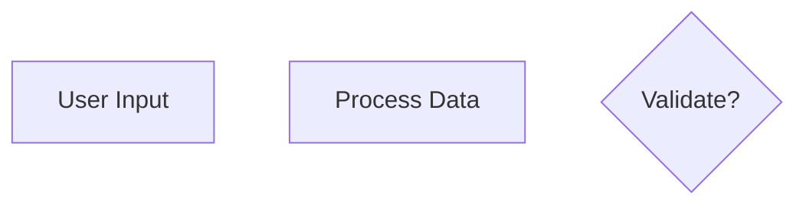

#### WRONG - Missing quotes cause parse errors


This applies to ALL node types:
- Rectangles: `A["text"]`
- Rounded: `B("text")`
- Circles: `C(("text"))`
- Diamonds: `D{"text"}`
- Hexagons: `E{{"text"}}`

### Rule 3: Subgraph Names - No Special Characters

**Subgraph names must NOT contain parentheses or special characters.**

#### CORRECT
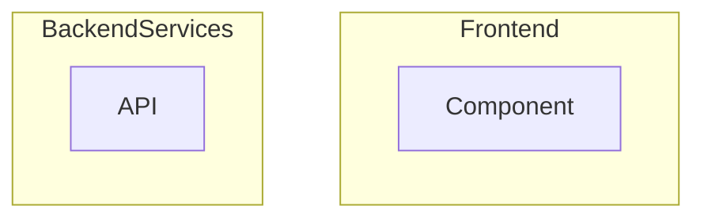

#### WRONG - Parentheses in subgraph name
```mermaid
graph TD
    subgraph Frontend(React)
        A["Component"]
    end
```

Use alphanumeric characters and underscores only.

### Rule 4: Sequence Diagram Messages - Never Empty

**The colon in sequence diagrams must be followed by content.**

#### CORRECT
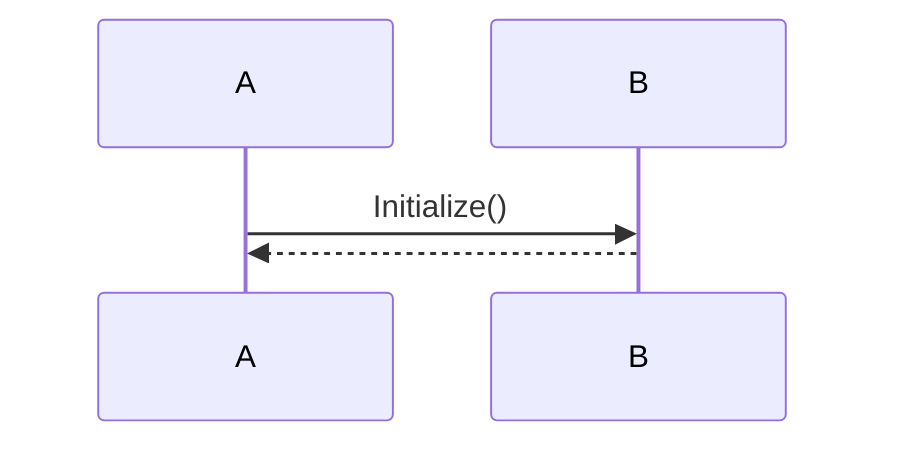

#### WRONG - Empty message
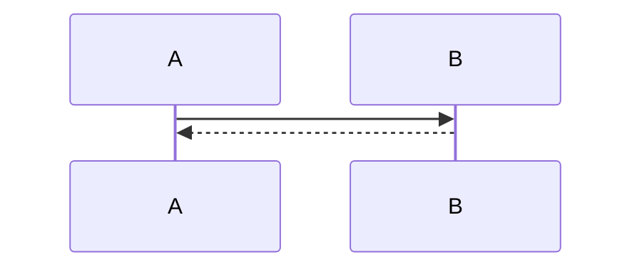

When there's no meaningful message, use `;` as placeholder.

### Rule 5: No Shorthand Activation

**Do NOT use shorthand activation syntax (`->>+`, `-->>-`).**

#### CORRECT
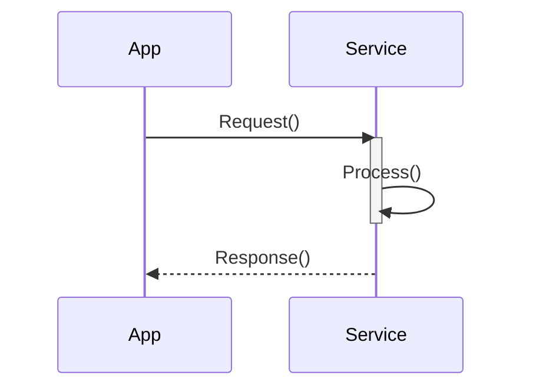

#### WRONG - Shorthand activation
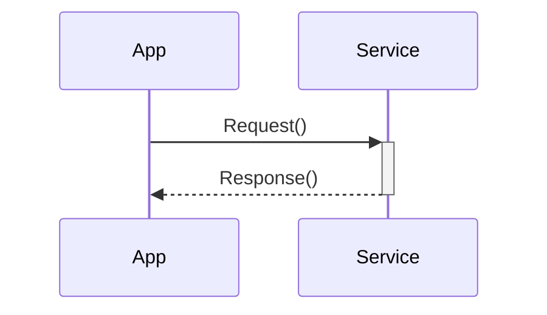

### Rule 6: No Source Citations in Diagrams

**Never include source file citations inside Mermaid diagrams.**

#### CORRECT
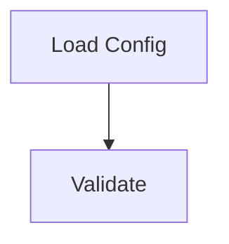

#### WRONG - Citation in diagram
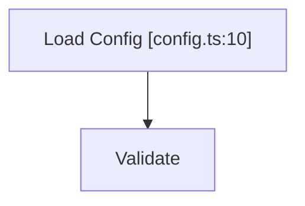

Place citations outside the diagram in the documentation text.

## Language-Specific Text

**Node labels should be in the target language (default: Japanese).**

#### For Japanese output
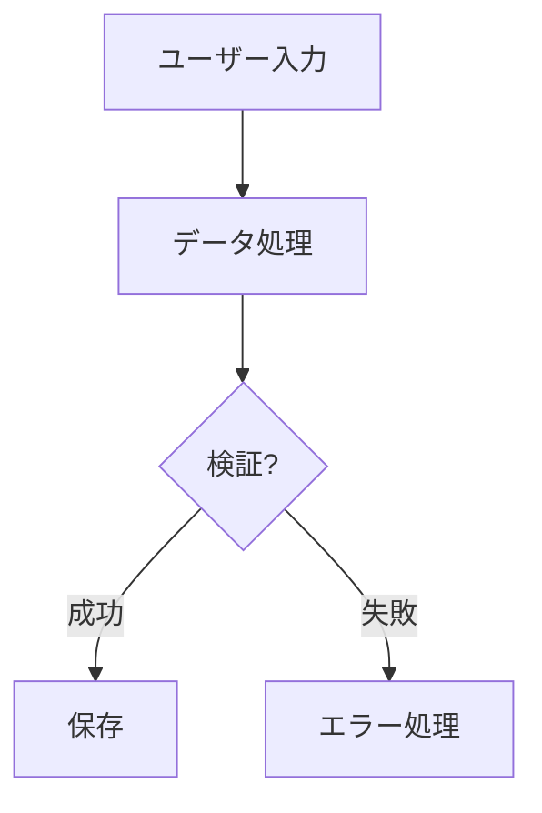

## Flowchart Best Practices

### Node Style

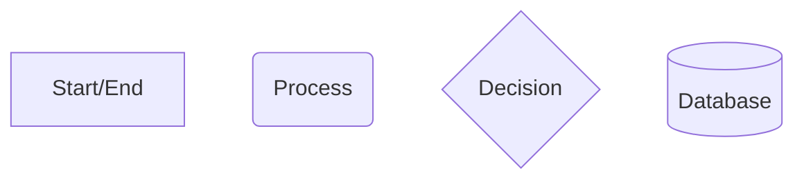

### Edge Labels

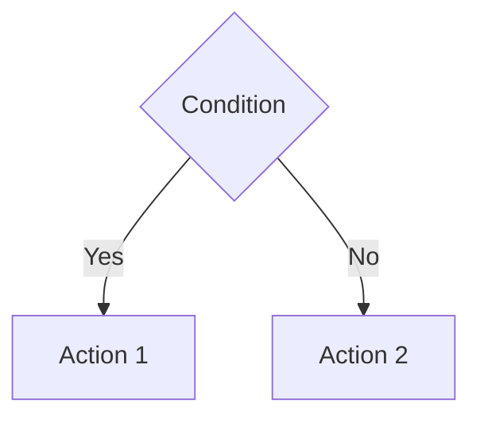

### Keep It Simple

- Maximum 10-15 nodes per diagram
- 3-4 words per node label
- Avoid crossing lines when possible

## Sequence Diagram Best Practices

### Participant Aliases

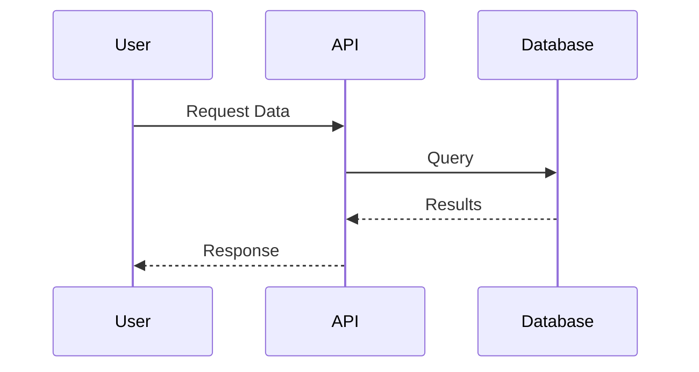

### Activation Boxes

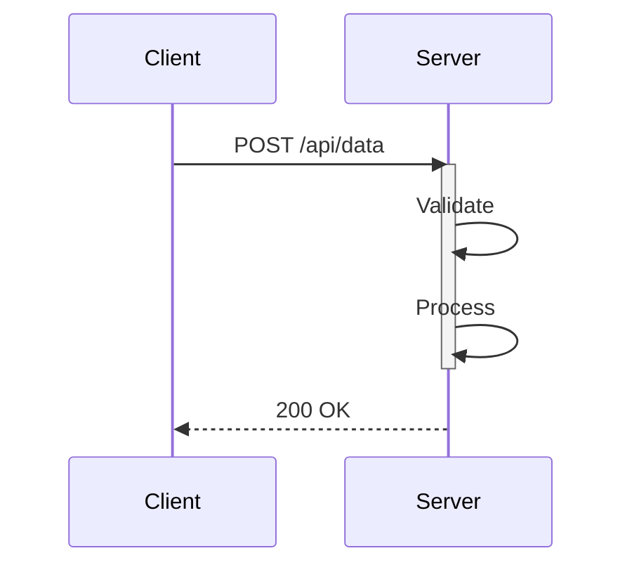

### Notes

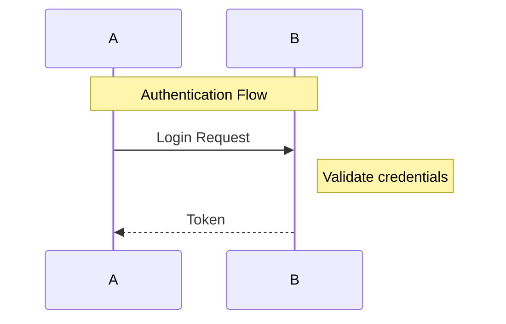

## Class Diagram Best Practices

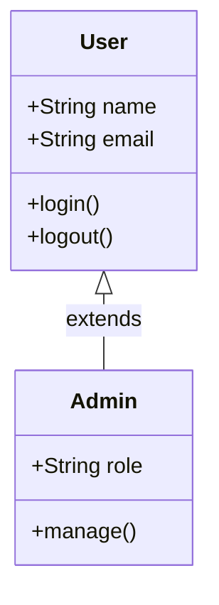

## State Diagram Best Practices

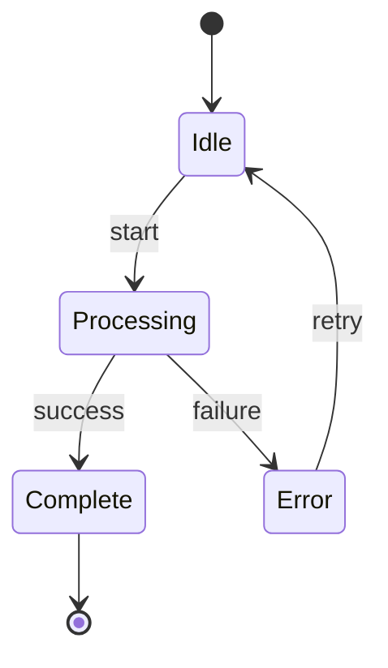

## Validation Process

### 1. Using CLI Script

Use `validate_mermaid.py` to extract and validate in one step:

```bash
python3 validate_mermaid.py --input {doc_dir} --invalid-only --output _reports/mermaid_invalid.json
```

Options:
- `--input PATH`: File (.mmd/.md) or directory to scan
- `--invalid-only`: Only output invalid blocks
- `--extract-only`: Only extract blocks without validation
- `--patterns PATTERNS`: Glob patterns for files (default: *.md)

**Validation Output Fields**:

| Field | Type | Description |
|-------|------|-------------|
| `is_valid` | boolean | Whether the diagram is valid |
| `error_message` | string | Clean error description |
| `error_type` | string | Error category (see below) |
| `error_line` | number | Line number where error occurred |
| `fix_hint` | string | Suggested fix for the error |

**Error Types**:

| Type | Description |
|------|-------------|
| `lexical_error` | Unrecognized text or character issues |
| `syntax_error` | General syntax issues |
| `node_error` | Problems with node definitions |
| `edge_error` | Problems with arrows/edges |
| `graph_structure_error` | Issues with diagram structure |
| `style_error` | Problems with style declarations |
| `cli_unavailable` | mmdc not installed |
| `timeout` | Validation timeout |
| `unknown` | Unclassified error |

### 2: Fix Errors

Use `error_type` and `fix_hint` to guide fixes:

| Error Type | Common Fix |
|------------|------------|
| `lexical_error` | Add quotes around text with special characters |
| `syntax_error` | Check diagram type declaration and arrow syntax |
| `node_error` | Ensure brackets are balanced, quote labels |
| `edge_error` | Use valid arrows (-->, ---, -.->), quote labels |

### 3: Retry (Max 3 Attempts)

If validation fails after 3 attempts:
1. Comment out the diagram
2. Add TODO marker
3. Record in mermaid_report.json

## Common Errors and Fixes

### Error: "Parse error on line X"

Usually caused by unquoted text with special characters.

**Before**:
```mermaid
graph TD
    A[User (Admin)] --> B
```

**After**:
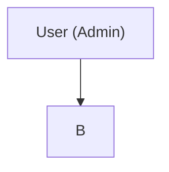

### Error: "Lexical error"

Usually caused by invalid characters or syntax.

**Before**:
```mermaid
graph TD
    A --> B: label
```

**After**:
```mermaid
graph TD
    A -->|"label"| B
```

### Error: "Unknown diagram type"

Check for typos in diagram type declaration.

**Before**:
```mermaid
flowChart TD
```

**After**:
```mermaid
graph TD
```

## Template Examples

### Data Flow Diagram

```mermaid
graph TD
    subgraph Input
        A["User Request"]
        B["API Call"]
    end

    subgraph Processing
        C["Validation"]
        D["Business Logic"]
        E["Data Transform"]
    end

    subgraph Output
        F["Response"]
        G["Database"]
    end

    A --> C
    B --> C
    C --> D
    D --> E
    E --> F
    E --> G
```

### API Sequence

```mermaid
sequenceDiagram
    participant C as Client
    participant G as Gateway
    participant S as Service
    participant D as Database

    C->>G: POST /api/resource
    activate G
    G->>S: Forward Request
    activate S
    S->>D: INSERT
    D-->>S: Success
    deactivate S
    S-->>G: 201 Created
    deactivate G
    G-->>C: Response
```

### Component Hierarchy

```mermaid
classDiagram
    class Component {
        <<abstract>>
        +render()
    }

    class Button {
        +variant: string
        +onClick()
    }

    class Input {
        +value: string
        +onChange()
    }

    Component <|-- Button
    Component <|-- Input
```
