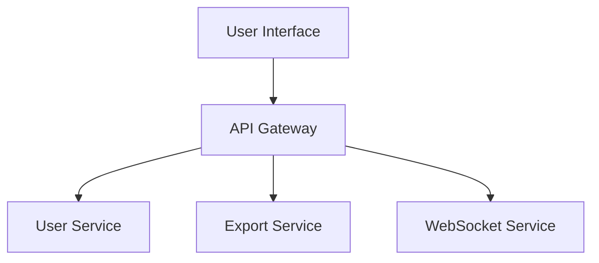

# Page Template and Markers

This document defines the page structure and marker conventions for wiki pages.

## Page Structure

Every wiki page MUST follow this structure:

```markdown
<!-- PAGE_ID: {page_id} -->
<details>
<summary>📚 Relevant source files</summary>

The following files were used as context for generating this wiki page:

- [file1.ext:1-100](url)
- [file2.ext:50-200](url)

</details>

# {Page Title}

> **Related Pages**: [[Page 2 Title|02_page-2.md]], [[Page 3 Title|03_page-3.md]]

---

<!-- BEGIN:AUTOGEN {section_id} -->
## {Section Title}

{Section content with source citations}

Sources: [file.ext:10-20](url)
<!-- END:AUTOGEN {section_id} -->

---

<!-- BEGIN:AUTOGEN {next_section_id} -->
## {Next Section Title}

{More content}

Sources: [file.ext:30-40](url)
<!-- END:AUTOGEN {next_section_id} -->

---
```

## Markers

### PAGE_ID Marker

**Purpose**: Uniquely identify the page for incremental updates.

**Format**:
```html
<!-- PAGE_ID: {page_id} -->
```

**Rules**:
- Must be at the very beginning of the file
- page_id must match the ID in toc.yaml
- One PAGE_ID per file

**Example**:
```html
<!-- PAGE_ID: myproject_01_overview -->
```

### AUTOGEN Markers

**Purpose**: Mark auto-generated content boundaries for safe updates.

**Format**:
```html
<!-- BEGIN:AUTOGEN {section_id} -->
{generated content}
<!-- END:AUTOGEN {section_id} -->
```

**Rules**:
- Every autogen section must have both BEGIN and END markers
- section_id must match the ID in toc.yaml
- Content outside markers is preserved during updates
- Include a `---` separator after each section

**Example**:
```html
<!-- BEGIN:AUTOGEN myproject_01_overview_introduction -->
## Introduction

This project provides...

Sources: [README.md:1-10](https://github.com/...)
<!-- END:AUTOGEN myproject_01_overview_introduction -->

---
```

### Nested Sections

For nested sections, use appropriate heading levels:

```markdown
<!-- BEGIN:AUTOGEN myproject_02_arch_frontend -->
## Frontend Architecture

Overview of frontend...

### Component Structure

<!-- BEGIN:AUTOGEN myproject_02_arch_frontend_components -->
Details about components...

Sources: [Component.tsx:15-30](url)
<!-- END:AUTOGEN myproject_02_arch_frontend_components -->

### State Management

<!-- BEGIN:AUTOGEN myproject_02_arch_frontend_state -->
State management details...

Sources: [store.ts:1-50](url)
<!-- END:AUTOGEN myproject_02_arch_frontend_state -->

<!-- END:AUTOGEN myproject_02_arch_frontend -->

---
```

## Heading Levels

| Section Depth | Heading | Markdown |
|---------------|---------|----------|
| Page title | H1 | `#` |
| Top-level section | H2 | `##` |
| Nested level 1 | H3 | `###` |
| Nested level 2 | H4 | `####` |
| Nested level 3 | H5 | `#####` |

## Source Files List

At the top of each page, include a collapsible list of source files:

```markdown
<details>
<summary>📚 Relevant source files</summary>

The following files were used as context for generating this wiki page:

- [Button.tsx:1-120](https://github.com/company/myapp/blob/abc123/README.md#L1-L200)
- [styles.css:1-200](https://github.com/company/myapp/blob/abc123/styles.css#L1-L200)
- [api.ts:1-160](https://github.com/company/myapp/blob/abc123/api.ts#L1-L160)

</details>
```

## Related Pages

Link to related pages using wiki-style links:

```markdown
> **Related Pages**: [[02_architecture.md]], [[03_api.md]]
```

## Section Content Guidelines

### Section Header

Each section should start with:
1. The heading (H2 or appropriate level)
2. A brief 1-2 sentence introduction

```markdown
## Component Architecture

This section describes the component structure and organization of the frontend.
```

### Section Body

Include:
- Explanatory text with source citations
- Code examples (if relevant)
- Tables for structured data
- Diagrams (if `diagrams_needed: true`)

### Section Footer

End each section with:
1. Source citations summary (if not inline)
2. The END:AUTOGEN marker
3. A horizontal rule `---`

```markdown
Sources: [Component.tsx:15-30](url), [types.ts:1-20](url)
<!-- END:AUTOGEN section_id -->

---
```

## Manual Sections

For sections where `autogen: false`, leave a placeholder:

```markdown
## Manual Section Title

<!-- This section is manually maintained -->

{Manual content goes here}

---
```

Do NOT add AUTOGEN markers to manual sections.

## Complete Example

```markdown
<!-- PAGE_ID: myapp_01_overview -->
<details>
<summary>📚 Relevant source files</summary>

The following files were used as context for generating this wiki page:

- [README.md:1-200](README.md)
- [package.json:1-200](package.json)
- [src/index.ts:1-200](src/index.ts)

</details>

# Project Overview

> **Related Pages**: [[Architecture|02_architecture.md]], [[Getting Started|03_getting-started.md]]

---

<!-- BEGIN:AUTOGEN myapp_01_overview_introduction -->
## Introduction

MyApp is a modern web application built with React and TypeScript. It provides a comprehensive solution for managing user data and workflows.

The application follows a modular architecture with clear separation of concerns between the frontend UI layer and the backend API services. [README.md:1-15](https://github.com/company/myapp/blob/abc123/README.md#L1-L15)

Sources: [README.md:1-15](https://github.com/company/myapp/blob/abc123/README.md#L1-L15)
<!-- END:AUTOGEN myapp_01_overview_introduction -->

---

<!-- BEGIN:AUTOGEN myapp_01_overview_features -->
## Key Features

The application provides the following key features:

| Feature | Description |
|---------|-------------|
| User Management | Create, update, and delete user accounts [src/users/index.ts:10-25](url) |
| Data Export | Export data in CSV and JSON formats [src/export/index.ts:5-20](url) |
| Real-time Updates | WebSocket-based live updates [src/websocket/index.ts:1-30](url) |



Sources: [src/index.ts:1-50](url), [package.json:1-30](url)
<!-- END:AUTOGEN myapp_01_overview_features -->

---

## Notes

<!-- This section is manually maintained -->

Additional notes and updates will be added here as the project evolves.

---
```
